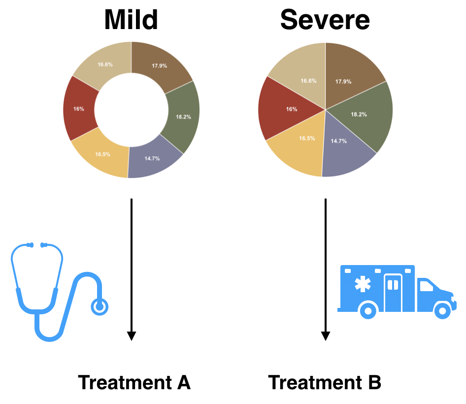
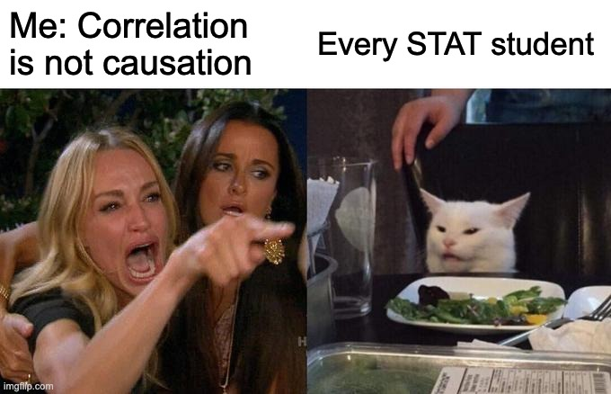
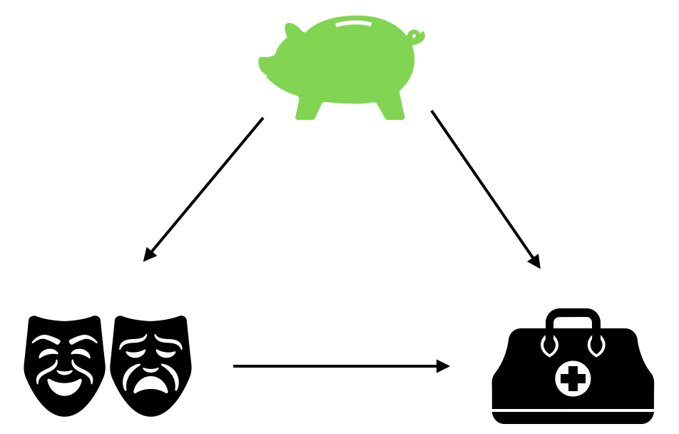
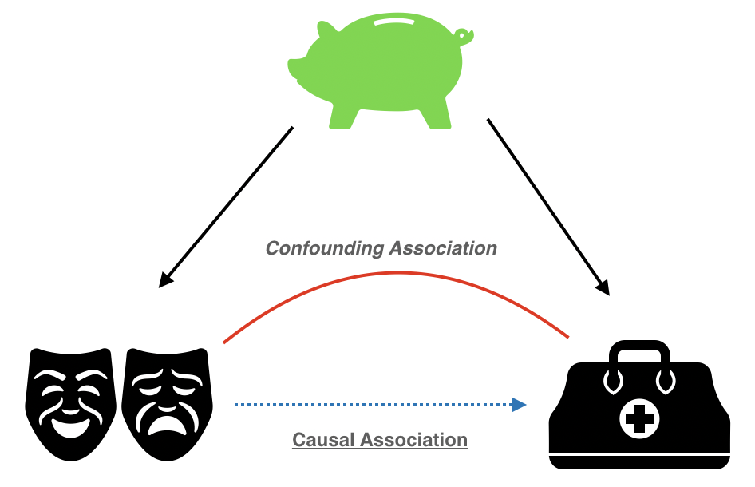
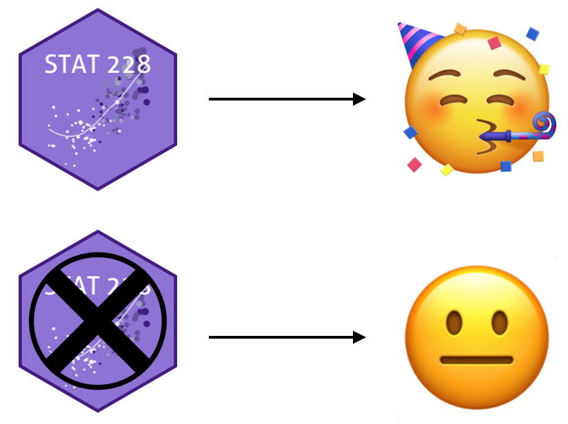
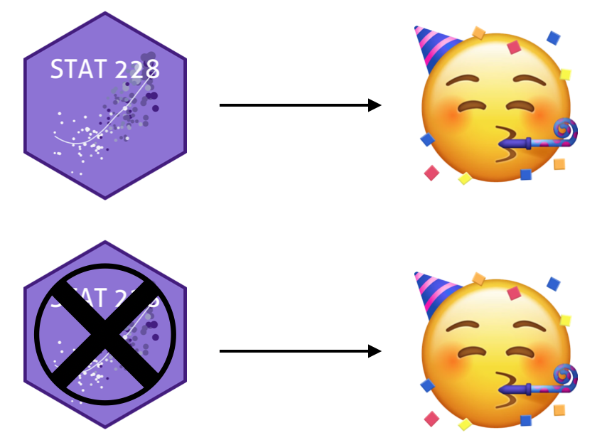
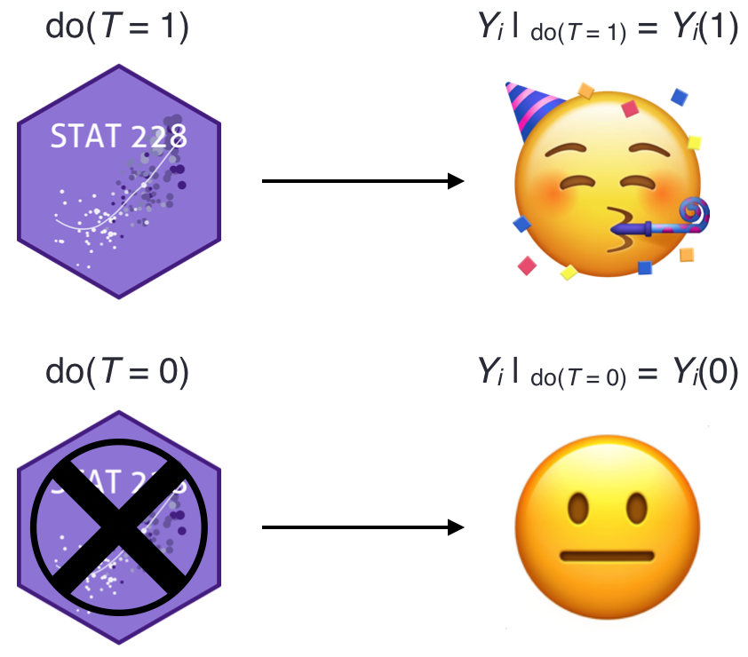
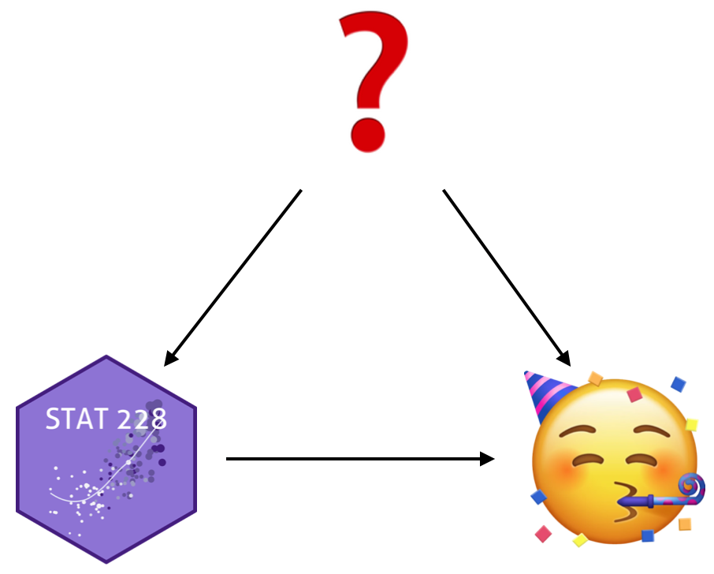
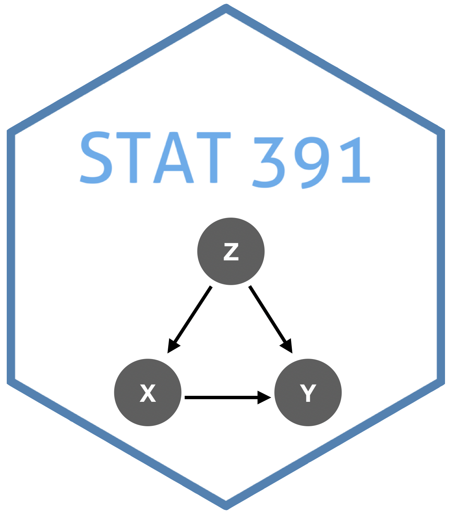
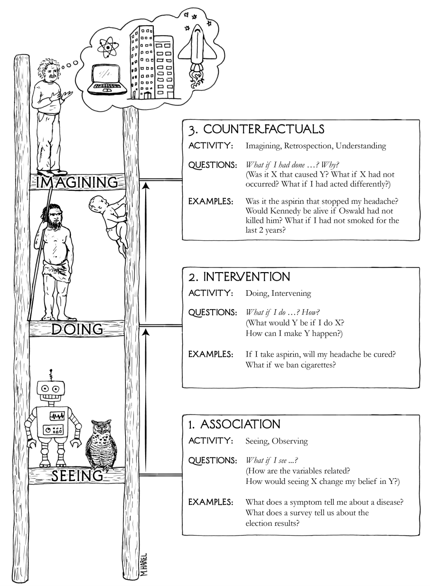

```{r xaringan-themer, include = FALSE}
library(xaringanthemer)
mono_accent(base_color = "#5E5E5E") #3E8A83?
options(htmltools.preserve.raw = FALSE)
```

```{r, include = FALSE}
library(tidyverse)
library(ggdag)
library(gt)
```

<!--
pagedown::chrome_print("~/Dropbox/Teaching/03-Simmons Courses/MATH228-Introduction to Data Science/Lecture Slides/01-Introduction/01-Introduction.html")
-->

class: center, middle, frame

# Revisiting Intro Stats

---

# Three Relevant Topics

### From Intro Stats:

.center[

## Simpson's Paradox

]

--

<br></br>

.center[

## CoRrElAtIoN iS nOt CaUsAtIoN

]

--

<br></br>

.center[

## RCTs vs. Observational Studies

]

---

# What is causal inference?

--

**Infer**ring **causal** effects of any *treatment*/*policy*/*intervention* (etc.)

--

.center[
```{r, echo = FALSE, dpi = 300, fig.width=9, fig.height=4.5, out.width="100%"}
example_dag = dagify(y ~ x, 
                     labels = c("y" = "Outcome", 
                                "x" = "Intervention"),
                     coords = list(x = c(x = 1, y = 2), 
                                   y = c(x = 1, y = 1)))
ggdag(example_dag, text = FALSE, use_labels = "label", seed = 12) + 
  theme_dag()
```
]

--

- **Effect** of metformin + sulfonylurea on CVD symptoms in T2D patients
- **Effect** of climate change policies on emissions
- **Effect** of coffee on cancer risk

---

# Simpson's Paradox

New disease: **Piéchart Disease**<sup>[*]</sup> 😨😱😨😱😨😱

- **Treatment**, *T*: A (0) or B (1)

- **Condition**, *C*: *mild* (0) or *severe* (1)

- **Outcome**, *Y*: *no* (0) or *yes* (1)

<br></br>

.display2[Question]: Is there a **causal effect** between treatment and outcome?

.footnote[
[*] the "t" is silent
]

---

# Piéchart Disease Outcome Table

.pull-left[
```{r, echo = FALSE}
results <- tribble(
  ~Treatment, ~Total,
  "A", "15% (150/1000)",
  "B", "20% (100/500)"
) 

results %>%
  gt() %>%
  data_color(columns = vars(Treatment, Total), 
             colors = c("white"))
```
]

.pull-right[
# .display[Which treatment should you choose?]
]

--

.center[
```{r, echo = FALSE, dpi = 300, fig.width=9, fig.height=4.5, out.width="100%"}
example_dag = dagify(Y ~ T, 
                     labels = c("Y" = "Outcome", 
                                "T" = "Treatment"),
                     coords = list(x = c(T = 1, Y = 2), 
                                   y = c(T = 1, Y = 1)))
ggdag(example_dag, text = TRUE, seed = 12) + 
  theme_dag()
```
]

---

# Piéchart Disease Outcome Table

.pull-left[
```{r, echo = FALSE}
results <- tribble(
  ~T, ~Mild, ~Severe, ~Total,
  "A", "12% (108/900)", "42% (42/100)", "15% (150/1000)",
  "B", "10% (5/50)", "21% (95/450)", "20% (100/500)"
) 

results %>%
  gt() %>%
  data_color(columns = vars(T, Mild, Severe, Total), 
             colors = c("white"))
```
]

.pull-right[
# .display[Which treatment should you choose?]
]

---

# Piéchart Disease Outcome Table

.pull-left[
```{r, echo = FALSE}
results <- tribble(
  ~T, ~Mild, ~Severe, ~Total,
  "A", "12% (108/900)", "42% (42/100)", "15% (150/1000)",
  "B", "10% (5/50)", "21% (95/450)", "20% (100/500)"
) 

results %>%
  gt() %>%
  data_color(columns = vars(T, Mild, Severe, Total), 
             colors = c("white")) %>%
  tab_style(
    style = list(
      cell_fill(color = "lightcyan"),
      cell_text(weight = "bold")
      ),
    locations = cells_body(
      columns = vars(Mild, Severe),
      rows = (T == "B"))
    ) %>%
  tab_style(
    style = list(
      cell_fill(color = "lightcyan"),
      cell_text(weight = "bold")
      ),
    locations = cells_body(
      columns = vars(Total),
      rows = (Total == "15% (150/1000)"))
    )
```
]

.pull-right[
```{r, echo = FALSE, dpi = 250}

```
]

--

.center[
```{r, echo = FALSE, dpi = 300, fig.width=5, fig.height=3.5, out.width="35%"}
example_dag = dagify(Y ~ T + C,
                     T ~ C,
                     labels = c("Y" = "Outcome", 
                                "T" = "Treatment", 
                                "C" = "Condition"),
                     coords = list(x = c(T = 1, Y = 3, C = 2), 
                                   y = c(T = 1, Y = 1, C = 2)))
ggdag(example_dag) + 
  geom_dag_point(color = "grey80", size = 17) +
  geom_dag_text(color = "black", size = 5) +
  theme_dag()
```
]

---

# Simpson's Paradox

.display1[Background] 

- [In 1951](https://rss.onlinelibrary.wiley.com/doi/10.1111/j.2517-6161.1951.tb00088.x), E.H. Simpson published a *famous* article (cited over 2000 times) that described an analysis of 2x2 tables that led to *paradoxical* results. 

--

.display2[What appears to have happened]

- A trend appears in *several different groups*, but disappears (or reverses) when these groups are combined. 

--

.display3[What is *actually* happening]

- The paradox is the result of disregarding the *causal structure* of the research problem [(Hernan et al., 2011)](https://academic.oup.com/ije/article/40/3/780/746837). 

> Once the causal goal is made explicit and causal considerations are incorporated into the analysis, the course of action becomes crystal clear. 

---

# Correlation is not Causation

.center[
```{r, echo = FALSE, dpi = 150}

```
]

---

# Let's go to the opera!

**Going to the opera** is *strongly correlated* with **living longer**

- NY Times: [CLICK FOR ARTICLE](https://www.nytimes.com/2019/12/22/us/arts-health-effects-ucl-study.html?smtyp=cur&smid=tw-nythealth)

.pull-left[
```{r, echo = FALSE, dpi = 250}
knitr::include_graphics("dag_theater.png")
```
]

---

# Let's go to the opera!

**Going to the opera** is *strongly correlated* with **living longer**

- NY Times: [CLICK FOR ARTICLE](https://www.nytimes.com/2019/12/22/us/arts-health-effects-ucl-study.html?smtyp=cur&smid=tw-nythealth)

.pull-left[
```{r, echo = FALSE, dpi = 250}

```
]

--

.pull-right[
**Common cause**: Money 🤑🤑🤑

1. Those who *attend the opera* differ from those who *do not attend the opera* in (at least) one fundamental way. 

2. **Confounding**!
]

---

# Let's go to the opera!

**Going to the opera** is *strongly correlated* with **living longer**

- NY Times: [CLICK FOR ARTICLE](https://www.nytimes.com/2019/12/22/us/arts-health-effects-ucl-study.html?smtyp=cur&smid=tw-nythealth)

.pull-left[
```{r, echo = FALSE, dpi = 250}

```
]

--

.pull-right[
**Common cause**: Money 🤑🤑🤑

1. Those who *attend the opera* differ from those who *do not attend the opera* in (at least) one fundamental way. 

2. **Confounding**!

Total **association**: mixture of **causal** and **confounding** association
]

---

# One more...

**Films Nicholas Cage appears in**

- *is correlated with*

**Number of people who drowned by falling into a pool**<sup>[*]</sup>

(*r* = 0.666, seriously)

--

.center[
```{r, echo = FALSE, dpi = 250}

```
]

.footnote[
[*] [https://www.tylervigen.com/spurious-correlations](https://www.tylervigen.com/spurious-correlations)
]

---

# Correlation is not Causation

.center[
```{r, echo = FALSE, dpi = 150}

```
]

--

.center[
# .display[Except when it is!]
]

---

# Potential Outcomes/Counterfactuals

**Intuition**

*Inferring the (causal) effect of an intervention on some outcome*

.pull-left[
```{r, echo = FALSE, dpi = 250}
knitr::include_graphics("emoji_neutral.png")
```

- *A student, pre-STAT 228*
]

--

.pull-right[
```{r, echo = FALSE, dpi = 250}

```

- *A causal effect!*
]

---

# Potential Outcomes

**Intuition**

*Inferring the (causal) effect of an intervention on some outcome*

.pull-left[
```{r, echo = FALSE, dpi = 250}
knitr::include_graphics("emoji_neutral.png")
```

- *A student, pre-STAT 228*
]

.pull-right[
```{r, echo = FALSE, dpi = 250}

```

- *No causal effect...*
]

---

# Potential Outcomes

**Notation**

.pull-left[
- *T*: observed **treatment** (binary)

- *Y*: observed **outcome**

- *i*: denotes *specific observation*
    - Example: $Y_{i}$
]

--

.pull-right[
```{r, echo = FALSE, dpi = 250}

```
]

--

**More Notation**

- $Y_{i}(1)$: **potential outcome** *conditional on treatment*
- $Y_{i}(0)$: **potential outcome** *conditional on no treatment*

--

.center[
**Causal Effect**: $Y_{i}(1)-Y_{i}(0)$
]

---

# Fundamental Problem of Causal Inference

.center[
```{r, echo = FALSE, dpi = 250}
knitr::include_graphics("emoji_thinking.jpeg")
```
]

--

> [(Holland, 1986)](http://www.cs.columbia.edu/~blei/fogm/2019F/readings/Holland1986.pdf): We only ever observe one realization. 

**If you chose to take STAT 228, you cannot simultaneously *not choose* to take it!**

.pull-left[
```{r, echo = FALSE, dpi = 250}
knitr::include_graphics("stat228_problem.png")
```
]

--

.pull-right.center[
**Individual Causal Effect** 

$Y_{i}(1)-$❓️
]

---

# Fundamental Problem of Causal Inference

.center[
```{r, echo = FALSE, dpi = 250}
knitr::include_graphics("emoji_thinking.jpeg")
```
]

> [(Holland, 1986)](http://www.cs.columbia.edu/~blei/fogm/2019F/readings/Holland1986.pdf): We only ever observe one realization. 

**If you chose to take STAT 228, you cannot simultaneously *not choose* to take it!**

.pull-left[

.center[
**Average Causal Effect?**

$(\bar{Y}\mid T = 1) -(\bar{Y}\mid T = 0)$

(i.e., a *difference in means*)

.display2[Can we do this?]

]

]

--

.pull-right.center[
**Probably not...**

```{r, echo = FALSE, dpi = 300}

```

]

---

# One more time...

.center[
```{r, echo = FALSE, dpi = 150}

```
]

---

# Correlation vs. Causation

*How do we find...*

.pull-left[
<p style="text-align: center;"><b>Correlation</b></p>

$$r_{xy}=\frac{\sum(x_{i}-\bar{x})(y_{i}-\bar{y})}{\sqrt{\sum(x_{i}-\bar{x})^{2}\sum(y_{i}-\bar{y})^{2}}}$$
```{r}
library(moderndive)

house_prices %>%
  get_correlation(price ~ sqft_living)
```
]

--

.pull-right.center[
<p style="text-align: center;"><b>Causation</b></p>

```{r, echo = FALSE, dpi = 250}
knitr::include_graphics("emoji_thinking.jpeg")
```

*Philosophy*

(and STAT 391...)

```{r, echo = FALSE, dpi = 250, out.width = "50%"}

```
]

---

# OK, so what is causation?

A variable *X* can be said to **cause** an outcome *Y* if<sup>1</sup>:

- **Association**: *X* and *Y* are *associated*

- **Time ordering**: *X* *precedes* *Y*

- **Nonspuriousness**: The association between *X* and *Y* is *not spurious*

.footnote[
[1] F. Urdinez and A. Cruz. *R for Political Data Science* (2020). 
]

---

# The Causal Revolution

.left-column[
```{r, echo = FALSE}
knitr::include_graphics("book_of_why.jpg")
```
]

.right-column[
```{r, echo = FALSE}

```
]

--

(Pearl et al., 2016): *X* is a cause of *Y* if *Y* **listens to** *X* and decides its value in response to what it hears. 

- But what if *Y* listens to more than just *X*?

---

# The Ladder of Causation

From *The Book of Why*

.center[
```{r, echo = FALSE, dpi = 220}

```
]


---

# Causal Diagrams

.center[
### .display[Directed Acyclic Graphs (DAGs)]
]

.pull-left[
```{r, dpi = 300, fig.width=9, fig.height=4.5, out.width="100%"}
library(ggdag)
example_dag = 
  dagify(Y ~ X + Z, 
         X ~ Z, 
         coords = 
           list(x = c(X = 1, Z = 2, Y = 3), 
                y = c(X = 1, Z = 2, Y = 1)))
ggdag(example_dag) + 
  theme_dag()
```
]

.pull-right[
- Maps the *philosophical* model

- **Goal**: Isolate and *identify* the **causal pathway** between *X* and *Y* by *controlling for* *Z*. 

We'll cover several popular methods for isolating causal pathways throughout the course!
]


---

# Causal Inference in Observational Studies

**Piéchart Disease** 😨😱😨😱😨😱
- **Treatment**, *T*: A (0) or B (1)
- **Condition**, *C*: *mild* (0) or *severe* (1)
- **Outcome**, *Y*: *no* (0) or *yes* (1)

.pull-left[
<p style="text-align: center;"><b>Ideal (RCT)</b></p>

```{r, echo = FALSE, fig.width=5, fig.height=3.4, dpi = 350}
dagify(
  Y ~ T + C,
  labels = c("Y" = "Outcome", 
             "T" = "Treatment", 
             "C" = "Condition"),
  exposure = "T", 
  outcome = "Y",
  latent = "C",
  coords = list(x = c(T = 1, Y = 3, C = 2), 
                y = c(T = 1, Y = 1, C = 2))
) %>% 
  tidy_dagitty() %>% 
  node_status() %>%
  ggplot(aes(x = x, y = y, xend = xend, yend = yend)) +
  geom_dag_edges() +
  geom_dag_point(aes(color = status), size = 17) +
  geom_dag_text(color = "black", size = 5) +
  scale_color_manual(values = c("#FF4136", "grey60", "#0074D9"),
                     na.value = "#7FDBFF") +
  guides(color = FALSE) +
  theme_dag()
```
]

--

.pull-right[
<p style="text-align: center;"><b>Observational Study</b></p>

```{r, echo = FALSE, fig.width=5, fig.height=3.4, dpi = 350}
dagify(
  Y ~ T + C,
  T ~ C,
  labels = c("Y" = "Outcome", 
             "T" = "Treatment", 
             "C" = "Condition"),
  exposure = "T", 
  outcome = "Y",
  latent = "C",
  coords = list(x = c(T = 1, Y = 3, C = 2), 
                y = c(T = 1, Y = 1, C = 2))
) %>% 
  tidy_dagitty() %>% 
  node_status() %>%
  ggplot(aes(x = x, y = y, xend = xend, yend = yend)) +
  geom_dag_edges() +
  geom_dag_point(aes(color = status), size = 17) +
  geom_dag_text(color = "black", size = 5) +
  scale_color_manual(values = c("#FF4136", "grey60", "#0074D9"),
                     na.value = "#7FDBFF") +
  guides(color = FALSE) +
  theme_dag()
```
]

--

You can't always randomize treatment!

- Might be **unethical**, **infeasible**, or straight-up **impossible**.

---

# So...

How do we estimate causal effects in observational studies?!

.center[

## Backdoor adjustment
]

- In other words, *control for the right variables*!

--

.pull-left[
```{r, eval = FALSE}
fit_causal = lm(Y ~ T + C, data = ...)
summary(fit_causal)
```
]

.pull-right[
```{r, echo = FALSE, fig.width=5, fig.height=3.4, dpi = 350}
dagify(
  Y ~ T + C,
  labels = c("Y" = "Outcome", 
             "T" = "Treatment", 
             "C" = "Condition"),
  exposure = "T", 
  outcome = "Y",
  latent = "C",
  coords = list(x = c(T = 1, Y = 3, C = 2), 
                y = c(T = 1, Y = 1, C = 2))
) %>% 
  tidy_dagitty() %>% 
  node_status() %>%
  ggplot(aes(x = x, y = y, xend = xend, yend = yend)) +
  geom_dag_edges() +
  geom_dag_point(aes(color = status), size = 17) +
  geom_dag_text(color = "black", size = 5) +
  scale_color_manual(values = c("#FF4136", "grey60", "#0074D9"),
                     na.value = "#7FDBFF") +
  guides(color = FALSE) +
  theme_dag()
```
]

- **Note**: *Linear regression* is one way to adjust for confounders, and it comes with its limitations!

---

class: center, middle, frame

# Class Details

---

# Readings

- Paul J. Gertler et al., **Impact Evaluation in Practice**, 2nd ed.
    - Available here: [https://openknowledge.worldbank.org/handle/10986/25030](https://openknowledge.worldbank.org/handle/10986/25030)
    
- Scott Cunningham, **Causal Inference: The Mixtape**, 2018. 
    - Available here: [https://www.scunning.com/mixtape.html](https://www.scunning.com/mixtape.html)
    
- Miguel A. Hernan and James M. Robins, **Causal Inference: What If**, 2020. 
    - Available here: [https://www.hsph.harvard.edu/miguel-hernan/causal-inference-book/](https://www.hsph.harvard.edu/miguel-hernan/causal-inference-book/)

- and lots of papers!

(While some of the readings can have fairly technical portions, we'll focus on **applied causal inference**!)

---

# Grades

- **Problem sets [20%]**: Completed in RStudio via *R Markdown*

- **Seminar/Journal Club Presentation [20%]**: Starting in **Module 4**, students will develop, present, and lead a discussion on a journal article and/or book reading related to the appropriate module.

- **Final Project [30%]**: You will submit a *causal research proposal* on a topic of your choosing and give a short presentation.
    
- **Casual Causal Paper [20%]**: Two *thought papers* (~2 pages each) will be assigned during the semester asking you to take a stance on a prompt, and provide evidence for that stance based on material related to the course.

- **Virtual Class Participation [10%]**

---

# Course Format

(I'll try my best to be consistent and stick to this format!)

**Tuesdays**: Interactive lecture introducing new material

**Thursdays**: Seminar/Journal Club Presentation, R tutorials, breakout room activities in R, etc.

--

- For maximum benefit, complete the assigned reading in advance and come to class ready with questions, and try your best to stick with the assignment schedule posted on the syllabus.
    - But...

--

> I am aiming for total flexibility. *We're still in a pandemic and learning in this environment is HARD*. Issues will arise, and that’s ok! Let’s communicate and we can figure out a plan together. **My main goal is to support you and your learning**. 

---

# Schedule

.pull-left[
.center[
```{r, echo = FALSE, dpi = 300}

```
]
]

.pull-right[
.display1[Part 1:] **R Review** (data visualization, wrangling, regression)

.display2[Part 2:] **Theory of Causal Inference** (potential outcomes, graphical models, randomized trials)

.display3[Part 3:] **Tools and Methods** (matching, weighting, difference-in-differences, regression discontinuity, instrumental variables)
]

---

# Goals

.center[
### Understand the *philosophy* of causation

<br></br>

### Design rigorous evaluation strategies

<br></br>

### Conduct independent research/lit review

<br></br>

### Communication!
]
