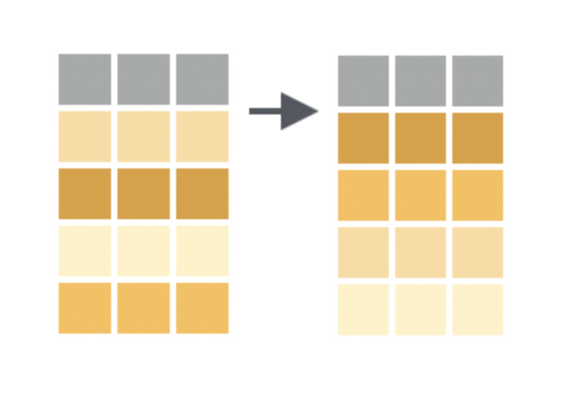

```{r xaringan-themer, include = FALSE}
library(xaringanthemer)
mono_accent(base_color = "#5E5E5E") #3E8A83?
options(htmltools.preserve.raw = FALSE)
```

```{r, echo = FALSE}
knitr::opts_chunk$set(warning = FALSE, message = FALSE)
```


```{r, include = FALSE}
library(tidyverse)
library(ggdag)
library(gt)
```

<!--
pagedown::chrome_print("~/Dropbox/Teaching/03-Simmons Courses/MATH228-Introduction to Data Science/Lecture Slides/01-Introduction/01-Introduction.html")
-->


# Topics

- .display1[The S.S. FAM - Five Main Verbs]

<br></br>

- .display2[Other Useful Verbs] (.display4[Anthony's Favorite Things])

<br></br>

- .display3[Combining Multiple Tables]

---

class: center, middle, frame

# The S.S. FAM

.center[
```{r, echo = FALSE, dpi = 300}

```
]

---

# Data Wrangling in R? 

**dplyr** (D-plyer, **NOT** *dipler*)

.center[
```{r, echo = FALSE, out.width = "40%"}
knitr::include_graphics("dplyr_hex.png")
```
]

---

# A Grammar for Data Wrangling

Similar to how `ggplot2` provides a *grammar* for **data visualization**... 

- `dplyr` provides a *grammar* for **data transformation**. 

--

**Five verbs for working with data in a data frame**:

- `select()`: take a subset of *columns* (e.g., variables)

- `summarize()` (usually with `group_by()`): aggregate data *across rows* (e.g., grouped means)

- `filter()`: take a subset of *rows* (e.g., observations, cases, individuals)

- `arrange()`: sort rows

- `mutate()`: add or modify *existing columns*

Each of these functions takes a **data frame** (or a `tibble`) as its first argument (similar to `ggplot()`). 

- They are *usually* used in conjunction with each other (e.g., in a *pipeline*). 

---

# Setting the Table

We'll illustrate some *data wrangling* examples using open data on **hotel booking demand** via [TidyTuesday](https://github.com/rfordatascience/tidytuesday/blob/master/data/2020/2020-02-11/readme.md). 

```{r, warning = FALSE, message = FALSE}
hotels_raw <- readr::read_csv('https://raw.githubusercontent.com/rfordatascience/tidytuesday/master/data/2020/2020-02-11/hotels.csv')
```

.display2[Our **causal** question]: 

- What impact does assigning a room *different to what a customer had reserved* have on whether the booking was *canceled*?

--

.pull-left[
*T*: Different room assigned? 
- (`0` = "No", `1` = "Yes")

*Y*: Booking canceled? 
- (`0` = "No", `1` = "Yes")

*C*: Possible **confounders** 
- 🤔
]

.pull-right[
```{r, echo = FALSE, dpi = 300, fig.width=5, fig.height=3.5}
example_dag = dagify(Y ~ T + C,
                     T ~ C,
                     exposure = "T", 
                     outcome = "Y",
                     coords = list(x = c(T = 1, Y = 3, C = 2), 
                                   y = c(T = 1, Y = 1, C = 2))) %>%
  tidy_dagitty() %>%
  node_status()
ggdag(example_dag) + 
  geom_dag_point(aes(color = status), size = 17) +
  geom_dag_text(color = "black", size = 5) +
  scale_color_manual(values = c("dodgerblue", "hotpink"), 
                     na.value = "chartreuse") +
  guides(color = FALSE) +
  theme_dag()
```

]

---

# `select()` columns

.center[
```{r, echo = FALSE, dpi = 300}

```
]

`select()` allows you to return a *subset* of **columns** of a data frame. 

- This might not seem like much, but data frames with *many* columns (i.e., hundreds of variables, or even 32!) are not uncommon. 

---

# `select()` columns

The `hotels_raw` dataset has *32* columns. While these each hold some potentially useful piece of information, `select()` can help us pare down the columns to a simpler amount:

```{r}
hotels = hotels_raw %>%
  select(hotel, is_canceled, reserved_room_type, assigned_room_type, 
         booking_changes, lead_time, country, previous_cancellations, 
         stays_in_week_nights, stays_in_weekend_nights, arrival_date_month)
```

--

.display1[A few notes]:

- I *strongly recommend* NOT overwriting the raw dataset - use a different name!

- Order matters in `select()`: The order in which you list columns is the order in which they'll appear!

---

# `summarize()` with `group_by()`

Four of the *S.S. FAM* verbs all provide different ways to **manipulate** a data frame. 

- `select()`, `filter()`, `arrange()`, `mutate()`

- The extent of the analysis we can perform *solely by manipulating a data frame* is limited. 

--

`summarize()` and `group_by()` allow us to make calculations and *comparisons*. 

- `summarize()` (with or without `group_by()`) collapses the data into rows based on **summary statistics**. 

.center[
```{r, echo = FALSE, dpi = 300}

```
]

---

# `summarize()`

The important step in `summarize()` is specifying **how** we want to reduce the data to a single set of summary statistics. 
- **Examples**: `mean()`, `sd()`, `median()`, `IQR()`, `max()`, `n()`, and many more

Let's calculate the **proportion** of *cancellations*...

(i) .display1[overall]

(ii) .display2[by hotel type]

--

👇 .display1[overall] 👇

```{r}
hotels_raw %>%
  summarize(n_bookings = n(), 
            prop_cancellations = sum(is_canceled)/n())
```

---

# `summarize()`

The important step in `summarize()` is specifying **how** we want to reduce the data to a single set of summary statistics. 
- **Examples**: `mean()`, `sd()`, `median()`, `IQR()`, `max()`, `n()`, and many more

Let's calculate the **proportion** of *cancellations*...

(i) .display1[overall]

(ii) .display2[by hotel type]

👇 .display2[by hotel type] 👇

```{r}
hotels_raw %>%
  group_by(hotel) %>% #<<
  summarize(n_bookings = n(), 
            prop_cancellations = sum(is_canceled)/n())
```

---

# `filter()` rows

While `select()` is useful in cutting out unwanted columns (especially if there are *many* columns), we might still need to perform other operations on the data. 

.center[
```{r, echo = FALSE, dpi = 300}

```
]

`filter()` allows you to return a *subset* of **rows** of a data frame. 

- Specify criteria about the values of a variables in your dataset.

- `filter()` out only those rows that match that criteria.

---

# `filter()` rows

Let's obtain booking data for *only the reservations in June, July, or August*:

```{r, eval = FALSE}
hotels_resort = hotels_raw %>%
  filter(arrival_date_month %in% c("June", "July", "August"))
```

**Note**: We use the `%in%` to check for rows with `arrival_date_month` equal to *either* `"June"`, `"July"`, or `"August"`

---

# `select()` and `filter()` together

Similar to when using *only* `select()`, we might want to perform other operations on the data in conjunction with `filter()`. 

- We can conveniently construct a single *pipeline* with all of the operations!

```{r, eval = FALSE}
hotels_resort = hotels_raw %>%
  select(hotel, is_canceled, reserved_room_type, assigned_room_type, 
         booking_changes, lead_time, country, previous_cancellations, 
         stays_in_week_nights, stays_in_weekend_nights, arrival_date_month) %>%
  filter(arrival_date_month %in% c("June", "July", "August"))
```

--

You can even add a plot at the end of a pipeline!

```{r, eval = FALSE}
hotels_raw %>%
  select(hotel, is_canceled, reserved_room_type, assigned_room_type, 
         booking_changes, lead_time, country, previous_cancellations, 
         stays_in_week_nights, stays_in_weekend_nights, arrival_date_month) %>%
  filter(arrival_date_month %in% c("June", "July", "August")) %>%
  ggplot(aes(x = stays_in_week_nights)) + 
  geom_histogram(binwidth = 2, color = "white") + 
  facet_wrap(~ hotel)
```

---

# `arrange()` rows

The `arrange()` function will *sort the rows* of a data frame by a pre-specified *column*. 

.center[
```{r, echo = FALSE, dpi = 300}

```
]

While we can do this as an *exploratory* step in the `View()` window, `arrange()` allows us to perform additional operations on a custom-sorted data frame. 

---

# `arrange()` rows

When we run this code:

```{r, eval = FALSE}
hotels_raw %>%
    group_by(arrival_date_month) %>% #<<
    summarize(n_bookings = n(), 
              n_canceled = sum(is_canceled),
              prop_cancellations = sum(is_canceled)/n())
```

The `arrival_date_month` column in the summary table is arranged *alphabetically*. 

- This is usually the default setting with *characters* in R

--

Let's `arrange()` this table in *descending* order by `prop_cancellations`:

```{r, eval = FALSE}
hotels_raw %>%
    group_by(arrival_date_month) %>% 
    summarize(n_bookings = n(), 
              n_canceled = sum(is_canceled),
              prop_cancellations = sum(is_canceled)/n()) %>%
  arrange(desc(prop_cancellations))
```

---

# `mutate()` existing columns

`mutate()` is a function that defines and inserts *new variables* into a data frame as *columns*. 

.center[
```{r, echo = FALSE, dpi = 300}

```
]

---

# `mutate()` existing columns

*Now* we can address our **causal** question further:

- What impact does assigning a room *different to what a customer had reserved* have on whether the booking was *canceled*?

.display3[Two relevant columns for the "treatment"]:

```{r}
hotels_raw %>%
  select(reserved_room_type, assigned_room_type) %>%
  head()
```


Using `reserved_room_type` and `assigned_room_type`, we can *create* a new `is_reservation_changed` variable by checking each row for *equality*. 

---

# `mutate()` existing columns

Using `reserved_room_type` and `assigned_room_type`, we can *create* a new `is_reservation_changed` variable by checking each row for *equality*. 

```{r}
hotels = hotels_raw %>%
  mutate(is_reservation_changed = 
           (reserved_room_type != assigned_room_type))
hotels %>%
  select(reserved_room_type, assigned_room_type, is_reservation_changed) %>%
  head()
```

**Note**: `(reserved_room_type != assigned_room_type)` checks a *logical condition* for each row, and therefore returns either a `TRUE` or `FALSE` value. 

---

# One Giant Pipeline

Let's use all components of the S.S FAM in one pipeline!

```{r}
hotels_raw %>%
  mutate(is_reservation_changed = 
           (reserved_room_type != assigned_room_type)) %>%
  select(hotel, is_reservation_changed, is_canceled, reserved_room_type, 
         assigned_room_type, booking_changes, lead_time, country, 
         previous_cancellations, stays_in_week_nights, 
         stays_in_weekend_nights, arrival_date_month) %>%
  filter(arrival_date_month %in% c("June", "July", "August")) %>%
  group_by(is_reservation_changed) %>%
  summarize(n_bookings = n(), 
            n_canceled = sum(is_canceled),
            prop_cancellations = sum(is_canceled)/n())
```

---

# Confounders?!

```{r}
hotels_raw %>%
  mutate(is_reservation_changed = 
           (reserved_room_type != assigned_room_type)) %>%
  group_by(is_reservation_changed) %>%
  summarize(mean_booking_changes = mean(booking_changes))
```

```{r}
hotels_raw %>%
    group_by(is_canceled) %>%
    summarize(mean_booking_changes = mean(booking_changes))
```

---

# Confounders?!

```{r}
hotels_raw %>%
  mutate(is_reservation_changed = 
           (reserved_room_type != assigned_room_type)) %>%
  group_by(is_reservation_changed) %>%
  summarize(mean_lead_time = mean(lead_time))
```

```{r}
hotels_raw %>%
  mutate(is_reservation_changed = 
           (reserved_room_type != assigned_room_type)) %>%
  group_by(is_canceled) %>%
  summarize(mean_lead_time = mean(lead_time))
```

---

# The S.S. FAM

.pull-left[
- `select()`: choose columns by name

- `summarize()` (usually with `group_by()`): reduce variables to summary values

- `filter()`: pick a subset of rows matching criteria

- `arrange()`: reorder rows

- `mutate()`: add new variables
]

.pull-right[
```{r, echo = FALSE}

```
]

---

class: center, middle, frame

# Other Useful Verbs

## Anthony's Favorite Things

---

# `case_when()`

From `?case_when`:

> This function allows you to vectorise multiple `if_else()` statements. 

--

Let's create a new `season` variable:

- If `arrival_date_month %in% c("December", "January", "February")`, then `season = "Winter"`

- If `arrival_date_month %in% c("March", "April", "May")`, then `season = "Spring"`

- If `arrival_date_month %in% c("June", "July", "August")`, then `season = "Summer"`

- If `arrival_date_month %in% c("September", "October", "November")`, then `season = "Fall"`

---

# `case_when()`

From `?case_when`:

> This function allows you to vectorise multiple `if_else()` statements. 

Let's create a new `season` variable:

```{r}
hotels = hotels_raw %>%
  mutate(season = 
           case_when(arrival_date_month %in% c("December", "January", "February") ~ "Winter", 
                     arrival_date_month %in% c("March", "April", "May") ~ "Spring", 
                     arrival_date_month %in% c("June", "July", "August") ~ "Summer", 
                     arrival_date_month %in% c("September", "October", "November") ~ "Fall"))

hotels %>%
  group_by(season) %>%
  summarize(prop_cancellations = sum(is_canceled)/n())
```

---

# The `slice_()` Family

Index **rows** by their *integer* location. 

Let's find the **top 3** most expensive *average daily rates* (`adr`) per `hotel` type:

```{r}
hotels %>%
  group_by(hotel) %>%
  slice_max(adr, n = 3) %>%
  select(hotel, adr)
```

- **Note**: This replaces the `top_n()` function, which has been *superseded*. 

---

# `sample_n()`

Sample *n* rows from a table. 

.display2[Good for...]

- displaying a *data preview*

- downsampling to show examples on a smaller dataset

```{r}
set.seed(391)
hotels_raw %>%
  sample_n(size = 5) %>%
  select(hotel, stays_in_weekend_nights, adults, children, arrival_date_month)
```

**Note**: `sample_n()` was recently superseded by `slice_sample()`, but I'm *very* used to it...

---

# `across()`

This is a .display2[NEW] function! 🤩🤩🤩

- Apply a function (or more than one function) **across** multiple columns. 

```{r}
spotify_songs <- readr::read_csv('https://raw.githubusercontent.com/rfordatascience/tidytuesday/master/data/2020/2020-01-21/spotify_songs.csv')

spotify_songs %>%
  group_by(playlist_genre) %>%
  summarize(across(danceability:acousticness, 
                   list(mean = mean)))
```

---

# `across()` with `_with()`

Be **lazy** and use `ends_with("ness")` instead of listing out...

- `loudness`
- `speechiness`
- `acousticness`
- `instrumentalness`
- `liveness`

```{r}
spotify_songs %>%
  group_by(playlist_genre) %>%
  summarize(across(ends_with("ness"), mean))
```

---

# `relocate()`

Be **lazy** and use `relocate()` instead of having to `select()` all over again!

```{r}
hotels = hotels_raw %>%
  select(hotel, is_canceled, reserved_room_type, assigned_room_type, 
         booking_changes, lead_time, country, previous_cancellations, 
         stays_in_week_nights, stays_in_weekend_nights, arrival_date_month)
```

- But I want `hotel` later on, and `arrival_date_month` earlier!

--

```{r}
hotels = hotels %>%
  relocate(hotel, .after = assigned_room_type,) %>%
  relocate(arrival_date_month, .before = is_canceled)

names(hotels)
```

---

# `count()`

`count()` is probably my **favorite** function of *all time*! 

- It's so simple, but **SO** useful. 

```{r}
spotify_songs %>% 
  count(playlist_subgenre)
```

---

# `count()`

`count()` is probably my **favorite** function of *all time*! 

- It's so simple, but **SO** useful. 

```{r}
spotify_songs %>% 
  count(playlist_subgenre, sort = TRUE) #<<
```

---

# `count()`

`count()` is probably my **favorite** function of *all time*! 

- It's so simple, but **SO** useful. 

```{r, eval = FALSE}
spotify_songs %>% 
  count(playlist_subgenre, sort = TRUE) 
```

The result is pretty self-explanatory. `count()` returns a *count* of rows **by group**. 

- It performs the *same function* that `group_by(playlist_subgenre) %>% summarize(n = n())` would!

`count()` is **very** useful when you're working with a large number of categories and want a brief snapshot of their representation in a dataset. 

- **Note**: `add_count()` returns the original dataset with the `n` column added!

---

# `count()`

`count()` is probably my **favorite** function of *all time*! 

- You could also pipe the results from `count()` into a `geom_col()` bar graph:

.pull-left[
```{r, eval = FALSE}
spotify_songs %>% 
  count(playlist_subgenre) %>%
  ggplot(aes(x = playlist_subgenre, 
             y = n)) + 
  geom_col() + 
  coord_flip() + 
  labs(x = "", y = "Count") +
  theme_minimal()
```
]

.pull-right[
```{r, echo = FALSE, dpi = 300}
spotify_songs %>% 
  count(playlist_subgenre)  %>%
  ggplot(aes(x = playlist_subgenre, y = n)) + 
  geom_col() + 
  coord_flip() + 
  labs(x = "", y = "Count") +
  theme_minimal()
```
]

---

# `fct_reorder()`

Unless there's a *good reason*, bar graphs should *probably* be arranged in ascending or descending order.

- `fct_reorder()`, when used after `count()` (or `summarize()`) can help with that!

.pull-left[
```{r, eval = FALSE}
spotify_songs %>% 
  count(playlist_subgenre) %>%
  ggplot(aes(x = fct_reorder(playlist_subgenre, n),
             y = n)) + 
  geom_col() + 
  coord_flip() + 
  labs(x = "", y = "Count") +
  theme_minimal()
```
]

.pull-right[
```{r, echo = FALSE, dpi = 300}
spotify_songs %>% 
  count(playlist_subgenre) %>%
  ggplot(aes(x = fct_reorder(playlist_subgenre, n), y = n)) + 
  geom_col() + 
  coord_flip() + 
  labs(x = "", y = "Count") +
  theme_minimal()
```
]

---

# `fct_lump()`

`fct_lump()` (and `fct_reorder()`) are from the `{forcats}` package - they're very helpful when dealing with **factors**!

- `fct_lump()` **lumps** together multiple levels within a **factor**. 

```{r, eval = FALSE}
spotify_songs %>% 
  mutate(playlist_subgenre = fct_lump(playlist_subgenre, 8)) %>%
  count(playlist_subgenre) %>%
  ggplot(aes(x = fct_reorder(playlist_subgenre, n),
             y = n)) + 
  geom_col() + 
  coord_flip() + 
  labs(x = "", y = "Count") +
  theme_minimal()
```

---

class: center, middle, frame

# Combining Multiple Tables

---

# Combining Multiple Tables

So far we have been working with *single data frames*, which are reminiscent of single *spreadsheets/tables*. 

- However, many data projects contain *multiple tables* used together. 

- Luckily, `dplyr` gives efficient means to work with multiple tables. 

--

One family of verbs that we will use to work with multiple tables is called **mutating joins**. 

- These add new variables to one data frame from *matching observations* in another

(i) `inner_join()`

(ii) `full_join()`

(iii) `left_join()` and `right_join()`

(iv) `anti_join()`

---

# `inner_join()`

`inner_join()` joins together multipletables, keeping **only** rows with matching "key" variable names. 

- Let's look at **several** data tables on [college tuition, diversity, and pay](https://github.com/rfordatascience/tidytuesday/blob/master/data/2020/2020-03-10/readme.md):

```{r}
tuition_cost <- readr::read_csv('https://raw.githubusercontent.com/rfordatascience/tidytuesday/master/data/2020/2020-03-10/tuition_cost.csv')
salary_potential <- readr::read_csv('https://raw.githubusercontent.com/rfordatascience/tidytuesday/master/data/2020/2020-03-10/salary_potential.csv')
diversity_school <- readr::read_csv('https://raw.githubusercontent.com/rfordatascience/tidytuesday/master/data/2020/2020-03-10/diversity_school.csv')
```

--

A matching column between `tuition_cost` and `salary_potential` is `name` (the **name** of the school). 

- But one dataset has *more* **unique** schools than the other!

```{r}
length(unique(tuition_cost$name))

length(unique(salary_potential$name))
```

---

# `inner_join()`

We can use `inner_join()` to join together the `tuition_cost` and `salary_potential` tables, using `name` as a **key**. 

- But this will also remove *any* rows from **EITHER** table that don't share a matching key. 

```{r}
college_tuition_salary_inner = tuition_cost %>%
  inner_join(salary_potential, by = "name")

length(unique(college_tuition_salary_inner$name))
```

---

# `full_join()`

`full_join()` works similarly to `inner_join()`, it just doesn't remove *any* rows. 

- If any rows from either table **DO NOT** share a matching key, those will still be included with `NA` values under the columns from the *other* table. 

```{r}
college_tuition_salary_full = tuition_cost %>%
  full_join(salary_potential, by = "name")

length(unique(college_tuition_salary_full$name))
```

One could use **imputation** techniques (for example) to fill in the *missing values*. 

---

# `left_join()`

We use `left_join()` when we want to include **all** rows in one table (the "left" table), and *only* rows in the other table with a matching "key" variable. 

- `right_join()` works similarly, just in the other direction. 

```{r}
college_tuition_salary_left = tuition_cost %>%
  left_join(salary_potential, by = "name")

length(unique(tuition_cost$name))
length(unique(college_tuition_salary_left$name))
```

---

# `right_join()`

We use `right_join()` when we want to include **all** rows in one table (the "right" table), and *only* rows in the other table with a matching "key" variable. 

- `left_join()` works similarly, just in the other direction. 

```{r}
college_tuition_salary_right = tuition_cost %>%
  right_join(salary_potential, by = "name")

length(unique(salary_potential$name))
length(unique(college_tuition_salary_right$name))
```


---

# `anti_join()`

To be honest, I haven't used this one very much...it's basically the *opposite* of `inner_join()`. 

- `anti_join()` returns all rows from one table **without** a match in the other table. 

--

**Taylor Swift lyrics**

```{r}
taylor_swift_lyrics <- readr::read_csv('https://raw.githubusercontent.com/rfordatascience/tidytuesday/master/data/2020/2020-09-29/taylor_swift_lyrics.csv')
```

We'll use `anti_join()` to **remove** *stop words* from Taylor Swift's songs. 

---

# `anti_join()`

```{r}
library(tidytext)
# The 'stop_words' dataset is built-in

tidy_swift = taylor_swift_lyrics %>%
  unnest_tokens(word, Lyrics)

head(tidy_swift)
```

---

# `anti_join()`

```{r}
tidy_swift_anti = tidy_swift %>%
  anti_join(stop_words, by = "word") #<<

head(tidy_swift_anti)
```

---

# Which words does T. Swift say the most?

```{r, dpi = 300}
tidy_swift_anti %>%
  count(word, sort = TRUE) %>% 
  slice_max(n, n = 10) %>%
  ggplot(aes(x = fct_reorder(word, n), y = n)) + 
  geom_col() + 
  labs(x = "", y = "Count", 
       title = "Which words does Taylor Swift LOVE the most?") +
  coord_flip() + 
  theme_minimal()
```


