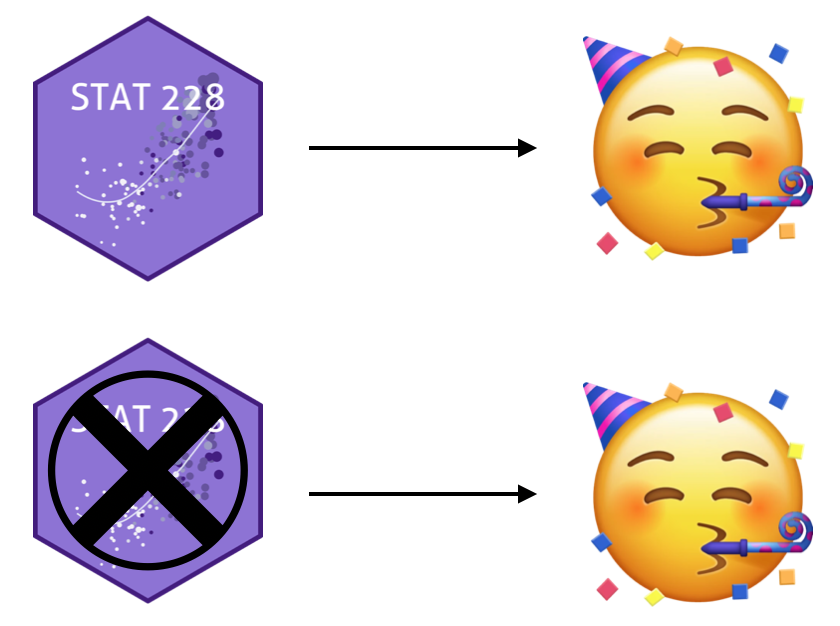
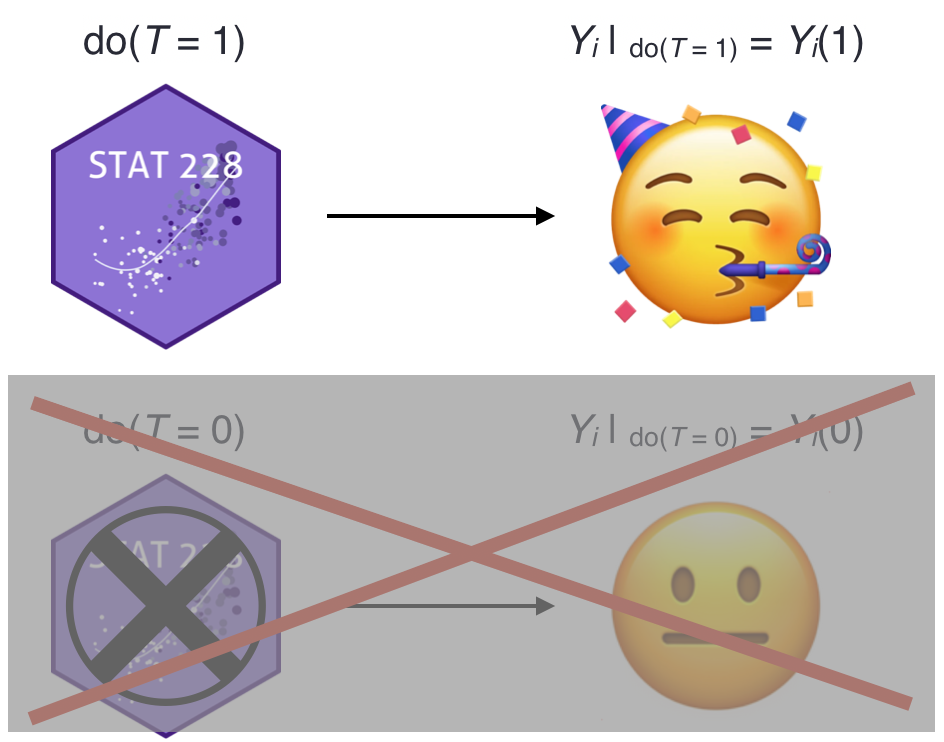

```{r xaringan-themer, include = FALSE}
library(xaringanthemer)
mono_accent(base_color = "#5E5E5E") #3E8A83?
options(htmltools.preserve.raw = FALSE)
```

```{r, include = FALSE}
library(tidyverse)
library(broom)
library(patchwork)
library(ggdag)
library(gt)
```

<!--
pagedown::chrome_print("~/Dropbox/Teaching/03-Simmons Courses/MATH228-Introduction to Data Science/Lecture Slides/01-Introduction/01-Introduction.html")
-->

class: center, middle, frame

# The Rubin Causal Model

---

# The Rubin Causal Model

.pull-left[
.display2[An approach to causal inference based on *potential outcomes*]

- $[Y(0), Y(1)]$

- $[Y^0, Y^1]$

]

.pull-right[

```{r, echo = FALSE}
knitr::include_graphics("rubin.jpg")
```

> [**Donald Rubin**](https://statistics.fas.harvard.edu/people/donald-b-rubin)

]

.center[
## What are potential outcomes?
]

--

[Click: **One of the most important statistical ideas of the past 50 years**](https://statmodeling.stat.columbia.edu/2020/12/09/what-are-the-most-important-statistical-ideas-of-the-past-50-years/)

- According to Andrew Gelman

---

# Potential Outcomes

**Intuition**

*Inferring the (causal) effect of an intervention on some outcome*

.pull-left[
```{r, echo = FALSE, dpi = 250}

```

- *A student, pre-STAT 228*
]

--

.pull-right[
```{r, echo = FALSE, dpi = 250}
knitr::include_graphics("stat228_potential.png")
```

.display2[A causal effect!]
]

---

# Potential Outcomes

**Intuition**

*Inferring the (causal) effect of an intervention on some outcome*

.pull-left[
```{r, echo = FALSE, dpi = 250}

```

- *A student, pre-STAT 228*
]

.pull-right[
```{r, echo = FALSE, dpi = 250}

```

.display1[No causal effect...]
]

---

# Potential Outcomes

.display1[Notation]

.pull-left[
- *T*: observed **treatment** (binary)
    - STAT 228 (1)
    - no STAT 228 (0)

- *Y*: observed **outcome**
    - *Love of statistics* (1-10)

- *i*: denotes *specific observation*
    - Example: $Y_{i}$
]

--

.pull-right[
```{r, echo = FALSE, dpi = 250}

```
]

--

.display1[More Notation]

- $Y_{i}(1)$: **potential outcome** *conditional on treatment*
- $Y_{i}(0)$: **potential outcome** *conditional on no treatment*

--

.center[
**Causal Effect**: $Y_{i}(1)-Y_{i}(0)$
]

---

# Fundamental Problem of Causal Inference

.center[
```{r, echo = FALSE, dpi = 250}
knitr::include_graphics("emoji_thinking.jpeg")
```
]

--

> [(Holland, 1986)](http://www.cs.columbia.edu/~blei/fogm/2019F/readings/Holland1986.pdf): We only ever observe one realization. 

**If you chose to take STAT 228, you cannot simultaneously *not choose* to take it!**

.pull-left[
```{r, echo = FALSE, dpi = 250}

```
]

--

.pull-right.center[
**Causal Effect**: $Y_{i}(1)-$❓️
]

---

# Potential Outcomes (in a table)

.center[
```{r, echo = FALSE}
po_data = tibble(
  Student = 1:8, 
  Treated = c(TRUE, TRUE, TRUE, FALSE, TRUE, FALSE, FALSE, FALSE), 
  Outcome = c(8, 7.5, 8.5, 6, 7.5, 8, 10, 8), 
  Y1 = c("8", "7.5", "8.5", "?", "7.5", "?", "?", "?"), 
  Y0 = c("?", "?", "?", "6", "?", "8", "10", "8"), 
  delta = c("?", "?", "?", "?", "?", "?", "?", "?")
) %>%
  mutate(`Outcome<br>with treatment` = Y1,
         `Outcome<br>without treatment` = Y0,
         Effect = delta) %>%
  select(-Y1, -Y0, -delta)

po_data %>% 
  gt::gt() %>%
  cols_align(
    align = "center", 
    columns = TRUE
  ) %>%
  tab_style(
    style = list(
      cell_text(color = "red", weight = "bold")
      ),
    locations = cells_body(
      columns = vars(`Outcome<br>with treatment`),
      rows = `Outcome<br>with treatment` != "?")
  ) %>%
  tab_style(
    style = list(
      cell_text(color = "red", weight = "bold")
      ),
    locations = cells_body(
      columns = vars(`Outcome<br>without treatment`),
      rows =`Outcome<br>without treatment` != "?") 
  ) %>%
  tab_style(
    style = list(
      cell_text(color = "red", weight = "bold")
      ),
    locations = cells_body(
      columns = vars(Effect), 
      rows = Effect == "?")
  ) 
```
]

--

- $Y_{i}$: **Outcome** for student *i*
    - $Y_{i}(1)$: **Outcome** with treatment (only *observed* for some)
    - $Y_{i}(0)$: **Outcome** without treatment (only *observed* for some)
    
- $Y_{i}(1)-Y_{i}(0)=$ ❓

---

# Fundamental Problem of Causal Inference

Remember, we can only *observe* $Y_{i}(1)$ if person $i$ actually received the treatment!

- What can we do to estimate a **causal effect**? 🤔🤔🤔

--

.display2[Average Treatment Effect (ATE)]

$$\large\text{ATE}=E[Y(1)-Y(0)]=E[Y(1)]-E[Y(0)]=❓\normalsize$$

.center-small[
```{r, echo = FALSE}
po_data = tibble(
  Student = 1:8, 
  Treated = c(TRUE, TRUE, TRUE, FALSE, TRUE, FALSE, FALSE, FALSE), 
  Outcome = c(8, 7.5, 8.5, 6, 7.5, 8, 10, 8), 
  Y1 = c("8", "7.5", "8.5", "?", "7.5", "?", "?", "?"), 
  Y0 = c("?", "?", "?", "6", "?", "8", "10", "8"), 
  delta = c("?", "?", "?", "?", "?", "?", "?", "?")
) %>%
  mutate(`Outcome<br>with treatment` = Y1,
         `Outcome<br>without treatment` = Y0,
         Effect = delta) %>%
  select(-Y1, -Y0, -delta)

po_data %>% 
  gt::gt() %>%
  cols_align(
    align = "center", 
    columns = TRUE
  ) %>%
  tab_style(
    style = list(
      cell_text(color = "red", weight = "bold")
      ),
    locations = cells_body(
      columns = vars(`Outcome<br>with treatment`),
      rows = `Outcome<br>with treatment` != "?")
  ) %>%
  tab_style(
    style = list(
      cell_text(color = "red", weight = "bold")
      ),
    locations = cells_body(
      columns = vars(`Outcome<br>without treatment`),
      rows =`Outcome<br>without treatment` != "?") 
  ) %>%
  tab_style(
    style = list(
      cell_text(color = "red", weight = "bold")
      ),
    locations = cells_body(
      columns = vars(Effect), 
      rows = Effect == "?")
  ) 
```
]

---

# Average Treatment Effect (ATE)

$$\large\text{ATE}=E[Y(1)-Y(0)]=E[Y(1)]-E[Y(0)]=❓\normalsize$$

.center-small[
```{r, echo = FALSE}
po_data = tibble(
  Student = 1:8, 
  Treated = c(TRUE, TRUE, TRUE, FALSE, TRUE, FALSE, FALSE, FALSE), 
  Outcome = c(8, 7.5, 8.5, 6, 7.5, 8, 10, 8), 
  Y1 = c("8", "7.5", "8.5", "?", "7.5", "?", "?", "?"), 
  Y0 = c("?", "?", "?", "6", "?", "8", "10", "8"), 
  delta = c("?", "?", "?", "?", "?", "?", "?", "?")
) %>%
  mutate(`Outcome<br>with treatment` = Y1,
         `Outcome<br>without treatment` = Y0,
         Effect = delta) %>%
  select(-Y1, -Y0, -delta)

po_data %>% 
  gt::gt() %>%
  cols_align(
    align = "center", 
    columns = TRUE
  ) %>%
  tab_style(
    style = list(
      cell_text(color = "black", weight = "bold"), 
      cell_fill(color = "dodgerblue", alpha = 0.4)
      ),
    locations = cells_body(
      columns = vars(`Outcome<br>with treatment`),
      rows = `Outcome<br>with treatment` != "")
  ) %>%
  tab_style(
    style = list(
      cell_text(color = "black", weight = "bold"), 
      cell_fill(color = "hotpink", alpha = 0.4)
      ),
    locations = cells_body(
      columns = vars(`Outcome<br>without treatment`),
      rows =`Outcome<br>without treatment` != "") 
  ) %>%
  tab_style(
    style = list(
      cell_text(color = "red", weight = "bold")
      ),
    locations = cells_body(
      columns = vars(Effect), 
      rows = Effect == "?") 
  ) 
```
]

- $\color{#418FF7}{E[Y\mid T = 1]=\frac{1}{4}(8+7.5+8.5+7.5)=7.875}$
- $\color{#ED73B2}{E[Y\mid T = 0]=\frac{1}{4}(6+8+10+8)=8}$

--

.center[
## Is the causal effect 7.875 - 8 = -0.125?
]

---

# NO!!!

.pull-left[


]

.pull-right[


]

---

# Average Treatment Effect (ATE)

$$\text{ATE}=E[Y(1)]-E[Y(0)]\boldsymbol\neq E[Y\mid T=1]-E[Y\mid T=0]$$

- $E[Y\mid T=1]-E[Y\mid T=0]$ shows an **associative difference**
    - (a *correlation is not causation* difference...)

.center-small[
```{r, echo = FALSE}
po_data = tibble(
  Student = 1:8, 
  Treated = c(TRUE, TRUE, TRUE, FALSE, TRUE, FALSE, FALSE, FALSE), 
  Outcome = c(8, 7.5, 8.5, 6, 7.5, 8, 10, 8), 
  Y1 = c("8", "7.5", "8.5", "?", "7.5", "?", "?", "?"), 
  Y0 = c("?", "?", "?", "6", "?", "8", "10", "8"), 
  delta = c("?", "?", "?", "?", "?", "?", "?", "?")
) %>%
  mutate(`Outcome<br>with treatment` = Y1,
         `Outcome<br>without treatment` = Y0,
         Effect = delta) %>%
  select(-Y1, -Y0, -delta)

po_data %>% 
  gt::gt() %>%
  cols_align(
    align = "center", 
    columns = TRUE
  ) %>%
  tab_style(
    style = list(
      cell_text(color = "black", weight = "bold"), 
      cell_fill(color = "dodgerblue", alpha = 0.4)
      ),
    locations = cells_body(
      columns = vars(`Outcome<br>with treatment`),
      rows = `Outcome<br>with treatment` != "?")
  ) %>%
  tab_style(
    style = list(
      cell_text(color = "black", weight = "bold"), 
      cell_fill(color = "hotpink", alpha = 0.4)
      ),
    locations = cells_body(
      columns = vars(`Outcome<br>without treatment`),
      rows =`Outcome<br>without treatment` != "?") 
  ) %>%
  tab_style(
    style = list(
      cell_text(color = "red", weight = "bold")
      ),
    locations = cells_body(
      columns = vars(Effect), 
      rows = Effect == "?") 
  ) 
```
]

--

The **observed outcomes**, $Y_{i}$, are *not necessarily* the same as $Y_{i}(1)$ or $Y_{i}(0)$. 

- $Y_{i}$ is only equal to the potential outcome corresponding to the *received treatment*.

---

# Average Treatment Effect (ATE)

Now *let's pretend* we know every potential outcome...

.center-small[
```{r, echo = FALSE}
po_data = tibble(
  Student = 1:8, 
  Treated = c(TRUE, TRUE, TRUE, FALSE, TRUE, FALSE, FALSE, FALSE), 
  Outcome = c(8, 7.5, 8.5, 6, 7.5, 8, 10, 8), 
  Y1 = c("8", "7.5", "8.5", "7", "7.5", "8", "9", "8.5"), 
  Y0 = c("6", "7", "8", "6", "7", "8", "10", "8"), 
  delta = c("2", "0.5", "0.5", "1", "0.5", "0", "-1", "0.5")
) %>%
  mutate(`Outcome<br>with treatment` = Y1,
         `Outcome<br>without treatment` = Y0,
         Effect = delta) %>%
  select(-Y1, -Y0, -Outcome, -delta)

po_data %>% 
  gt::gt() %>%
  cols_align(
    align = "center", 
    columns = TRUE
  ) %>%
  tab_style(
    style = list(
      cell_text(color = "#0174D9", weight = "bold")
      ),
    locations = cells_body(
      columns = vars(`Outcome<br>with treatment`),
      rows = Treated == TRUE)
  ) %>%
  tab_style(
    style = list(
      cell_text(color = "#0174D9", weight = "bold")
      ),
    locations = cells_body(
      columns = vars(`Outcome<br>without treatment`),
      rows = Treated == FALSE) 
  ) %>%
  tab_style(
    style = list(
      cell_text(color = "black", weight = "bold"), 
      cell_fill(color = "chartreuse", alpha = 0.4)
      ),
    locations = cells_body(
      columns = vars(Effect)) 
  ) 
```
]

\begin{align*}
ATE&=E[Y(1)]-E[Y(0)]\\
   &=\frac{2+0.5+0.5+1+0.5+0+(-1)+(0.5)}{8}\\
   &=\boxed{0.5}
\end{align*}

---

# Conditional Average Treatment Effect (CATE)

This is just the **ATE**, but in a *subgroup*. 

.center[
### Is STAT 228 more effective for certain course backgrounds?
]

--

.center-small[
```{r, echo = FALSE}
po_data = tibble(
  Student = 1:8, 
  STAT227 = c("Yes", "Yes", "Yes", "Yes", "No", "No", "No", "No"),
  Treated = c(TRUE, TRUE, TRUE, FALSE, TRUE, FALSE, FALSE, FALSE), 
  Outcome = c(8, 7.5, 8.5, 6, 7.5, 8, 10, 8), 
  Y1 = c("8", "7.5", "8.5", "7", "7.5", "8", "9", "8.5"), 
  Y0 = c("6", "7", "8", "6", "7", "8", "10", "8"), 
  delta = c("2", "0.5", "0.5", "1", "0.5", "0", "-1", "0.5")
) %>%
  mutate(`Outcome<br>with treatment` = Y1,
         `Outcome<br>without treatment` = Y0,
         Effect = delta) %>%
  select(-Y1, -Y0, -Outcome, -delta)

po_data %>% 
  gt::gt() %>%
  cols_align(
    align = "center", 
    columns = TRUE
  ) %>%
  tab_style(
    style = list(
      cell_text(color = "#0174D9", weight = "bold")
      ),
    locations = cells_body(
      columns = vars(`Outcome<br>with treatment`),
      rows = Treated == TRUE)
  ) %>%
  tab_style(
    style = list(
      cell_text(color = "#0174D9", weight = "bold")
      ),
    locations = cells_body(
      columns = vars(`Outcome<br>without treatment`),
      rows = Treated == FALSE) 
  ) %>%
  tab_style(
    style = list(
      cell_text(color = "black", weight = "bold"), 
      cell_fill(color = "chartreuse", alpha = 0.4)
      ),
    locations = cells_body(
      columns = vars(Effect)) 
  ) %>%
  tab_style(
    style = list(
      cell_fill(color = "mediumpurple1", alpha = 0.3)
      ),
    locations = cells_body(
      columns = vars(STAT227)) 
  ) 
```
]

--

$\small CATE_{\text{227}}=E[Y(1)-Y(0)\mid \text{STAT227}=\text{Yes}]=\frac{1}{4}(2+0.5+0.5+1)=\boxed{1}\normalsize$

$\small CATE_{\text{no227}}=E[Y(1)-Y(0)\mid \text{STAT227}=\text{No}]=\frac{1}{4}(0.5+0+(-1)+0.5)=\boxed{0}\normalsize$

---

# ATE on the Treated (ATT)

$$\large\text{ATT}=E[Y(1)-Y(0)\mid T = 1]\normalsize$$

.center[
### Is STAT 228 more effective for those who took STAT 228? 😐
]

--

.center-small[
```{r, echo = FALSE}
po_data = tibble(
  Student = 1:8, 
  STAT227 = c("Yes", "Yes", "Yes", "Yes", "No", "No", "No", "No"),
  Treated = c(TRUE, TRUE, TRUE, FALSE, TRUE, FALSE, FALSE, FALSE), 
  Outcome = c(8, 7.5, 8.5, 6, 7.5, 8, 10, 8), 
  Y1 = c("8", "7.5", "8.5", "7", "7.5", "8", "9", "8.5"), 
  Y0 = c("6", "7", "8", "6", "7", "8", "10", "8"), 
  delta = c("2", "0.5", "0.5", "1", "0.5", "0", "-1", "0.5")
) %>%
  mutate(`Outcome<br>with treatment` = Y1,
         `Outcome<br>without treatment` = Y0,
         Effect = delta) %>%
  select(-Y1, -Y0, -Outcome, -delta)

po_data %>% 
  gt::gt() %>%
  cols_align(
    align = "center", 
    columns = TRUE
  ) %>%
  tab_style(
    style = list(
      cell_text(color = "#0174D9", weight = "bold")
      ),
    locations = cells_body(
      columns = vars(Treated),
      rows = Treated == TRUE) 
  ) %>%
  tab_style(
    style = list(
      cell_text(color = "black", weight = "bold"), 
      cell_fill(color = "chartreuse", alpha = 0.4)
      ),
    locations = cells_body(
      columns = vars(Effect), 
      rows = Treated == TRUE) 
  )
```
]

--

- $\small ATT=E[Y(1)-Y(0)\mid T=1]=\frac{1}{4}(2+0.5+0.5+0.5)=\boxed{0.875}\normalsize$

---

# ATE on the Untreated (ATU)

$$\large\text{ATU}=E[Y(1)-Y(0)\mid T = 0]\normalsize$$

.center[
### Is STAT 228 more effective for those who did not take STAT 228?
]

.center-small[
```{r, echo = FALSE}
po_data = tibble(
  Student = 1:8, 
  STAT227 = c("Yes", "Yes", "Yes", "Yes", "No", "No", "No", "No"),
  Treated = c(TRUE, TRUE, TRUE, FALSE, TRUE, FALSE, FALSE, FALSE), 
  Outcome = c(8, 7.5, 8.5, 6, 7.5, 8, 10, 8), 
  Y1 = c("8", "7.5", "8.5", "7", "7.5", "8", "9", "8.5"), 
  Y0 = c("6", "7", "8", "6", "7", "8", "10", "8"), 
  delta = c("2", "0.5", "0.5", "1", "0.5", "0", "-1", "0.5")
) %>%
  mutate(`Outcome<br>with treatment` = Y1,
         `Outcome<br>without treatment` = Y0,
         Effect = delta) %>%
  select(-Y1, -Y0, -Outcome, -delta)

po_data %>% 
  gt::gt() %>%
  cols_align(
    align = "center", 
    columns = TRUE
  ) %>%
  tab_style(
    style = list(
      cell_text(color = "#0174D9", weight = "bold")
      ),
    locations = cells_body(
      columns = vars(Treated),
      rows = Treated == FALSE) 
  ) %>%
  tab_style(
    style = list(
      cell_text(color = "black", weight = "bold"), 
      cell_fill(color = "chartreuse", alpha = 0.4)
      ),
    locations = cells_body(
      columns = vars(Effect), 
      rows = Treated == FALSE) 
  )
```
]

- $\small ATU=E[Y(1)-Y(0)\mid T=0]=\frac{1}{4}(1+0+(-1)+0.5)=\boxed{0.125}\normalsize$

---

# More on the ATT

.display1[Why might one use the ATT?]

- In some scenarios, we might be more interested in the causal effect of a treatment on the subset of individuals *who actually receive the treatment*!

--

From [Ho et al. (2007)](https://gking.harvard.edu/files/matchp.pdf):

> In our example, this is the average causal effect in districts in which the Democratic Party nominated the incumbent member of the House. From one perspective, we might want to know this treatment effect on the treated (the ATT) since obviously this is the group of districts where the treatment was applied. In other words, the ATT is the effect of the treatment actually applied. Medical studies typically use the ATT as the designated quantity of interest because they often only care about the causal effect of drugs for patients that receive or would receive the drugs. For another example, in job training programs, we are not normally interested in assigning employed people to have this training.  

---

# ATE vs ATT

.center[
### They sound similar, but they aren't always the same!
]

- $\large ATE = E[Y(1) - Y(0)]\normalsize$ 

- $\large ATT = E[Y(1) - Y(0)\mid T = 1]\normalsize$

--

.center[
## ATE = ATT + Treatment Selection Bias
]

If study participants are **randomized** into treatment groups, selection bias is zero. 

- More on **randomized studies** soon!

---

# Back to the "REAL" Data

.pull-left-small[
```{r, echo = FALSE}
po_data = tibble(
  Student = 1:8, 
  STAT227 = c("Yes", "Yes", "Yes", "Yes", "No", "No", "No", "No"),
  Treated = c(TRUE, TRUE, TRUE, FALSE, TRUE, FALSE, FALSE, FALSE), 
  Outcome = c(8, 7.5, 8.5, 6, 7.5, 8, 10, 8)
) 

po_data %>% 
  gt::gt() %>%
  cols_align(
    align = "center", 
    columns = TRUE
  ) 
```
]

.pull-right[
The **causal effect** is *not* the difference in mean `Outcome` between *treated* and *untreated*!

- Treatment is *not* **randomly assigned**. 

- We cannot see *unit level causal effects* because we cannot observe *both* **potential outcomes** for each unit. 
]

--

<br></br><br></br>

.center[
## What do we do?!
]

---

# Back to the "REAL" Data

.pull-left-small[
```{r, echo = FALSE}
po_data = tibble(
  Student = 1:8, 
  STAT227 = c("Yes", "Yes", "Yes", "Yes", "No", "No", "No", "No"),
  Treated = c(TRUE, TRUE, TRUE, FALSE, TRUE, FALSE, FALSE, FALSE), 
  Outcome = c(8, 7.5, 8.5, 6, 7.5, 8, 10, 8)
) 

po_data %>% 
  gt::gt() %>%
  cols_align(
    align = "center", 
    columns = TRUE
  ) 
```
]

.pull-right[
### Taking STAT 228 might be correlated with taking STAT 227

```{r, echo = FALSE, dpi = 300}
knitr::include_graphics("dag_227_228.png")
```
]

--

If **STAT 227** is a *confounder*, that means that those who *took STAT 228* differ from those who *did not take STAT 228* in some key way. 

---

# Confounding

- $\large E[Y(1)]-E[Y(0)]\neq E[Y\mid T = 1] - E[Y\mid T = 0]\normalsize$

.center[
### Why?
]

--

.center[
## The groups aren't comparable!
]

.center[
```{r, echo = FALSE, dpi = 250}
knitr::include_graphics("confounding.png")
```
]

---

# Weighting the CATEs

.pull-left-small[
```{r, echo = FALSE}
po_data = tibble(
  Student = 1:8, 
  STAT227 = c("Yes", "Yes", "Yes", "Yes", "No", "No", "No", "No"),
  Treated = c(TRUE, TRUE, TRUE, FALSE, TRUE, FALSE, FALSE, FALSE), 
  Outcome = c(8, 7.5, 8.5, 6, 7.5, 8, 10, 8)
) 

po_data %>% 
  gt::gt() %>%
  cols_align(
    align = "center", 
    columns = TRUE
  ) 
```
]

.pull-right[
**One *estimate* of the ATE**:

### Weighted average of the CATES

(assuming that treatment was *randomly assigned* within levels of the confounder...)
]

--

Estimate the CATEs...

- $\widehat{CATE}_{\text{227}}=\frac{1}{3}(8+7.5+8.5) - \frac{1}{1}(6)=2$
- $\widehat{CATE}_{\text{no227}}=\frac{1}{1}(7.5) - \frac{1}{3}(8+10+8)=-1.1667$

--

\begin{align*}
\small
\widehat{ATE}&=[\text{P}(\text{STAT227} = \text{Yes})\times CATE_{\text{227}}] + [\text{P}(\text{STAT227} = \text{No})\times CATE_{\text{no227}}]\\
&= \frac{4}{8}(2) + \frac{4}{8}(-1.1667)= \boxed{0.41665}
\normalsize
\end{align*}

---

# ATEs in Regression

```{r}
stat228_data = tibble(
  stat227 = c("Yes", "Yes", "Yes", "Yes", "No", "No", "No", "No"), 
  stat228 = c("Yes", "Yes", "Yes", "No", "Yes", "No", "No", "No"), 
  Outcome = c(8, 7.5, 8.5, 6, 7.5, 8, 10, 8)
)
stat228_model = lm(Outcome ~ stat228 + stat227, data = stat228_data)
tidy(stat228_model)
```

$\widehat{Outcome}=8.27+0.417(\text{STAT228})-1.08(\text{STAT227})$

- $\hat{\beta}_{1}=0.417$: **Is this the ATE?**

--

.center[
## It's only one estimate of the ATE!
]

---

class: center, middle, frame

# Some Assumptions

---

# Correlation is not causation!

.center[
```{r, echo = FALSE, dpi = 200}
knitr::include_graphics("meme.jpg")
```
]

--

.center[
### Except when it is
]

> What assumptions would make the average treatment effect (ATE) EQUAL to the associative difference?

---

# Exchangeability

Also called: .display1[Unconfoundedness], .display2[Ignorability], or .display3[Independence]

$$ \Large [Y(1), Y(0)] \perp T$$

*What does this mean?!* 🤔🤔🤔

> The treatment has been assigned to individuals *independent* of their potential outcomes. Treatment assignment has **nothing to do** with potential benefits of the treatment. 

--

Is your decision to take a class *independent* of any *potential benefits* of the class?

- Probably not...

--

**IF** $[Y(1), Y(0)] \perp T$: 

$$E[Y(1)\mid T = 1] = E[Y(1)\mid T = 0] = E[Y(1)]$$

In this case, **potential outcomes** and **treatment assignment** are independent!

- But *usually*, we can't just take a simple **difference in means** and call it causal!!!

---

# Exchangeability

.center[
```{r, echo = FALSE, dpi = 250}
knitr::include_graphics("exchangeable1.png")
```
]

---

# Exchangeability

.center[
```{r, echo = FALSE, dpi = 250}

```
]

--

.display2[What this means] 👇

- $E[Y(1)\mid T = 1] = E[Y(1)\mid T = 0] = E[Y(1)]$

- $E[Y(0)\mid T = 0] = E[Y(0)\mid T = 1] = E[Y(0)]$

.display1[What this means] 👇

- Group A's **potential outcomes** for **T = 1** are *equal* to Group B's **potential outcomes** for **T = 1** (on average). 

- Group B's **potential outcomes** for **T = 0** are *equal* to Group A's **potential outcomes** for **T = 0** (on average). 

---

# Conditional Exchangeability

In many studies (e.g., .display1[observational studies]), **exchangeability** does not hold. 

- There is *usually* some reason for treatment selection that could **also** impact the outcome. 

- **Example**: .display2[Taking STAT 227] might be a **common cause** of...
    - **taking STAT 228**
    - an *increase* (😐 hopefully 😐) in **love of statistics**

--

By **controlling** for these common causes (e.g., holding constant in a regression model), we can hope to achieve .display1[conditional exchangeability]: $$ \Large [Y(1), Y(0)] \perp T\mid X$$

> Treatment assignment has **nothing to do** with potential benefits of the treatment, **within levels of the measured variables**.

- Also known as the **no unmeasured confounding** assumption!

---

# Consistency

This will sound .display2[obvious], but...

> **Consistency** means that the *observed outcome* for every treated individual equals their *potential outcome* if they had received treatment. 

- If individual *i* received **treatment** (T = 1), then $Y_{i}=Y_{i}(1)$. 

--

Basically, .display1[consistency] means that we have:

1. well-defined **interventions** (e.g., no *different/hidden versions* of treatment)

2. well-defined **outcomes**

--

<br></br>

.display2[Is "STAT 228 (yes vs no)" a well-defined intervention?] 🤔

---

# Positivity

.center[

]

---

# Positivity

If you want to compare .display3[different treatment groups], then you need to have people in your data who are able to receive *all* .display2[treatment options]!

- In other words, *don't compare apples to oranges when you only have apples*!

--

.display1[Technically speaking]:

> **Positivity**: $0 < P(T = 1 \mid X) < 1$

- The **probability** of receiving a particular treatment, *conditional on covariates*, is .display2[positive]. 

--

<br></br>

.display1[Positivity] could be violated if, *for example*, a group of patients cannot receive a particular treatment. 

- This could happen if they were more susceptible to **side effects** of that treatment. 

---

# Another Framework

.center[
## Directed Acyclic Graphs (DAGs)
]

.display3[A complementary framework to potential outcomes]

.display2[Coming up next!]

.center[
```{r, echo = FALSE, dpi = 300}
knitr::include_graphics("dag_227_228.png")
```
]
