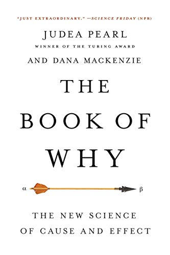

```{r xaringan-themer, include = FALSE}
library(xaringanthemer)
mono_accent(base_color = "#5E5E5E") #3E8A83?
options(htmltools.preserve.raw = FALSE)
```

```{r, include = FALSE}
library(tidyverse)
library(broom)
library(patchwork)
library(ggdag)
library(gt)
```

<!--
pagedown::chrome_print("~/Dropbox/Teaching/03-Simmons Courses/MATH228-Introduction to Data Science/Lecture Slides/01-Introduction/01-Introduction.html")
-->

class: center, middle, frame

# DAG Notation

---

# What is a DAG?

.center[
## Directed Acyclic Graph
]

.pull-left[

.display1[**Directed**: Each *node* has an arrow that points to another node.]

.display2[**Acyclic**: Causality runs in [one direction](https://en.wikipedia.org/wiki/One_Direction). There are no *cycles*. ]
 
.display3[**Graph**: It's a graph! (Though not the "usual" kind... 📈📉📊)]
]

--

.pull-right[

```{r simple-dag, echo=FALSE, fig.width=4.5, fig.height=3, out.width="100%", dpi = 300}
dagify(
  Y ~ T + X,
  T ~ X,
  coords = list(x = c(T = 1, Y = 3, X = 2),
                y = c(T = 1, Y = 1, X = 2))
) %>% 
  ggplot(aes(x = x, y = y, xend = xend, yend = yend)) +
  geom_dag_edges() +
  geom_dag_point(color = "grey80", size = 14) +
  geom_dag_text(color = "black", size = 5) +
  theme_dag()
```
]

---

# Acyclicness

.center[
### What is that?
]

.display2[💜 for Stats → STAT 228 → 💜 for Stats]

--

<br></br>

.center[
## But isn't that cyclic?!

(not quite)
]

<br></br>

.display3[💜 for Stats<sub>*t* - 1</sub> → STAT 228<sub>*t*</sub> → 💜 for Stats<sub>*t*</sub>]

.center[
### Two versions of the node separated by time index!
]

---

# The Causal Revolution

.left-column[
```{r, echo = FALSE}

```
]

.right-column[
```{r, echo = FALSE}
knitr::include_graphics("pearl.jpg")
```
]

---

# How to draw a DAG

.center[
## Does Treatment *T* cause *Y*?
]

### 1. List relevant variables

- *T*: **treatment**
- *Y*: **outcome**
- *X*: **covariate**

--

### 2. Connect arrows

.pull-left[
```{r, echo=FALSE, fig.width=4.5, fig.height=3, out.width="75%", dpi = 300}
dagify(
  Y ~ T + X,
  T ~ X,
  coords = list(x = c(T = 1, Y = 3, X = 2),
                y = c(T = 1, Y = 1, X = 2))
) %>% 
  ggplot(aes(x = x, y = y, xend = xend, yend = yend)) +
  geom_dag_edges() +
  geom_dag_point(color = "grey80", size = 14) +
  geom_dag_text(color = "black", size = 5) +
  theme_dag()
```
]

---

# How to draw a DAG

.center[
## Does Treatment *T* cause *Y*?
]

### 1. List relevant variables

- *T*: **treatment**
- *Y*: **outcome**
- <u>**X**</u>: **covariates** (*X*<sub>1</sub>, *X*<sub>2</sub>, *X*<sub>3</sub>)

### 2. Connect arrows

.pull-left[
```{r, echo=FALSE, fig.width=4.5, fig.height=3, out.width="75%", dpi = 300}
dagify(
  Y ~ T + X1 + X3,
  T ~ X1,
  X2 ~ T + Y,
  X3 ~ T,
  exposure = "T", 
  outcome = "Y",
  coords = list(x = c(T = 1, Y = 4, X1 = 2, X2 = 5, X3 = 2),
                y = c(T = 2, Y = 2, X1 = 3, X2 = 3, X3 = 1))
) %>% 
  ggdag_status() +
  geom_dag_edges() +
  geom_dag_point(color = "grey80", size = 14) +
  geom_dag_text(color = "black", size = 5) +
  guides(color = FALSE) +
  theme_dag()
```
]

---

# How to draw a DAG

.center[
## Does Treatment *T* cause *Y*?
]

### 3. Determine which variables to measure/control for

```{r, eval = FALSE}
model1 = lm(Y ~ T + X1, data = ...)
tidy(model1)
```

<br></br>

This depends on your **research question**!

- (and a little bit of *story-telling*)

---

# DAG Notation

.pull-left[
```{r, echo=FALSE, fig.width=4.5, fig.height=3, out.width="100%", dpi = 300}
dagify(
  Y ~ T + X,
  T ~ X,
  coords = list(x = c(T = 1, Y = 3, X = 2),
                y = c(T = 1, Y = 1, X = 2))
) %>% 
  ggplot(aes(x = x, y = y, xend = xend, yend = yend)) +
  geom_dag_edges() +
  geom_dag_point(color = "grey80", size = 14) +
  geom_dag_text(color = "black", size = 5) +
  theme_dag()
```
]

.pull-right[
.display1[**Nodes** (circles) represent *random variables*.]

.display2[**Arrows** represent a *causal effect* between the two variables.]

- .display3[Direction of arrow] → .display3[Direction of causality]
]

--

<br></br>

From [Causal Inference: The Mixtape](https://mixtape.scunning.com/ch2.html):

> A DAG is supposed to be a theoretical representation of the state-of-the-art knowledge about the phenomena you’re studying.

---

# DAG Example

.center[
## Does college education increase earnings?
]

### 1. List relevant variables

.center[
## Education (treatment, T) → Earnings (outcome, Y)
]

--

- parental education

- family income

- **unobserved covariates**, *U* (ability, genetics, background, etc.)

---

# DAG Example

.center[
## Does college education increase earnings?
]

### 2. Connect arrows

```{r edu-earn-simple, echo=FALSE, fig.width=4.5, fig.height=3, out.width="50%", dpi = 300}
edu_earn_coords <- list(x = c(T = 2, Y = 4),
                        y = c(T = 2, Y = 2))
dagify(
  Y ~ T,
  exposure = "T",
  outcome = "Y",
  labels = c(Y = "Earnings", T = "Education"),
  coords = edu_earn_coords) %>% 
  ggdag_status() + 
  guides(color = FALSE) +
  theme_dag()
```

---

# DAG Example

.center[
## Does college education increase earnings?
]

### 2. Connect arrows

.pull-left[
```{r, echo=FALSE, fig.width=4.7, fig.height=3.5, out.width="100%", dpi = 300}
edu_earn_coords = list(x = c(T = 2, Y = 4, FI = 3, PE = 1, U = 1), 
                       y = c(T = 2, Y = 2, FI = 4, PE = 4, U = 1))

dagify(
  Y ~ T + FI,
  T ~ FI + PE + U,
  FI ~ PE,
  PE ~ U,
  exposure = "T",
  outcome = "Y",
  labels = c(Y = "Earnings", T = "Education", FI = "Family Income", 
             PE = "Parental Education", U = "Unobserved"),
  coords = edu_earn_coords) %>% 
  ggdag_status(use_labels = "label", text = FALSE) + 
  guides(color = FALSE) +
  theme_dag()
```
]

--

.pull-right[
.display2[Education → Earnings]

.display1[Education ← Family Income → Earnings]

.display3[Education ← Parental Education → Family Income → Earnings]

.display3[Education ← Unobserved → Parental Education → Family Income → Earnings]
]

---

# DAG Example

.center[
## Does college education increase earnings?
]

### 3. Determine which variables to measure/control for

--

.center[
# This requires a bit more work...
]

> **Causal identification**: A causal effect is *identified* if the association between treatment and outcome is properly isolated. 

.center[
## Close **backdoor paths** by *adjusting* for those variables!

### This satisfies the *backdoor criterion*. 
]

---

class: center, middle, frame

# Confounding

---

# Confounding

.pull-left[
```{r, echo=FALSE, fig.width=4.5, fig.height=3.5, out.width="100%", dpi = 300}
dagify(
  Y ~ T + Z,
  T ~ Z,
  coords = list(x = c(T = 1, Y = 3, Z = 2),
                y = c(T = 1, Y = 1, Z = 2))
) %>% 
  ggdag() +
  theme_dag()
```
]

.pull-right[
## Paths involving T and Y?

.display1[T → Y]: **causation**

.display2[Z → T → Y]: **chain**

.display3[T ← Z → Y]: **fork**

]

--

.display2[T ← Z → Y] is a **backdoor path**. 

*Z* is also a **confounder**, and we need to adjust/control for it in order to properly *identify* the causal pathway between *T* and *Y*. 

---

# Let's go to the opera!

**Going to the opera** is *strongly correlated* with **living longer**

- NY Times: [CLICK FOR ARTICLE](https://www.nytimes.com/2019/12/22/us/arts-health-effects-ucl-study.html?smtyp=cur&smid=tw-nythealth)

.pull-left[
```{r, echo = FALSE, dpi = 250}
knitr::include_graphics("dag_theater_money.png")
```
]

.pull-right[
**Common cause**: Money 🤑🤑🤑

1. Those who *attend the opera* differ from those who *do not attend the opera* in (at least) one fundamental way. 

2. **Confounding**!
]

---

# Let's go to the opera!

**Going to the opera** is *strongly correlated* with **living longer**

- NY Times: [CLICK FOR ARTICLE](https://www.nytimes.com/2019/12/22/us/arts-health-effects-ucl-study.html?smtyp=cur&smid=tw-nythealth)

.pull-left[
```{r, echo = FALSE, dpi = 250}
knitr::include_graphics("dag_theater_money.png")
```
]

.pull-right[
## Paths between T and Y?

### 1. Attended opera → Life span

### 2. Attended opera ← $$ → Life span

- *Money* is a **confounder**
]

---

# Closing Back-Door Paths

.center[
```{r, echo = FALSE, dpi = 250}

```
]

<br></br>

.center[
## Close the door by adjusting for money
]

---

# Closing Back-Door Paths

.pull-left[
```{r, echo = FALSE, dpi = 250}

```
]

.pull-right[
We want to compare individuals as if they had similar amounts of **money**. 

- Remove any *differences* in individuals that are *predicted* by money. 

## Hold money constant!
]

---

# Adjusting for Confounders

.center[
## Include the terms in a regression model. 
]

$$\widehat{LifeSpan} = \hat{\beta}_{0}+\hat{\beta}_{1}(OperaAttendance) + \hat{\beta}_{2}(Income)$$

### Other ways:

.center[
## Matching

## Subclassification

## Inverse Probability Weighting

(and more!)
]

---

# ONLY Adjust for Confounders!

In the **opera** example, the .display1[causal effect] of interest is .display2[Attended opera → Life span]. 

- In order to **isolate** this causal effect, make sure your DAG contains *everything* that is **relevant to the causal effect of interest**!

--

For instance, there are a *bunch* of things that might **cause** .display2[opera attendance]. 

- enjoyment of opera, location, type of job (received tickets as a perk?), vacation time, *unobserved* stuff

👆But these variables have **no causal effect** on the outcome of life span! They don't have to be included in the DAG

--

Derive **valid** .display1[causal] conclusions by building a .display1[causal] DAG

- Any variable that either **directly** or *indirectly* .display1[causally] affects *at least two* variables already included in the DAG should be included. 

---

# Connection to Exchangeability

Ignorability/Exchangeability/Unconfoundedness holds if...

$$ [Y(1), Y(0)] \perp T$$

> The treatment has been assigned to individuals *independent* of their potential outcomes. Treatment assignment has **nothing to do** with potential benefits of the treatment. 

--

- All individuals have the **same probability** of receiving **treatment**. 

- $E[Y(1)]-E[Y(0)] = E[Y\mid T=1] - E[Y\mid T=0]$

--

.pull-left[
```{r, echo=FALSE, fig.width=4.5, fig.height=3, out.width="100%", dpi = 300}
dagify(
  Y ~ T + X,
  coords = list(x = c(T = 1, Y = 3, X = 2),
                y = c(T = 1, Y = 1, X = 2))
) %>% 
  ggplot(aes(x = x, y = y, xend = xend, yend = yend)) +
  geom_dag_edges() +
  geom_dag_point(color = "grey80", size = 14) +
  geom_dag_text(color = "black", size = 5) +
  theme_dag()
```
]

.pull-right[
.display1[No common causes of treatment and outcome]

.display2[No backdoor paths that need to be blocked]
]

---

# Conditional Exchangeability

**Conditional** exchangeability (*no unmeasured confounding*) holds if...

$$ [Y(1), Y(0)] \perp T\mid X$$

> The treatment has been assigned to individuals *independent* of their potential outcomes, *conditional on X*. 

- **Example**: The *probability* of receiving treatment varies across levels of *X* in a **conditionally randomized experiment** or an **observational study**. 

--

.pull-left[
```{r, echo=FALSE, fig.width=4.5, fig.height=3, out.width="100%", dpi = 300}
dagify(
  Y ~ T + X,
  T ~ X,
  exposure = "T", 
  outcome = "Y",
  coords = list(x = c(T = 1, Y = 3, X = 2),
                y = c(T = 1, Y = 1, X = 2))
) %>% 
  ggdag_status() +
  guides(color = FALSE) +
  theme_dag()
```
]

.pull-right[
.display1[*X* is a common cause of treatment and outcome]

.display2[Control for *X* to block the backdoor path]
]

---

class: center, middle, frame

# Colliders

## When Statistical Control Hurts

---

# What is a collider?

.pull-left[
```{r, echo=FALSE, fig.width=4.5, fig.height=3, out.width="100%", dpi = 300}
dagify(
  Y ~ T,
  X ~ T + Y,
  exposure = "T", 
  outcome = "Y",
  coords = list(x = c(T = 1, Y = 3, X = 2),
                y = c(T = 1, Y = 1, X = 2))
) %>% 
  ggdag_status() +
  guides(color = FALSE) + 
  theme_dag()
```

### Notice any differences?
]

--

.pull-right[
## T *causes* X

## Y *causes* X

.display3[*X* is a collider.]
]

.center[
## Should you control for X?
]

---

# NO!!!

.pull-left[


]

.pull-right[


]

---

# Health Problems and Work Satisfaction

From [Rohrer (2018)](https://journals.sagepub.com/doi/full/10.1177/2515245917745629):

.center[
### What are the effects of health problems on work satisfaction?
]

- longitudinal study

- some amount of follow-up time before measuring **work satisfaction**

.center[
```{r, echo=FALSE, fig.width=5.5, fig.height=4, out.width = "50%", dpi = 300}
dagify(
  Y ~ X + Z,
  C ~ X + Z,
  coords = list(x = c(X = 1, Y = 3, Z = 1, C = 2),
                y = c(X = 3, Y = 2, Z = 1, C = 2)),
  exposure = "X",
  outcome = "Y",
  labels = c("X" = "Health Problems", "Y" = "Work Satisfaction",
             "Z" = "Stressful Workplace?", "C" = "Drop Out")
) %>% 
  ggdag_status(use_labels = "label", text = FALSE) + 
  guides(color = FALSE) +
  theme_dag()
```
]

---

# Attrition Bias

> What if *only the respondents who did not* **drop out** were included in the study?

- This would be the same as **controlling for drop out**, a .display3[collider]! 😨😱😨😱

--

.pull-left[
```{r, echo=FALSE, fig.width=5.5, fig.height=4, dpi = 300}
dagify(
  Y ~ X + Z,
  C ~ X + Z,
  Z ~ X,
  coords = list(x = c(X = 1, Y = 3, Z = 1, C = 2),
                y = c(X = 3, Y = 2, Z = 1, C = 2)),
  exposure = "X",
  outcome = "Y",
  latent = "C", 
  labels = c("X" = "Health Problems", "Y" = "Work Satisfaction",
             "Z" = "Stressful Workplace?", "C" = "Drop Out")
) %>% 
  ggdag_status(use_labels = "label", text = FALSE) + 
  guides(color = FALSE) +
  theme_dag()
```
]

.pull-right[
- Respondents with **<span style="color: #f8766d;">health problems</span>** might have remained in the study if they had **<span style="color: #7f7f7f;">low-stress jobs</span>**. 
- (and vice-versa)
]

Assuming a .display3[negative relationship] between **health problems** and **work satisfaction**, this effect could be *underestimated* if we only included *those who remained in the study*. 

---

# Collider Bias

.display1[Controlling for colliders can create FAKE causal effects!]

- .display2[...and hide *real* causal effects!]

.center[
```{r, echo=FALSE, message = FALSE, fig.width=6, fig.height=3.3, out.width="75%", dpi = 300}
celtics = tibble(
  height = c(78, 71, 89, 76, 79, 82, 76, 78, 84, 75, 80, 80, 72, 75, 70, 78, 80), 
  points = c(20.3, 3.3, 3.3, 3.4, 17.5, 8.1, 2.5, 3.4, 1.9, 12.9, 23.4, 9.2, 20.4, 6.9, 3.6, 3.4, 5.2)
)
celtics %>%
  ggplot(aes(x = height, y = points)) + 
  geom_point() + 
  geom_smooth() + 
  labs(x = "Height (in inches)", y = "Points (per game)", 
       caption = "Source: Basketball Refernce", title = "2019-2020 Boston Celtics") + 
  theme_minimal()
```
]

.display1[Are points per game dependent on height?]

- Not in the NBA...

---

# Collider Bias and Sample Selection

.center[
```{r, echo=FALSE, fig.width=5, fig.height=3.5, out.width="65%", dpi = 300}
dagify(
  Y ~ X,
  Z ~ Y,
  Z ~ X,
  coords = list(x = c(X = 1, Y = 2, Z = 1),
                y = c(X = 1, Y = 2, Z = 3)),
  exposure = "X",
  outcome = "Y",
  labels = c("X" = "Height", "Y" = "Points per game",
             "Z" = "Playing in NBA")
) %>% 
  ggdag_status(use_labels = "label", text = FALSE) + 
  guides(color = FALSE) +
  theme_dag()
```
]

.center[
.display1[Height → Points per game]

.display2[Height → Playing in NBA ← Points per game]
]

---

class: center, middle, frame

# Mediators

## Overcontrol Bias

---

# What is a mediator?

.pull-left[
```{r, echo=FALSE, fig.width=4.5, fig.height=3, out.width="100%", dpi = 300}
dagify(
  Y ~ T + X,
  X ~ T,
  exposure = "T", 
  outcome = "Y",
  coords = list(x = c(T = 1, Y = 3, X = 2),
                y = c(T = 1, Y = 1, X = 2))
) %>% 
  ggdag_status() +
  guides(color = FALSE) + 
  theme_dag()
```

### Notice any differences?
]

--

.pull-right[
## T *causes* X

## X *causes* Y

.display3[*X* is a mediator.]
]

.center[
## Should you control for X?
]

---

# NO!!!

.pull-left[


]

.pull-right[


]

---

# Mediators

Controlling for a **mediator** results in .display3[overcontrol bias]!

- A **mediator** is part of the *main causal pathway* of interest. 

.pull-left[
```{r, echo=FALSE, fig.width=4.5, fig.height=3, dpi = 300}
set.seed(1)
edu_earn_coords = list(x = c(T = 1, Y = 3, FI = 2, AI = 2), 
                       y = c(T = 2, Y = 2, FI = 3, AI = 1))

dagify(
  Y ~ T + FI + AI,
  T ~ FI,
  AI ~ T,
  exposure = "T",
  outcome = "Y",
  latent = "AI",
  labels = c(Y = "Earnings", T = "Education", FI = "Family Income", 
             AI = "Adult Intelligence"),
  coords = edu_earn_coords) %>%
  ggdag_status(use_labels = "label", text = FALSE) + 
  guides(color = FALSE) +
  theme_dag()
```
]

.pull-right[
Family income is a **confounder**, so it *must* be controlled for!

- But controlling for **adult intelligence**, a .display2[mediator], blocks a genuine *causal pathway*, and could *underestimate* the causal effect between **education** and **earnings**. 

- Also: Don't control for any **descendants** (or an effect) of a mediator!
]

---

# Recap

Causal inference in **observational studies** is .display3[very hard]!

- Need to be aware of *all* potential .display1[confounders] and how to control for them. 

Satisfy the **backdoor criterion** and **isolate the causal pathway** by *successfully closing all backdoors in a DAG*. 

--

.center[
.display1[Close a backdoor by...]
]

.pull-left-3[
.center[
### Adjusting for confounders
]

```{r, echo=FALSE, fig.width=4.5, fig.height=3, out.width="100%", dpi = 300}
dagify(
  Y ~ T + X,
  T ~ X,
  latent = "X",
  coords = list(x = c(T = 1, Y = 3, X = 2),
                y = c(T = 1, Y = 1, X = 2))
) %>% 
  ggdag_status() +
  scale_color_manual(values = "dodgerblue", na.value = "black") +
  guides(color = FALSE) + 
  theme_dag()
```
]

.pull-middle-3[
.center[
### NOT adjusting for colliders
]

```{r, echo=FALSE, fig.width=4.5, fig.height=3, out.width="100%", dpi = 300}
dagify(
  Y ~ T,
  X ~ T + Y,
  latent = "X",
  coords = list(x = c(T = 1, Y = 3, X = 2),
                y = c(T = 1, Y = 1, X = 2))
) %>% 
  ggdag_status() +
  scale_color_manual(values = "red", na.value = "black") +
  guides(color = FALSE) + 
  theme_dag()
```
]

.pull-right-3[
.center[
### NOT adjusting for mediators
]

```{r, echo=FALSE, fig.width=4.5, fig.height=3, out.width="100%", dpi = 300}
dagify(
  Y ~ T + X,
  X ~ T,
  latent = "X",
  coords = list(x = c(T = 1, Y = 3, X = 2),
                y = c(T = 1, Y = 1, X = 2))
) %>% 
  ggdag_status() +
  scale_color_manual(values = "red", na.value = "black") +
  guides(color = FALSE) + 
  theme_dag()
```
]