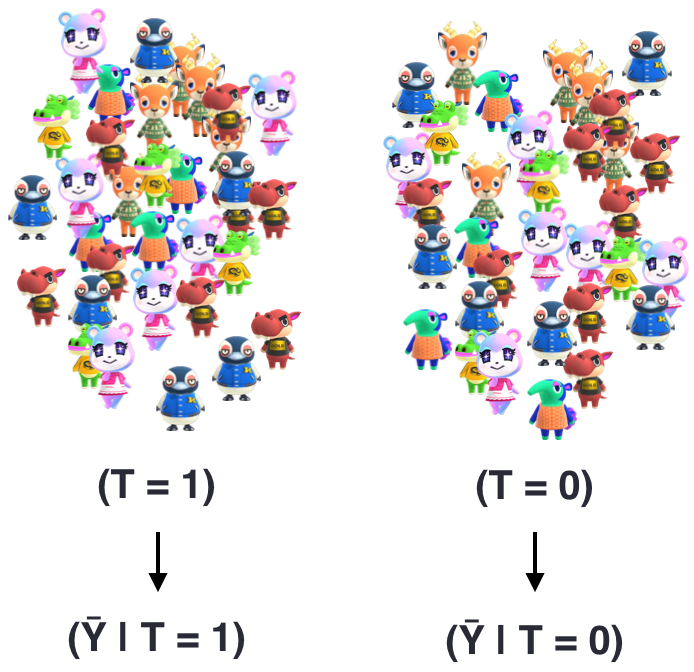
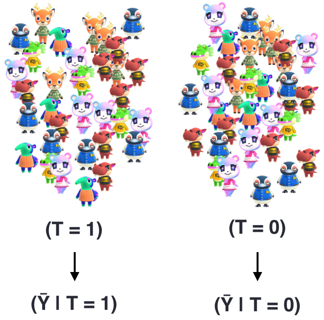
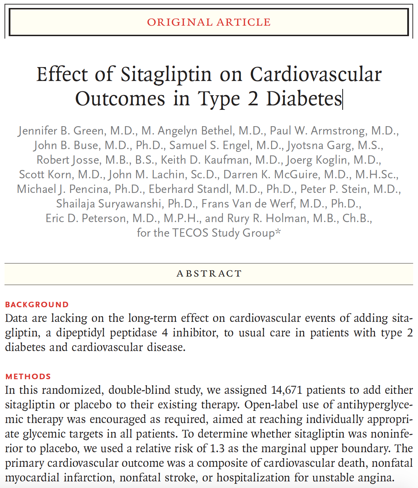
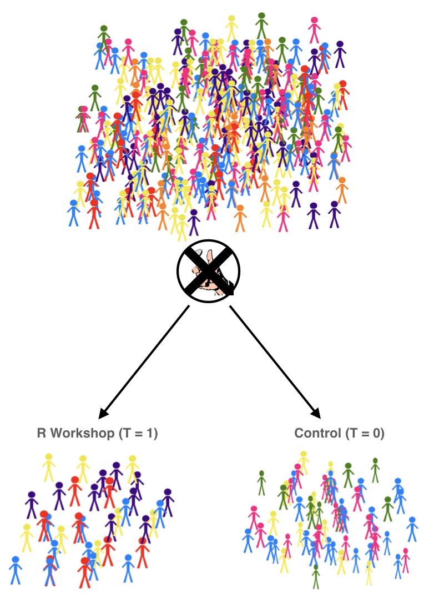
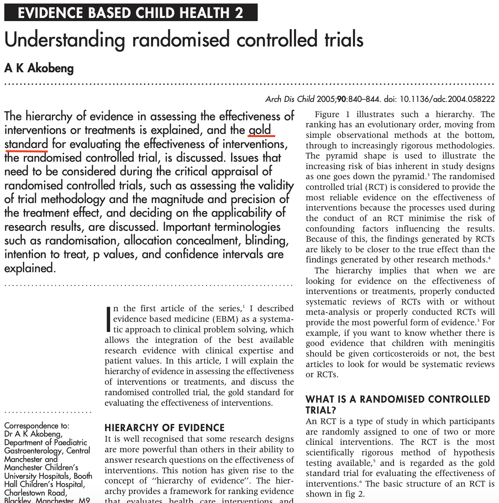
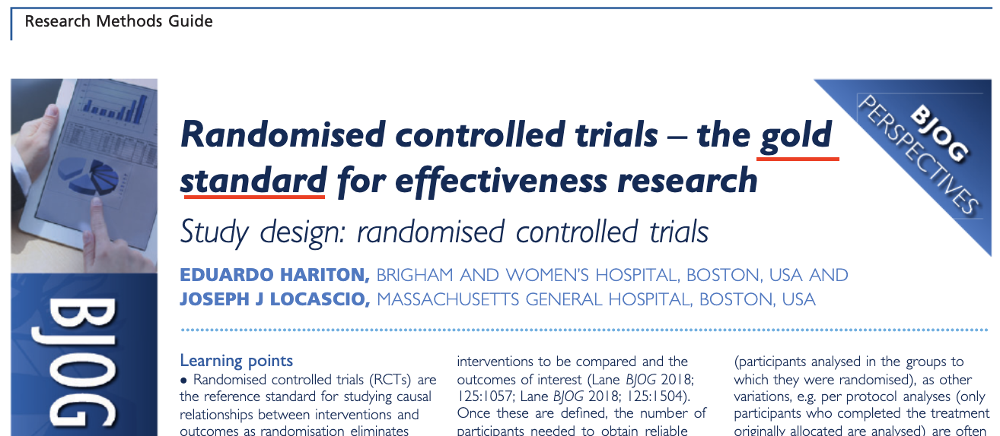
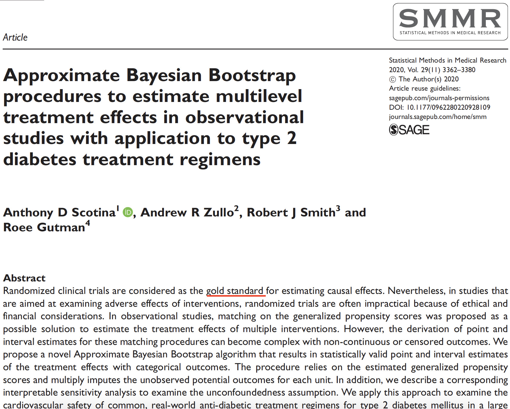
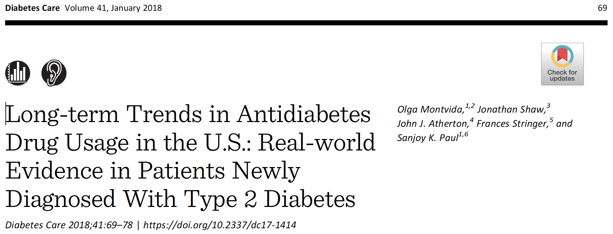

```{r xaringan-themer, include = FALSE}
library(xaringanthemer)
mono_accent(base_color = "#5E5E5E") #3E8A83?
options(htmltools.preserve.raw = FALSE)
```

```{r, include = FALSE}
library(tidyverse)
library(broom)
library(patchwork)
library(ggdag)
library(gt)
```

<!--
pagedown::chrome_print("~/Dropbox/Teaching/03-Simmons Courses/MATH228-Introduction to Data Science/Lecture Slides/01-Introduction/01-Introduction.html")
-->

class: center, middle, frame

# Randomization

---

# Why do we randomize?

.center[
## The Fundamental Problem of Causal Inference
]

.display3[Unit-level causal effect:] $$\delta_{i}=Y_{i}(1)-Y_{i}(0)$$

.center[
### BUT...
]

--

If individual *i* receives **treatment**, $$\delta_{i}=Y_{i}(1)-❓$$

<br></br>

.center[
.display1[We cannot observe this unit-level causal effect!!!]
]

---

# The magic of randomization

.center[
## If the treatment and non-treatment groups look the same, then...
]

$$
ATE=E[Y(1)]-E[Y(0)]\approx (\bar{Y}\mid T=1)-(\bar{Y}\mid T=0)
$$

.center[
### What does this look like?
]

--

.center[
```{r, echo = FALSE, dpi = 250}

```
]

---

# The magic of randomization

.center[
## If the treatment and non-treatment groups look the same, then...
]

$$
ATE=E[Y(1)]-E[Y(0)]\approx (\bar{Y}\mid T=1)-(\bar{Y}\mid T=0)
$$

.center[
### Exchangeability!
]

.center[
```{r, echo = FALSE, dpi = 250}

```
]

---

# RCTs in real life

[Click to read: Green et al., 2015](https://www.nejm.org/doi/full/10.1056/nejmoa1501352)

.center[
```{r, echo = FALSE, dpi = 300}

```
]

---

# RCTs in real life

.display1[Treatment, *T*]: *sitagliptin* vs *placebo*

- Added to existing therapy (*This is important!*)

.display2[Outcome, *Y*]: Composite of cardiovascular death, nonfatal myocardial infarction, nonfatal stroke, or hospitalization for unstable angina.

- We'll call this a *major adverse cardiovascular event* (MACE)

.display3[Randomization]: Patients were assigned in a *1:1 ratio* to receive either 100 mg daily sitagliptin or placebo. 

--

<br></br>

.center[
## Why is randomization important?!
]

---

# Randomized Controlled Trials

.pull-left[
```{r, echo = FALSE, dpi = 350, out.width = "80%"}
knitr::include_graphics("rct.png")
```
]

.pull-right[
Each patient is *different*, so we are still *missing potential outcomes*. 

- Though through **randomization** (via the coin flip), the missingness is only due to **chance**. 

.display1[The potential outcomes are **exchangeable**!]

$$[Y(1),Y(0)]\perp T$$
]

---

# RCTs in DAG Form

.pull-left[
```{r, echo=FALSE, dpi = 300}
dagify(
  Y ~ X + Z,
  coords = list(x = c(X = 1, Y = 2, Z = 1.5),
                y = c(X = 1, Y = 1, Z = 2)),
  labels = c(X = "Treatment", Y = "MACE", Z = "Age")
) %>% 
  ggplot(aes(x = x, y = y, xend = xend, yend = yend)) +
  geom_dag_edges() +
  geom_dag_point(color = "black", size = 14) +
  geom_dag_label_repel(aes(label = label),
                      nudge_x = 0, nudge_y = 0.5,
                      color = "black", 
                      fontface = "bold", lineheight = 0.95, seed = 391) +
  theme_dag()
```
]

.pull-right[
.display1[In a DAG, every arrow should reflect a causal relationship]!

- Since *treatment allocation* is done at **random**, there is no arrow pointing from the covariate (`Age`) to `Treatment`. 

- .display2[No confounding!]
]

---

class: center, middle, frame

# Analyzing RCTs

---

# How to analyze RCTs

.center[
.display1[Step 1: Check Covariate Balance]
]

.display1[**Goal of randomization**]: Helps us answer how similar the treatment groups might be with respect to **potential outcomes**! 

.center[
.display1[Exchangeability:] $[Y(0), Y(1)]\perp T$
]

--

<br></br>

.center[
.display2[Step 2: Find Average Treatment Effect]
]

- We'll usually focus on a **difference in means/proportions** in this class, but many studies use a *risk/hazard ratio*. 

---

# Fake RStats RCT

```{r, echo = FALSE, warning = FALSE}
set.seed(391)
fake_score_t <- tibble(Person = 1:400, 
                       Group = "Treatment",
                       Age = round(rnorm(400, mean = 21, sd = 1), 0),
                       Intro = sample(c("Yes", "No"), 400, replace = TRUE, prob = c(0.5, 0.5)),
                       Score = rnorm(400, mean = 90, sd = 2))
fake_score_c <- tibble(Person = 1:400, 
                       Group = "Control",
                       Age = round(rnorm(400, mean = 21, sd = 1), 0),
                       Intro = sample(c("Yes", "No"), 400, replace = TRUE, prob = c(0.5, 0.5)),
                       Score = rnorm(400, mean = 85, sd = 2))

fake_scores <- bind_rows(fake_score_t, fake_score_c) %>% 
  sample_frac(1)
```

.center[
.display2[Does an R workshop cause a STAT test score to increase among college students?]

.display1[Snapshot of sample] 👇👇👇
]

<br></br>

.center[
```{r, echo = FALSE, message = FALSE}
fake_scores %>% 
  head(6) %>% 
  mutate(across(where(is.numeric), ~round(., 2))) %>% 
  rename(`Intro Stats` = Intro) %>%
  gt::gt() %>%
  cols_align(
    align = "center", 
    columns = TRUE
  ) 
```

]

---

# Fake RStats RCT

.center[
.display2[Does an R workshop cause a STAT test score to increase among college students?]

.display1[Snapshot of DAG] 👇👇👇
]

.center[
```{r, echo=FALSE, dpi = 300, out.width = "50%"}
dagify(
  Y ~ X + Z + A,
  A ~ Z,
  coords = list(x = c(X = 1, Y = 4, Z = 2, A = 3),
                y = c(X = 1, Y = 1, Z = 2, A = 2)),
  labels = c(X = "Treatment", Y = "Score", Z = "Age", A = "Intro Stats")
) %>% 
  ggplot(aes(x = x, y = y, xend = xend, yend = yend)) +
  geom_dag_edges() +
  geom_dag_point(color = "black", size = 14) +
  geom_dag_label_repel(aes(label = label),
                      nudge_x = 0, nudge_y = 0.5,
                      color = "black", 
                      fontface = "bold", lineheight = 0.95, seed = 391) +
  theme_dag()
```
]

---

# Step 1: Check Covariate Balance

- `Age`, `Intro Stats`

As long as they are .display1[confounders]!

--

```{r, message = FALSE}
fake_scores %>%
  group_by(Group) %>%
  summarize(mean_age = mean(Age), 
            prop_intro = mean(Intro == "Yes"))
```

---

# Step 1: Check Covariate Balance

.pull-left[
```{r, balance-age, tidy=FALSE, message=FALSE, fig.show="hide", fig.dim=c(5.8, 5.2), out.width="100%", dpi = 300}
fake_scores %>%
  ggplot(aes(x = Age, 
             fill = Group)) + 
  geom_density(alpha = 0.3) +
  labs(y = "Density") +
  theme_minimal()
```
]

.pull-right[
`)
]

---

# Step 1: Check Covariate Balance

.pull-left[
```{r, balance-intro, tidy=FALSE, message=FALSE, fig.show="hide", fig.dim=c(5.8, 5.2), out.width="100%", dpi = 300}
fake_scores %>%
  mutate(intro_ind = 
           case_when(
             Intro == "Yes" ~ 1, 
             Intro == "No" ~ 0
           )) %>%
  ggplot(aes(x = Group, 
             y = intro_ind, 
             color = Group)) + 
  stat_summary(geom = "pointrange", 
               fun.data = "mean_se", 
               fun.args = list(mult=1.96)) +
  scale_y_continuous(labels = scales::percent) +
  labs(y = "Percent with Intro Stats") +
  guides(color = FALSE) +
  theme_minimal()
```
]

.pull-right[
`)
]

---

# Step 2: Find the ATE

.pull-left[

.display2[Difference in means]

```{r, message = FALSE}
fake_scores %>%
  group_by(Group) %>%
  summarize(mean_score = mean(Score))
```

```{r}
90 - 85
```
]

--

.pull-right[

.display1[Regression]

```{r}
score_model = lm(Score ~ Group, 
                 data = fake_scores)
tidy(score_model)[1:3]
```

]

---

class: center, middle, frame

# Observational Studies

---

# Fake RStats OBSERVATIONAL STUDY

Suppose instead that students could **choose** whether to participate in the R workshop. 

- ~~Everyone would.~~

- .display1[Treatment is no longer allocated at RANDOM!]

--

.center[
```{r, echo=FALSE, dpi = 300, out.width = "50%"}
dagify(
  Y ~ X + Z + A,
  X ~ Z + A,
  A ~ Z,
  coords = list(x = c(X = 1, Y = 4, Z = 2, A = 3),
                y = c(X = 1, Y = 1, Z = 2, A = 2)),
  labels = c(X = "Treatment", Y = "Score", Z = "Age", A = "Intro Stats")
) %>% 
  ggplot(aes(x = x, y = y, xend = xend, yend = yend)) +
  geom_dag_edges() +
  geom_dag_point(color = "black", size = 14) +
  geom_dag_label_repel(aes(label = label),
                      nudge_x = 0, nudge_y = 0.5,
                      color = "black", 
                      fontface = "bold", lineheight = 0.95, seed = 391) +
  theme_dag()
```
]

This is an .display2[observational study]. 

- But the goal is still to .display1[identify] and .display3[isolate] the *causal pathway* between `Treatment` and `Score`!

---

# Observational Study

.pull-left[
```{r, echo = FALSE, dpi = 350, out.width = "80%"}

```
]

--

.pull-right[
.display1[Identifiability Conditions:]

1. **Consistency**: No hidden treatment values/well-defined treatments

2. **(Conditional) Exchangeability**: The probability of receiving treatment depends *only* on measured covariates

3. **Positivity**: Each study participant could theoretically receive any value of treatment: $$0 < P(T\mid X) < 1$$
]

--

.center[
.display3[The identifiability conditions are difficult to meet in observational studies!] 
]

---

class: center, middle, frame

# The Target Trial

---

# The "Gold" Standard

.center[
### Google "rct gold standard"
]

--

- [Akobeng (2005)](https://adc.bmj.com/content/90/8/840)

.center[
```{r, echo = FALSE, dpi = 300}

```
]

---

# The "Gold" Standard

.center[
### Google "rct gold standard"
]

- [Hariton and Locascio (2018)](https://obgyn.onlinelibrary.wiley.com/doi/full/10.1111/1471-0528.15199)

.center[
```{r, echo = FALSE, dpi = 300}

```
]

---

# The "Gold" Standard

.center[
### Google "rct gold standard"
]

- [Scotina et al. (2020)](https://journals.sagepub.com/doi/full/10.1177/0962280220928109)

.center[
```{r, echo = FALSE, dpi = 300}

```
]

---

# The "Gold" Standard

RCTs are the .display4[gold standard] for evaluating the effectiveness of treatments. 

.center[
.display2[They're great, but can be challenging to design!]

.display3[and (sometimes) ~very~ unethical]
]

--

We can still make valid causal inferences with .display1[observational studies]!

- They just need to be very carefully designed. 

- .display1[That's what the rest of this class is about!]

--

.center[
.display2[Besides, RCTs aren't perfect!]
]

---

# External/Internal Validity in RCTs

- [Montvida et al. (2018)](https://care.diabetesjournals.org/content/41/1/69)

.center[
```{r, echo = FALSE, dpi = 300}

```
]

- Sometimes, experimental setting doesn't match the real world. 

--

Treatment groups are *comparable* (potential outcomes are **exchangeable**)

.center[
### But RCTs don't fix attrition!
]

Patient dropout is **bad**, especially when it is .display1[correlated with treatment]. 

---

# The Target Trial

For *many reasons*, a lot of our data and study design will be **observational**. 

- .display2[And that's okay!]

From Hernan and Robins:

> Causal inference from observational data can be viewed as an attempt to emulate the target trial.

--

<br></br>

.center[
.display3[If your study is observational, imagine the ideal randomized trial that you'd use to quantify your causal effect. ]
]
    
---

# Recap

.display2[Randomized controlled trials (RCTs) are great!]

If they're **designed properly**, they ensure that potential outcomes are *exchangeable* 

- (either unconditionally or conditional on covariates)

- They're the .display4[GoLd StAnDaRd]...

--

.display1[But RCTs can often be unfeasible!]

And/or **unethical**, **expensive**, etc.

- But hope is not lost!

--

.display3[Observational studies can also be useful!]

We just need to be *very careful* with both their **design** and **analysis**. 

- Attempting to emulate a **target trial** will help in specifying the *causal question* and the *analysis plan*. 