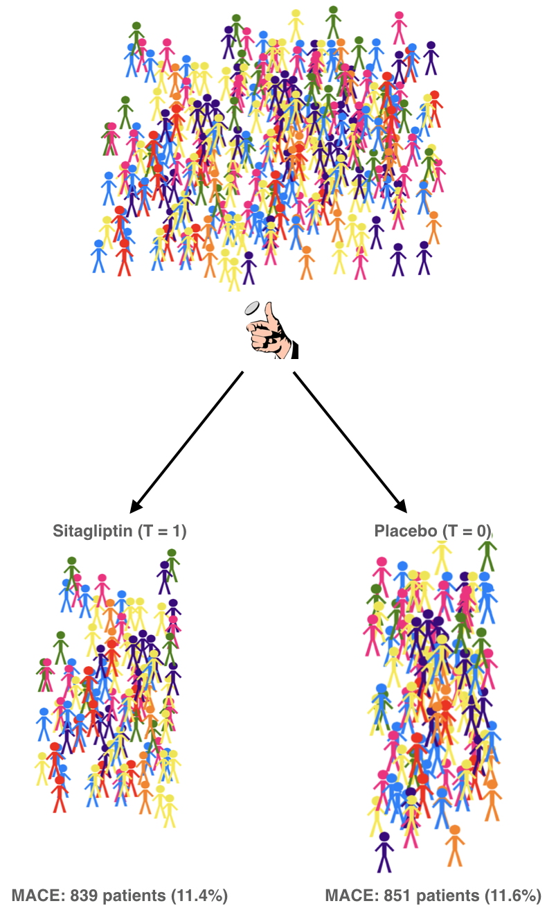
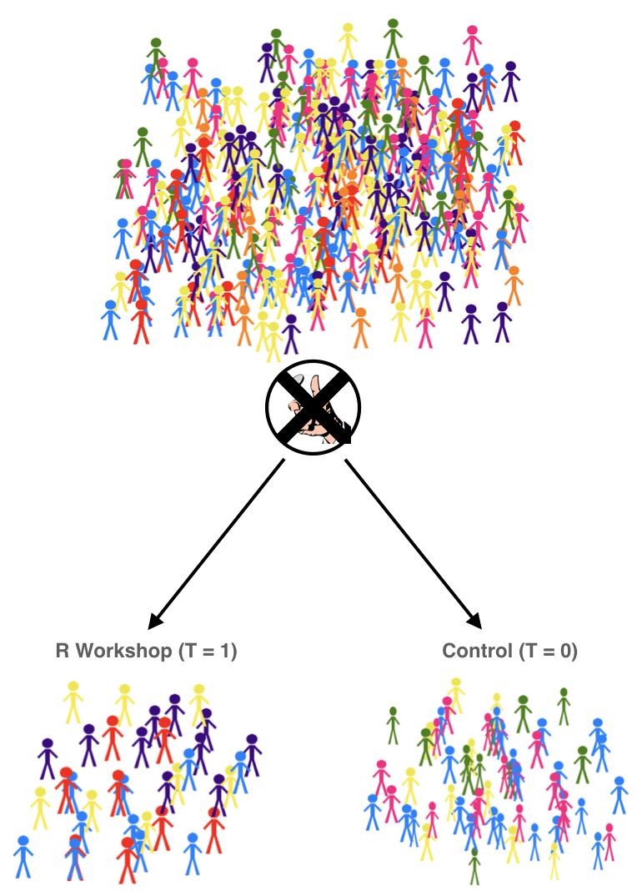

```{r xaringan-themer, include = FALSE}
library(xaringanthemer)
mono_accent(base_color = "#5E5E5E") #3E8A83?
options(htmltools.preserve.raw = FALSE)
```

```{r, include = FALSE}
library(tidyverse)
library(broom)
library(ggdag)
library(gt)
library(reactable)
```

<!--
pagedown::chrome_print("~/Dropbox/Teaching/03-Simmons Courses/MATH228-Introduction to Data Science/Lecture Slides/01-Introduction/01-Introduction.html")
-->

class: center, middle, frame

# Why match?

---

# Recap: RCTs

.pull-left[
```{r, echo = FALSE, dpi = 350, out.width = "80%"}

```
]

.pull-right[
.display1[The potential outcomes are **exchangeable**!]

$$[Y(1),Y(0)]\perp T$$
Though RCTs can be .display2[infeasible] for a number of reasons. 

- .display3[Money] 🤑🤑🤑
- .display3[Ethics] 😇
- .display3[Logistics] 📆
- .display3[Restricted Population] 🚫
]

---

# Recap: Observational Studies

.pull-left[
```{r, echo = FALSE, dpi = 350, out.width = "80%"}

```
]

.pull-right[
The causal pathway between **treatment** and **outcome** is no longer .display1[identifiable]!

- There exist .display2[confounders] that have associations with *both* the treatment and outcome. 

- .display3[Treatment is not allocated at RANDOM!]
]

---

# RCT vs Observational Studies

.pull-left[
.center[
### Randomized Controlled Trial

```{r, echo=FALSE, dpi = 300, out.width = "100%"}
dagify(
  Y ~ X + A,
  coords = list(x = c(X = 1, Y = 3, A = 2),
                y = c(X = 1, Y = 1, A = 2)),
  labels = c(X = "Treatment", Y = "Score", A = "Age")
) %>% 
  ggplot(aes(x = x, y = y, xend = xend, yend = yend)) +
  geom_dag_edges() +
  geom_dag_point(color = "black", size = 14) +
  geom_dag_label_repel(aes(label = label),
                      nudge_x = 0, nudge_y = 0.5,
                      color = "black", 
                      fontface = "bold", lineheight = 0.95, seed = 391) +
  theme_dag()
```
]
]

.pull-right[
.center[
### Observational Study

```{r, echo=FALSE, dpi = 300, out.width = "100%"}
dagify(
  Y ~ X + A,
  X ~ A,
  coords = list(x = c(X = 1, Y = 3, A = 2),
                y = c(X = 1, Y = 1, A = 2)),
  labels = c(X = "Treatment", Y = "Score", A = "Age")
) %>% 
  ggplot(aes(x = x, y = y, xend = xend, yend = yend)) +
  geom_dag_edges() +
  geom_dag_point(color = "black", size = 14) +
  geom_dag_label_repel(aes(label = label),
                      nudge_x = 0, nudge_y = 0.5,
                      color = "black", 
                      fontface = "bold", lineheight = 0.95, seed = 391) +
  theme_dag()
```
]
]

---

# R Workshop Observational Study

```{r, echo = FALSE, warning = FALSE}
set.seed(391)
fake_score_t <- tibble(Person = 1:10, 
                       Group = "Treatment",
                       Age = round(c(19, 22, 21, 20, 24, 27, 30, 26, 32, 23), 0),
                       Score = round(c(rnorm(5, mean = 85, sd = 3),
                                       rnorm(5, mean = 95, sd = 3)), 0))
fake_score_c <- tibble(Person = 11:30, 
                       Group = "Control",
                       Age = round(c(19, 22, 25, 27, 32, 20, 30, 21, 24, 26, 
                                     26, 24, 37, 45, 50, 48, 32, 23, 39, 36), 0),
                       Score = round(c(rnorm(10, mean = 83, sd = 3), 
                                       rnorm(10, mean = 93, sd = 3)), 0))

fake_scores <- bind_rows(fake_score_t, fake_score_c) %>% 
  sample_frac(1)
```

.center[
.display2[Does an R workshop cause a STAT test score to increase among employees at a tech company?]

.display1[Snapshot of sample] 👇👇👇
]

.center[
```{r, echo = FALSE, message = FALSE}
fake_scores %>% 
  group_by(Group) %>%
  slice_min(Person, n = 5) %>%
  ungroup() %>%
  gt::gt() %>%
  cols_align(
    align = "center", 
    columns = TRUE
  ) 
```

]

---

# R Workshop Observational Study

.center[
.display2[Does an R workshop cause a STAT test score to increase among employees at a tech company?]

.display1[Snapshot of sample] 👇👇👇
]

.center[
```{r, echo = FALSE, message = FALSE}
fake_scores %>% 
  group_by(Group) %>%
  slice_min(Person, n = 5) %>%
  ungroup() %>%
  rename(Y = Score) %>%
  mutate(`Y(1)` = c("?", "?", "?", "?", "?", "85", "83", "86", "82", "82"), 
         `Y(0)` = c("85", "82", "85", "86", "83", "?", "?", "?", "?", "?"), 
         Effect = c("?", "?", "?", "?", "?", "?", "?", "?", "?", "?")) %>%
  gt::gt() %>%
  cols_align(
    align = "center", 
    columns = TRUE
  ) %>%
  tab_style(
    style = list(
      cell_text(color = "black", weight = "bold"), 
      cell_fill(color = "hotpink", alpha = 0.2)
      ),
    locations = cells_body(
      columns = vars(`Y(1)`),
      rows =`Y(1)` == "?") 
  ) %>%
  tab_style(
    style = list(
      cell_text(color = "black", weight = "bold"), 
      cell_fill(color = "dodgerblue", alpha = 0.2)
      ),
    locations = cells_body(
      columns = vars(`Y(1)`),
      rows =`Y(1)` != "?") 
  ) %>%
  tab_style(
    style = list(
      cell_text(color = "black", weight = "bold"), 
      cell_fill(color = "hotpink", alpha = 0.2)
      ),
    locations = cells_body(
      columns = vars(`Y(0)`),
      rows =`Y(0)` == "?") 
  ) %>%
  tab_style(
    style = list(
      cell_text(color = "black", weight = "bold"), 
      cell_fill(color = "dodgerblue", alpha = 0.2)
      ),
    locations = cells_body(
      columns = vars(`Y(0)`),
      rows =`Y(0)` != "?") 
  )
```

]

---

# R Workshop Observational Study

.center-small[
```{r, echo = FALSE}
fake_scores %>%
  group_by(Group) %>%
  arrange(Person) %>%
  ungroup() %>%
  reactable(showPagination = TRUE, groupBy = "Group", 
            columns = list(
              Age = colDef(aggregate = "mean"), 
              Score = colDef(aggregate = "mean")
            ))
```
]

--

.pull-left[
```{r, message = FALSE}
fake_scores %>%
  group_by(Group) %>%
  summarize(mean_score = mean(Score))
```

```{r}
88.1 - 89.0
```

.center[
😳😳😳
]
]

--

.pull-right[
```{r, echo = FALSE, message=FALSE, fig.dim=c(5.8, 5.2), out.width="100%", dpi = 300}
fake_scores %>%
  ggplot(aes(x = Age, 
             fill = Group)) + 
  geom_density(alpha = 0.3) +
  labs(y = "Density") +
  theme_minimal()
```
]

---

# Is Age confounding?

.pull-left[
```{r, message = FALSE}
fake_scores %>%
  group_by(Group) %>%
  summarize(mean_age = mean(Age))
```
]

.pull-right[
```{r, echo = FALSE, message=FALSE, fig.dim=c(5.8, 5.2), out.width="100%", dpi = 300}
fake_scores %>%
  ggplot(aes(x = Age, y = Score)) + 
  geom_point() +
  geom_smooth() + 
  theme_minimal()
```
]

--

.center[
.display2[Age seems to be associated with both treatment and score.]
]

---

# Where we stand

1. .display1[We have missing *potential outcomes* and therefore cannot obtain unit-level treatment effects.]

--

2. .display2[*Age* is clearly confounding; it is associated with (i) whether an individual participates in the R Workshop, and (ii) the STAT score (outcome). ]

3. .display3[There is *some overlap* among *age* in both treatment groups. ]

--

<br></br>

We still cannot magically go back in time and generate those missing potential outcomes! 😞

.display1[But...]

- What if we *imputed* the missing potential outcomes by *conditioning on age*? 🤔

---

class: center, middle, frame

# Exact Matching

---

# How does it work?

.display2[Exact matching] works by filling in missing potential outcomes for each **treated individual** using a **control individual** that is "closest" to the treated individual for some *X* confounder(s). 

--

.pull-left[
```{r, echo = FALSE, message = FALSE}
fake_scores %>% 
  filter(Group == "Treatment") %>%
  arrange(Person) %>%
  gt::gt() %>%
  cols_align(
    align = "center", 
    columns = TRUE
  ) %>%
  tab_style(
    style = list(
      cell_text(color = "black", weight = "bold"), 
      cell_fill(color = "hotpink", alpha = 0.2)
      ),
    locations = cells_body(
      columns = vars(Score)
  )) %>%
  tab_style(
    style = list(
      cell_fill(color = "chartreuse", alpha = 0.2)
      ),
    locations = cells_body(
      columns = vars(Age)
  ))
```
]

--

.pull-right[
```{r, echo = FALSE, message = FALSE}
tibble(Person = c("11", "12", "18", "16", "19, 22", "14", "17", "20, 21", "15", "28"), 
       Group = rep("Control", 10), 
       Age = c(19, 22, 21, 20, 24, 27, 30, 26, 32, 23), 
       Score = c(85, 82, 85, 86, 93, 86, 84, 87, 83, 94)) %>%
  gt::gt() %>%
  cols_align(
    align = "center", 
    columns = TRUE
  ) %>%
  tab_style(
    style = list(
      cell_text(color = "black", weight = "bold"), 
      cell_fill(color = "dodgerblue", alpha = 0.2)
      ),
    locations = cells_body(
      columns = vars(Score)
  )) %>%
  tab_style(
    style = list(
      cell_fill(color = "chartreuse", alpha = 0.2)
      ),
    locations = cells_body(
      columns = vars(Age)
  ))
```
]

---

# Covariate Balance

Let's see how the distribution of `age` looks in the **matched** sample:

.center[
```{r, echo = FALSE, dpi = 300, out.width = "60%"}
matched_sample = tibble(Group = c(rep("Treatment", 10), rep("Control", 10)), 
                        Age = c(19, 22, 21, 20, 24, 27, 30, 26, 32, 23, 
                                19, 22, 21, 20, 24, 27, 30, 26, 32, 23)) 
matched_sample %>%
  ggplot(aes(x = Age, fill = Group)) + 
  geom_density(alpha = 0.3) +
  labs(y = "Density") +
  facet_wrap( ~ Group) + 
  theme_minimal() +
  theme(legend.position = "none")
```
]

---

# How does it work?

.center[
```{r, echo = FALSE, message = FALSE}
fake_scores %>% 
  filter(Group == "Treatment") %>%
  arrange(Person) %>%
  rename(Y = Score) %>%
  mutate(`Y(1)` = Y, 
         `Y(0)` = c(85, 82, 85, 86, 93, 86, 84, 87, 83, 94), 
         Effect = `Y(1)` - `Y(0)`) %>%
  gt::gt() %>%
  cols_align(
    align = "center", 
    columns = TRUE
  ) %>%
  tab_style(
    style = list(
      cell_text(color = "black", weight = "bold"), 
      cell_fill(color = "hotpink", alpha = 0.2)
      ),
    locations = cells_body(
      columns = vars(`Y(0)`)) 
  ) %>%
  tab_style(
    style = list(
      cell_text(color = "black", weight = "bold"), 
      cell_fill(color = "dodgerblue", alpha = 0.2)
      ),
    locations = cells_body(
      columns = vars(`Y(1)`)) 
  ) %>%
  tab_style(
    style = list(
      cell_text(color = "black", weight = "bold"), 
      cell_fill(color = "chartreuse", alpha = 0.2)
      ),
    locations = cells_body(
      columns = vars(Effect)) 
  )
```

# ATT (estimated) = 1.6 😎😎😎
]

---

# Some Notes

We just performed .display2[exact matching] to 

- (i) impute missing potential outcomes and 
- (ii) generate an *estimate* of the **ATT** (average treatment effect **on the treated**)

--

Remember, the *treated* individuals still have only one **observed** outcome!. 

- We *imputed* each $Y(0)$ by using the **observed** outcomes of *control* individuals with the **EXACT** same `age` as their match in the treatment group. 

--

By matching on the *confounder* `age`, we have achieved **exact** *covariate balance* on `age`. 

- Conditional on `age`, the two groups are **exchangeable**: $$[Y(1), Y(0)]\perp T\mid X$$

---

# Technical Details

We just generated a .display2[matching estimator] of the ATT. 

A *simple* matching estimator is given by: $$\widehat{ATT}=\frac{1}{n_{t}}\sum_{T_{i}=1}(Y_{i}-Y_{j(i)})$$

- $Y_{j(i)}$ is the *j*th individual matched to the *i*th individual based on the specified matching criteria (i.e., **exact matching**). 

--

Since $n_{t}$ is the *sample size of the treatment group*, $\widehat{ATT}$ is just the .display1[difference in means] between...

- the observed outcomes *in the treatment group*, and 
- the imputed *missing potential outcomes*, $Y(0)$, from the *control group*

--

.pull-left[
```{r, echo = FALSE, message = FALSE}
fake_scores %>% 
  filter(Group == "Treatment") %>%
  arrange(Person) %>%
  slice(1) %>%
  gt::gt() %>%
  cols_align(
    align = "center", 
    columns = TRUE
  ) %>%
  tab_style(
    style = list(
      cell_text(color = "black", weight = "bold"), 
      cell_fill(color = "hotpink", alpha = 0.2)
      ),
    locations = cells_body(
      columns = vars(Score)
  )) %>%
  tab_style(
    style = list(
      cell_fill(color = "chartreuse", alpha = 0.2)
      ),
    locations = cells_body(
      columns = vars(Age)
  ))
```

.center[
*Y*<sub>i</sub> = *Y*<sub>1</sub> = 84
]
]

.pull-right[
```{r, echo = FALSE, message = FALSE}
tibble(Person = c("11", "12", "18", "16", "19, 22", "14", "17", "20, 21", "15", "28"), 
       Group = rep("Control", 10), 
       Age = c(19, 22, 21, 20, 24, 27, 30, 26, 32, 23), 
       Score = c(85, 82, 85, 86, 93, 86, 84, 87, 83, 94)) %>%
  slice(1) %>%
  gt::gt() %>%
  cols_align(
    align = "center", 
    columns = TRUE
  ) %>%
  tab_style(
    style = list(
      cell_text(color = "black", weight = "bold"), 
      cell_fill(color = "dodgerblue", alpha = 0.2)
      ),
    locations = cells_body(
      columns = vars(Score)
  )) %>%
  tab_style(
    style = list(
      cell_fill(color = "chartreuse", alpha = 0.2)
      ),
    locations = cells_body(
      columns = vars(Age)
  ))
```

.center[
*Y*<sub>j(i)</sub> = *Y*<sub>11(1)</sub> = 85
]
]

---

# More than one match

But what if a treated individual has .display1[more than one] "closest" match from the control group?

.pull-left[
```{r, echo = FALSE, message = FALSE}
fake_scores %>% 
  filter(Group == "Treatment") %>%
  arrange(Person) %>%
  slice(5) %>%
  gt::gt() %>%
  cols_align(
    align = "center", 
    columns = TRUE
  ) %>%
  tab_style(
    style = list(
      cell_text(color = "black", weight = "bold"), 
      cell_fill(color = "hotpink", alpha = 0.2)
      ),
    locations = cells_body(
      columns = vars(Score)
  )) %>%
  tab_style(
    style = list(
      cell_fill(color = "chartreuse", alpha = 0.2)
      ),
    locations = cells_body(
      columns = vars(Age)
  ))
```
]

.pull-right[
```{r, echo = FALSE, message = FALSE}
fake_scores %>% 
  filter(Group == "Control") %>%
  arrange(Person) %>%
  slice(9, 12) %>% # Persons 19 and 22
  gt::gt() %>%
  cols_align(
    align = "center", 
    columns = TRUE
  ) %>%
  tab_style(
    style = list(
      cell_text(color = "black", weight = "bold"), 
      cell_fill(color = "hotpink", alpha = 0.2)
      ),
    locations = cells_body(
      columns = vars(Score)
  )) %>%
  tab_style(
    style = list(
      cell_fill(color = "chartreuse", alpha = 0.2)
      ),
    locations = cells_body(
      columns = vars(Age)
  ))
```
]

--

.pull-right[
.display2[Take the *average* of the outcomes for the "closest" matches! 👇]

```{r, echo = FALSE, message = FALSE}
tibble(Person = c("11", "12", "18", "16", "19, 22", "14", "17", "20, 21", "15", "28"), 
       Group = rep("Control", 10), 
       Age = c(19, 22, 21, 20, 24, 27, 30, 26, 32, 23), 
       Score = c(85, 82, 85, 86, 93, 86, 84, 87, 83, 94)) %>%
  slice(5) %>%
  gt::gt() %>%
  cols_align(
    align = "center", 
    columns = TRUE
  ) %>%
  tab_style(
    style = list(
      cell_text(color = "black", weight = "bold"), 
      cell_fill(color = "dodgerblue", alpha = 0.2)
      ),
    locations = cells_body(
      columns = vars(Score)
  )) %>%
  tab_style(
    style = list(
      cell_fill(color = "chartreuse", alpha = 0.2)
      ),
    locations = cells_body(
      columns = vars(Age)
  ))
```

]

---

# More than one match

But what if a treated individual has .display1[more than one] "closest" match from the control group?

.pull-left[
```{r, echo = FALSE, message = FALSE}
fake_scores %>% 
  filter(Group == "Treatment") %>%
  arrange(Person) %>%
  slice(5) %>%
  gt::gt() %>%
  cols_align(
    align = "center", 
    columns = TRUE
  ) %>%
  tab_style(
    style = list(
      cell_text(color = "black", weight = "bold"), 
      cell_fill(color = "hotpink", alpha = 0.2)
      ),
    locations = cells_body(
      columns = vars(Score)
  )) %>%
  tab_style(
    style = list(
      cell_fill(color = "chartreuse", alpha = 0.2)
      ),
    locations = cells_body(
      columns = vars(Age)
  ))
```
]

.pull-right[
```{r, echo = FALSE, message = FALSE}
fake_scores %>% 
  filter(Group == "Control") %>%
  arrange(Person) %>%
  slice(9, 12) %>% # Persons 19 and 22
  gt::gt() %>%
  cols_align(
    align = "center", 
    columns = TRUE
  ) %>%
  tab_style(
    style = list(
      cell_text(color = "black", weight = "bold"), 
      cell_fill(color = "hotpink", alpha = 0.2)
      ),
    locations = cells_body(
      columns = vars(Score)
  )) %>%
  tab_style(
    style = list(
      cell_fill(color = "chartreuse", alpha = 0.2)
      ),
    locations = cells_body(
      columns = vars(Age)
  ))
```
]

In this case, the .display2[matching estimator] is given by: $$\widehat{ATT}=\frac{1}{n_{t}}\sum_{T_{i}=1}\left(Y_{i}-\left[\frac{1}{M}\sum_{m=1}^{M}Y_{j_{m}(i)}\right]\right)$$

This looks like .display3[*a lot*]...

- But the $\frac{1}{M}\sum_{m=1}^{M}Y_{j_{m}(i)}$ portion is just the *average* of the *M* closest matches to individual *i*. 
    - For the particular match given above, $M=2$. There are *two* **exact** matches for Person 5. 
    
---

# Recap

We used .display1[exact matching] to create a .display2[matching estimator] to estimate the .display3[ATT] in an *observational study* comparing two treatment groups. 

- In the (fake) study of effects of an R Workshop on a STAT score among tech company employees, `age` was a **confounder**. 

- The two treatment groups were *different* (on `age`) in ways that were likely directly related to their potential outcomes. 

--

By **assuming** that treatment assignment was *random*, .display2[conditional on age], then matching on `age` will generate a *matched sample* that has .display1[exchangeable] potential outcomes. 

- In the matched sample, the .display1[R Workshop] and .display3[Control] groups were **balanced** on `age`. 

--

We performed .display1[exact matching], so individuals are matched *only if* their covariate values are EQUAL. 

- What if covariate values are *close*, or there are *many* covariates? 🤔

---

class: center, middle, frame

# Approximate Matching

---

# Limitations of Exact Matching

**Exact matching** can break down when we are matching on a *large* number of covariates. 

- It's much less likely for two individuals to be exactly the same on (for example) 10 characteristics, compared to one!

🤔👉 In this case, how can we determine .display1["closeness"] between two individuals to be matched?

--

.pull-left[
```{r, echo = FALSE, message = FALSE}
fake_scores %>% 
  filter(Group == "Treatment") %>%
  arrange(Person) %>%
  slice(5) %>%
  gt::gt() %>%
  cols_align(
    align = "center", 
    columns = TRUE
  ) %>%
  tab_style(
    style = list(
      cell_text(color = "black", weight = "bold"), 
      cell_fill(color = "hotpink", alpha = 0.2)
      ),
    locations = cells_body(
      columns = vars(Score)
  )) %>%
  tab_style(
    style = list(
      cell_fill(color = "chartreuse", alpha = 0.2)
      ),
    locations = cells_body(
      columns = vars(Age)
  ))
```
]

.pull-right[
```{r, echo = FALSE, message = FALSE}
fake_scores %>% 
  filter(Group == "Control") %>%
  arrange(Person) %>%
  slice(3) %>% # Person 13
  gt::gt() %>%
  cols_align(
    align = "center", 
    columns = TRUE
  ) %>%
  tab_style(
    style = list(
      cell_text(color = "black", weight = "bold"), 
      cell_fill(color = "hotpink", alpha = 0.2)
      ),
    locations = cells_body(
      columns = vars(Score)
  )) %>%
  tab_style(
    style = list(
      cell_fill(color = "chartreuse", alpha = 0.2)
      ),
    locations = cells_body(
      columns = vars(Age)
  ))
```
]

<br></br>

.center[
### "Distance" = 25 - 24 = 1
]

---

# Limitations of Exact Matching

**Exact matching** can break down when we are matching on a *large* number of covariates. 

- It's much less likely for two individuals to be exactly the same on (for example) 10 characteristics, compared to one!

🤔👉 In this case, how can we determine .display1["closeness"] between two individuals to be matched?

```{r, echo = FALSE, message = FALSE}
library(scales)
set.seed(391)
n_people <- 1000
r_workshop_scores <- tibble(
  id = 1:n_people, 
  education = round(rescale(rnorm(n_people, mean = 5, sd = 2), to = c(1, 10)), 0), 
  age = round(rnorm(n_people, 40, 5), 0),
  income_base = rbeta(1000, shape1 = 1, shape2 = 5) *100 + 50
) %>%
  mutate(income = rescale(round(income_base + education*7 + age*1 + rnorm(n_people, mean = 0, sd = 1), 2), 
                          to = c(75, 250)),
         intro_stats_score = 1*education + 0.25*income + 0.1*age + rnorm(n_people, mean = 0, sd = 1),
         intro_stats = rbinom(n_people, 1, 
                              rescale(intro_stats_score, to = c(0.05, 0.95))),
         r_workshop_score = (-0.075*income) + (-0.01*education) + (-0.75*intro_stats) + (-0.5*age) + rnorm(n_people, mean = 0, sd = 1), 
         r_workshop_prob = rescale(r_workshop_score, to = c(0.05, 0.95)),
         r_workshop = rbinom(n_people, 1, r_workshop_prob)) %>%
  mutate(score_base = (5*r_workshop) + (0.005*income) + (0.5*education) + (2*intro_stats) + (0.01*age) + rnorm(n_people, mean = 0, sd = 1),
         score = round(rescale(score_base, to = c(75, 100))), 0) %>%
  select(id, r_workshop, intro_stats, education, income, age, score)

set.seed(391)
r_workshop_scores %>%
  rename(ID = id, `R Workshop` = r_workshop, 
         `Intro Stats` = intro_stats, Education = education, 
         Income = income, Age = age, Score = score) %>%
  sample_n(5) %>%
  gt::gt() %>%
  cols_align(
    align = "center", 
    columns = TRUE
  ) %>%
  tab_style(
    style = list(
      cell_text(color = "black", weight = "bold"), 
      cell_fill(color = "hotpink", alpha = 0.2)
      ),
    locations = cells_body(
      columns = vars(Score)
  )) %>%
  tab_style(
    style = list(
      cell_fill(color = "dodgerblue", alpha = 0.2)
      ),
    locations = cells_body(
      columns = vars(`R Workshop`)
  ))
```

.center[
### What is the "distance" now?
]

---

# Nearest-Neighbor Covariate Matching

In .display2[nearest-neighbor matching], we find *untreated* observations that are similar (i.e., **very close**) to *treated* observations based on .display1[confounders]. 

- Can use a .display3[DAG] to map out possible confounders!

--

There are a lot of fairly technical ways to measure "distance" between **vectors** of covariates. 

- .display1[Euclidean Distance]: $$||X_{i}-X_{j}||=\sqrt{(X_{i}-X_{j})'(X_{i}-X_{j})}$$

- .display2[Mahalanobis Distance]: $$\sqrt{(X_{i}-X_{j})'\boldsymbol\Sigma^{-1}(X_{i}-X_{j})}$$

.center[
🚨🚨🚨 .display3[Don't worry, R will do all of this for us!]
]

---

# MatchIt R package

```{r}
library(MatchIt)
match_model = matchit(r_workshop ~ education + income + age + intro_stats, 
                       data = r_workshop_scores, 
                       method = "nearest",
                       distance = "mahalanobis", 
                       replace = TRUE)
summary(match_model)$sum.all[, 1:4]
```

--

```{r}
summary(match_model)$sum.matched[, 1:4]
```

```{r}
matched_data = match.data(match_model)
```

---

# Finding the Matching Estimator

Once we have the .display2[matched dataset], we could plug this into an `lm()` to see what the ATT is!

```{r}
model_matched_data = lm(score ~ r_workshop, data = matched_data)
tidy(model_matched_data)
```

--

Note that, by .display1[matching on the confounders], we have closed all .display3[backdoor paths] between those confounders and the *treatment*. 

- This means we *only* need to control for the treatment in `lm()`.

---

# Recap

.display2[Matching] is one way we can control for imbalances among confounders in different treatment groups. 

- Remember, we need .display2[conditional exchangeability] in the potential outcomes in order to estimate causal effects! $$[Y(1), Y(0)]\perp T\mid X$$

--

There are *many* types of matching algorithms. For example...

- .display1[exact matching] 
- .display3[nearest-neighbor matching]

--
    
These depend on pre-specified .display2[distance measures]. For example...

- .display1[Simple difference between covariate value]
- .display2[Euclidean or Mahalanobis distance]
- .display3[Propensity scores] (next week!)