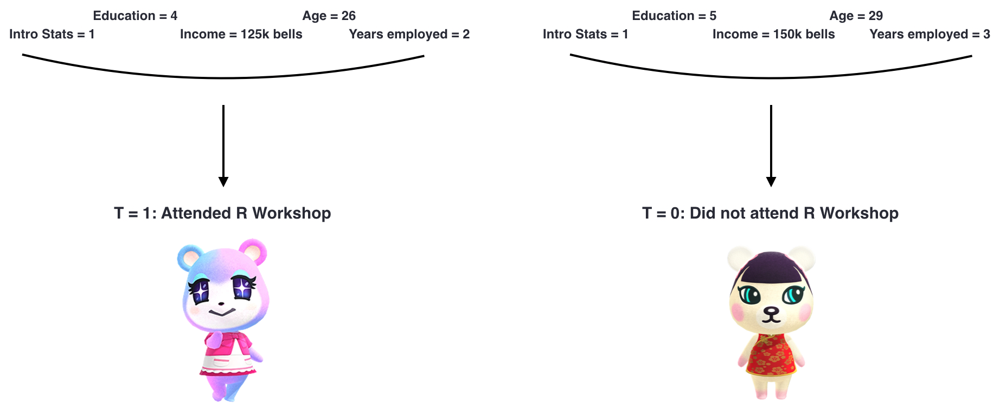
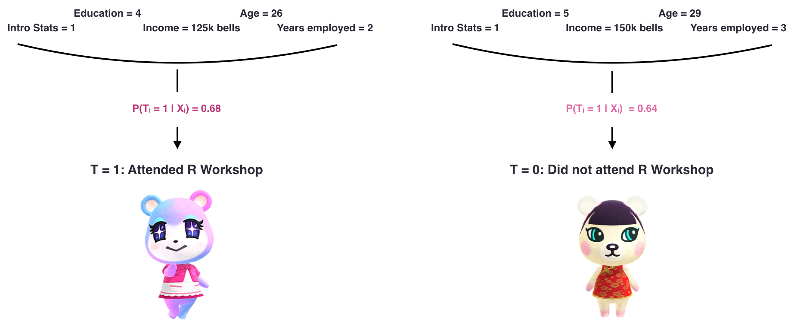
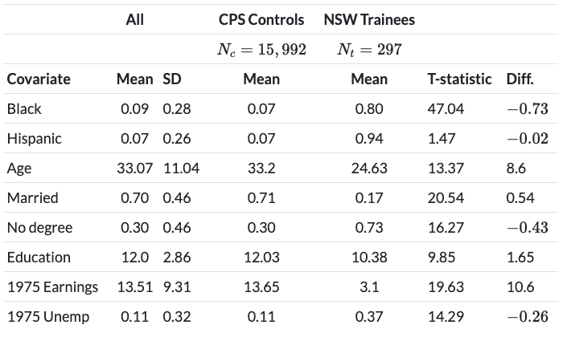

```{r xaringan-themer, include = FALSE}
library(xaringanthemer)
mono_accent(base_color = "#5E5E5E") #3E8A83?
options(htmltools.preserve.raw = FALSE)
```

```{r, echo = FALSE}
knitr::opts_chunk$set(
  message = FALSE, warning = FALSE
)
```

```{r, include = FALSE}
library(tidyverse)
library(broom)
library(ggdag)
library(gt)
library(reactable)
library(countdown)
```

<!--
pagedown::chrome_print("~/Dropbox/Teaching/03-Simmons Courses/MATH228-Introduction to Data Science/Lecture Slides/01-Introduction/01-Introduction.html")
-->

class: center, middle, frame

# Logistic Regression Crash Course

---

# What is logistic regression?

.display1[*Take yourself back to your first course on regression modeling.*]

.center[
🕔🚀🕢️
]

.display2[In the *shared Google doc*, jot down what you remember about logistic regression!]

- .display3[Have you used it before?]

- When is it used?

- How does it differ from linear regression?

- What was still confusing after your first exposure to logistic regression?

```{r echo = FALSE}
countdown(minutes = 3)
```

---

# Needed Packages

```{r}
library(tidyverse)
library(ISLR) # For 'Default' dataset
library(broom) # For tidying model output
library(rsample) # For data splitting
library(yardstick) # For model performance metrics
```

```{r}
Default %>% 
  sample_n(5)
```

> .display1[Goal]: Model the **probability** of *defaulting* on credit card debt

---

# Why logistic regression?

Suppose that we are trying to predict the medical condition of a patient admitted to the ER, based on their symptoms: $$Y=\begin{cases}1,\ \text{if stroke};\\ 2,\ \text{if myocardial infarction};\\ 3,\ \text{epileptic seizure}\end{cases}$$

--

.display2[Why linear regression won't work]

Coding would imply...

- an **ordering** on the outcomes (e.g., 3 is higher than 2)

- difference between **stroke** and **myocardial infarction** is *equal* to the difference between **myocardial infarction** and **epileptic seizure**. 

Plus, you can *change the code order* and get a completely different result!

---

# Why logistic regression?

.pull-left[
```{r, eval = FALSE}
Default %>%
  mutate(prob = ifelse(default == "Yes", 1, 0)) %>%
  ggplot(aes(x = balance, y = prob)) + 
  geom_point(alpha = 0.2) + 
  geom_smooth(method = "lm") + 
  labs(x = "Balance", 
       y = "Probability of Default", 
       title = "Linear Regression Fit") +
  theme_minimal()
```
]

.pull-right[
```{r, fig.dim=c(4.8, 4.2), echo = FALSE, dpi = 300}
Default %>%
  mutate(prob = ifelse(default == "Yes", 1, 0)) %>%
  ggplot(aes(x = balance, y = prob)) + 
  geom_point(alpha = 0.2) + 
  geom_smooth(method = "lm") + 
  labs(x = "Balance", 
       y = "Probability of Default", 
       title = "Linear Regression Fit") +
  theme_minimal()
```
]

> What is the **predicted** probability of default for a person with a credit card balance of 0?

---

# Why logistic regression?

.pull-left[
```{r, eval = FALSE}
Default %>%
  mutate(prob = ifelse(default == "Yes", 1, 0)) %>%
  ggplot(aes(x = balance, y = prob)) + 
  geom_point(alpha = 0.2) + 
  geom_smooth(method = "glm", 
              method.args = list(family = binomial(link = "logit"))) + 
  labs(x = "Balance", 
       y = "Probability of Default", 
       title = "Logistic Regression Fit") +
  theme_minimal()
```
]

.pull-right[
```{r, fig.dim=c(4.8, 4.2), echo = FALSE, dpi = 300}
Default %>%
  mutate(prob = ifelse(default == "Yes", 1, 0)) %>%
  ggplot(aes(x = balance, y = prob)) + 
  geom_point(alpha = 0.2) + 
  geom_smooth(method = "glm", 
              method.args = list(family = binomial(link = "logit"))) + 
  labs(x = "Balance", 
       y = "Probability of Default", 
       title = "Logistic Regression Fit") +
  theme_minimal()
```
]

> What is the **predicted** probability of default for a person with a credit card balance of 0?

---

# What is logistic regression?

The outcome variable in **logistic regression** must be *binary*. 

- Similar to **linear regression**, the explanatary variables in the model help explain the variation in the **likelihood** of the *binary* outcome, *Y*. 

--

Except in **logistic regression**, we model $p = P(Y\mid X)$ (probability of *Y*, *given* the explanatory variables) using a function that gives values *strictly* between 0 and 1 for all values of *X*: $$p= \frac{e^{\beta_{0}+\beta_{1}X}}{1+e^{\beta_{0}+\beta_{1}X}}$$

--

We can rearrange things into a more familiar format: $$\log\left(\frac{p}{1-p}\right)=\beta_{0}+\beta_{1}X$$

- $\log\left(\frac{p}{1-p}\right)$ is known as the **log odds**. 

---

# Data Splitting

Okay, enough of the technical stuff, let's *fit* a **logistic regression** model!

- Y = `default`
- X = `balance`

First, let's split our data intro a **training** (75%) and **testing** (25%) set, so we can see how well our model performs on data it hasn't seen before:

```{r}
set.seed(391) # CHANGE TO YOUR FAVORITE NUMBER!
default_split = initial_split(Default, strata = default)

default_train = training(default_split)
default_test = testing(default_split)
```

- We'll fit/train our model on the **training data**, `default_train`. 

---

# Simple Logistic Regression

Using the **training data**, we'll fit a logistic regression model in order to predict the *probability* of defaulting, based on each customer's average `balance`. 

```{r}
model_1 = glm(default ~ balance, family = "binomial", data = default_train)
```

- **Note**: We must use `family = "binomial"` in logistic regression, so R knows to fit a logistic regression model rather than some other type of **generalized linear model**. 

--

.pull-left[
- The estimated coefficients from `model_1` correspond to this **probability curve** 👉
]

.pull-right[
```{r, fig.dim=c(4.8, 4.2), echo = FALSE, dpi = 300, out.width = "90%"}
default_train %>%
  mutate(prob = ifelse(default == "Yes", 1, 0)) %>%
  ggplot(aes(x = balance, y = prob)) + 
  geom_point(alpha = 0.2) + 
  geom_smooth(method = "glm", 
              method.args = list(family = binomial(link = "logit"))) + 
  labs(x = "Balance", 
       y = "Probability of Default", 
       title = "Logistic Regression Fit") +
  theme_minimal()
```
]

---

# Logistic Regression Output

The coefficients from a **logistic regression** model are interpreted different than the ones from a *linear regression* model. 

```{r}
model_1 = glm(default ~ balance, family = "binomial", data = default_train)
tidy(model_1)
```

The coefficient for `balance`, $\hat{\beta}_{1}=0.00544$, represents the change in *log odds* as `balance` increases by one dollar. 

> What does this mean?!

---

# Odds Ratios

Make it simpler by *unlogging* the coefficients and converting them to **odds ratios**:

```{r}
exp(coef(model_1))
```

- Odds ratios are *centered at 1*; values *above* 1 mean that there's an **increase** in the likelihood of the outcome. 

--

The *odds ratio* for `balance`, 1.005452, is 0.005452 *above* 1. 

- **What this means**: For every one dollar increase in credit card balance, a person is 0.5452% *more likely* to default on their debt. 

--

You can generate *odds ratios* automatically in `tidy()` by adding `exponentiate = TRUE`:

```{r}
tidy(model_1, exponentiate = TRUE)
```

---

# Predicted Probabilities

The **main reason** we are even covering *logistic regression* in STAT 391 is because we'll need the **predicted probabilities** from models like these very soon!

Once we estimate the *coefficients*, we can compute the predicted *probability* of default for *any* credit card balance. 

- Just plug them into this mess of an equation (using credit card balance of 1,000 dollars): $$\hat{p}=\frac{e^{-10.5+0.00544\times 1000}}{1+e^{-10.5+0.00544\times 1000}}=0.00631$$

- A person with a credit card balance of 1,000 is **predicted** to have a default probability of 0.63%. 

--

Or, just use `predict()` (with `type = "response"`):

```{r}
predict(model_1, newdata = data.frame(balance = 1000), type = "response")
```

---

# Model Performance

Remember the **testing set** we've been holding back this entire time?

- Now it's time to use it to see how well our model performs!

First, I'll create a *somewhat crude* `pred_class` variable, by classifying those with *predicted probabilities* > 0.5 as having defaulted. 

--

```{r}
default_test_pred = default_test %>%
  mutate(pred_prob = predict(model_1, newdata = default_test, type = "response"), 
         pred_class = ifelse(pred_prob > 0.5, "Yes", "No")) 
```

--

Next, we'll obtain the model's **accuracy** by calculating the proportion of *true positives* and *true negatives*. 

- Basically, this tells us how many *predicted classifications* (`pred_class`) match the observed (`default`). 

--

```{r}
default_test_pred %>% 
  accuracy(truth = default, estimate = factor(pred_class)) 
```

---

# Multiple Logistic Regression

.display1[Now it's your turn!]

In your **breakout rooms**, each person fit a *multiple logistic regression model* with the following:

- *Y*: `default`
- *X*<sub>1</sub>: `balance`
- *X*<sub>2</sub>: `student`
- *X*<sub>3</sub>: `income`

Before you **split your data**, run the following code to *downsample*:

```{r}
default_down = Default %>%
  group_by(default) %>%
  sample_n(300) %>%
  ungroup()

# To get started...
set.seed(391) # CHANGE THIS NUMBER!
default_down_split = initial_split(default_down, strata = default)
```

Obtain your model's `accuracy`. Why do you think we *downsampled* the data?

---

# Looking Ahead

There are other types of models for predicting a **binary** outcome. 

- .display1[Classification and Regression Trees (CART)]
- .display2[Random Forests]
- .display3[Neural Networks]

But **logistic regression** is probably the most common method. 

--

<br></br>

We'll use this modeling technique to calculate **propensity scores**. 

- The *probability* of receiving treatment, conditional on *X*: $P(T = 1\mid X)$

- The **propensity score** will be used *extensively* in the **matching** and **weighting** methods coming up next!

---

class: center, middle, frame

# Propensity Score Matching

---

# Recap

We can use .display2[matching] algorithms to pair up **similar observations** and make the .display1[conditional exchangeability] assumption. 

- .display1[conditional exchangeability] = .display3[no unmeasured confounding]!

If two (or more) observations **in different treatment groups** are *pretty much* **identical** on a set of covariates, then we can say that the treatment assignment was essentially **random**. 

```{r, echo = FALSE, warning = FALSE}
set.seed(391)
fake_score_t <- tibble(Person = 1:10, 
                       Group = "Treatment",
                       Age = round(c(19, 22, 21, 20, 24, 27, 30, 26, 32, 23), 0),
                       Score = round(c(rnorm(5, mean = 85, sd = 3),
                                       rnorm(5, mean = 95, sd = 3)), 0))
fake_score_c <- tibble(Person = 11:30, 
                       Group = "Control",
                       Age = round(c(19, 22, 25, 27, 32, 20, 30, 21, 24, 26, 
                                     26, 24, 37, 45, 50, 48, 32, 23, 39, 36), 0),
                       Score = round(c(rnorm(10, mean = 83, sd = 3), 
                                       rnorm(10, mean = 93, sd = 3)), 0))

fake_scores <- bind_rows(fake_score_t, fake_score_c) %>% 
  sample_frac(1)
```

--

.pull-left[
```{r, echo = FALSE, message = FALSE}
fake_scores %>% 
  group_by(Group) %>%
  slice_min(Person, n = 3) %>%
  ungroup() %>%
  gt::gt() %>%
  cols_align(
    align = "center", 
    columns = TRUE
  ) 
```
]

.pull-right[
.display2[Some considerations]

- How many matches *per observation*?

- Matching *with* or *without* replacement?

- **Distance measure** (exact, Mahalanobis distance, something else??)
]

---

# Propensity Scores

.pull-left[
**Propensity score methods** were originally developed in the mid 1970s by Donald Rubin. 

- Very popular in the **medical sciences**

- One such method is .display2[propensity score matching]

]

.pull-right[

```{r, echo = FALSE}
knitr::include_graphics("rubin.jpg")
```

> [**Donald Rubin**](https://statistics.fas.harvard.edu/people/donald-b-rubin)

]

.center[
## What are propensity scores?
]

---

# Propensity Scores

> For each individual $i$, the **propensity score** is the probability of receiving treatment, conditional on the confounding variables: $$p(X_{i})=P(T_{i} = 1\mid X_{i})$$

We can estimate these from (for example) **logistic regression**:

```{r, eval = FALSE}
log_model = glm(treat ~ x1 + x2, family = "binomial", data = data)
prop_scores = fitted(log_model)
```

--

.display3[Key Assumptions]

1. **Conditional Exchangeability**: $[Y(0), Y(1)]\perp T\mid X$ 👉 *No unmeasured confounding*

2. **Common Support**: $0<p(X_{i})<1$ 👉 For any probability, there must be units in both the treatment group and the control group. 

---

# Matching on the Propensity Score

Instead of matching on **a bunch of covariates** at once... 

- We could match on the **single** propensity score for each individual!

<br></br>

.center[
```{r, echo = FALSE, dpi = 250}

```
]

---

# Matching on the Propensity Score

Instead of matching on **a bunch of covariates** at once...

- We could match on the **single** propensity score for each individual!

<br></br>

.center[
```{r, echo = FALSE, dpi = 250}

```
]

---

# Example: NSW Job Training Program

The National Supported Work (NSW) Demonstration was a federally and privately funded randomized experiment done in the 1970s to estimate the effects of a job training program for disadvantaged workers.

- Participants were randomly selected to participate in the training program. Both groups were followed up to determine the effect of the training on wages.

🚨🚨 .display2[Difference in means]: &#36;900 to &#36;1800, depending on the sample used

- (a **causal effect**, due to *randomization*)

--

<br></br>

**Lalonde** ([1986](http://business.baylor.edu/scott_cunningham/teaching/lalonde-1986.pdf)) used *observational* control data and a variety of econometric models to investigate whether non-experimental methods would yield similar results to the **randomized experiment**. 

🚨🚨 .display1[Difference in means]: Between &#36;8,067 and &#36;15,578, **but in the opposite direction**!

- One reason? **Selection bias**, which violates the **exchangeability** assumption. 

---

# Example: NSW Job Training Program

Dehejia and Wahba ([1999](https://www.uh.edu/~adkugler/Dehejia&Wahba_JASA.pdf)) used **propensity score matching** to analyze the data. 

- It turns out that the *observational* control group used by **Lalonde** ([1986](http://business.baylor.edu/scott_cunningham/teaching/lalonde-1986.pdf)) was *very dissimilar* to the *experimental* group that participated in the program. 

--

- By restricting the *observational* control group to those that were **similar** to the treated group, they could replicate the original NSW results.

🚨🚨 .display3[Difference in means]: Between &#36;1,473 and &#36;1,691 (in the "correct" direction")

---

# Observational Data (a deeper look)

Figure 5.12 from *Causal Inference: The Mixtape* 👇

.center[
```{r, echo = FALSE, dpi = 150}

```
]

**NSW Trainees** are...

- More likely to be Black, Hispanic, younger, married, unemployed, etc.

--

The two groups are **not** .display2[exchangeable] on *observed covariates*!

---

# Propensity Score Matching (in R)

.center[
```{r, echo = FALSE, dpi = 300}

```
]

```{r}
library(MatchIt)
library(tidyverse)
library(broom)

# View(lalonde)
# ?lalonde
```

---

# Lalonde Exercise

- .display1[Treatment variable]: `treat`

- .display3[Outcome variable]: `re78` (income in 1978, in USD)

**In your breakout rooms**, conduct an **exploratory analysis** and compare the two treatment groups (`treat = 1` and `treat = 0`). 

How do these two groups compare on the following variables:

- `age`
- `race`
- `re74`

---

# Estimating the Propensity Score

.display2[Propensity Score]: $p(X_{i})=P(T_{i}=1\mid X_{i})$

- .display1[In words]: The *probability* of joining the NSW training program, *conditional* on **observed** covariates (`race`, `age`, `re74`, etc.)

```{r}
pscore_model = glm(treat ~ age + educ + race + 
                     married + nodegree + re74 + re75, 
                   family = "binomial", 
                   data = lalonde)
lalonde$pscore = fitted(pscore_model)
```

--

```{r}
set.seed(228)
lalonde %>%
  select(age, race, re74, treat, pscore) %>%
  sample_n(5)
```

---

# Common Support?

```{r, dpi = 300, fig.dim=c(5.8, 5.2), out.width = "60%"}
ggplot(lalonde, aes(x = pscore, fill = factor(treat))) + 
  geom_density(alpha = 0.3) + 
  labs(x = "Propensity Score", fill = "Treatment Group") + 
  theme_minimal()
```

---

# Propensity Score Matching (in R)

```{r}
lalonde_pscore_match = matchit(treat ~ age + educ + race + 
                                 married + nodegree + re74 + re75,
                               data = lalonde, 
                               method = "nearest", 
                               distance = "logit", #<<
                               replace = TRUE)

lalonde_pscore_match
```

```{r, eval = FALSE}
summary(lalonde_pscore_match)
```

---

# Matching Diagnostics

All **185** *treated* participants were **matched** with .display2[similar] *untreated* participants. 

- 🚨🚨 "Similar" is based on values of the **propensity** score!

```{r, eval = FALSE}
# Check individual matches
lalonde_pscore_match$match.matrix

# Check propensity scores
lalonde_pscore_match$distance
```

--

We matched .display1[with replacement], so an *untreated* participant could've been matched to **more than one** *treated* participant. 

- **80** *untreated* participants were used as matches.

- **349** *untreated* participants were *discarded*.

---

# Matching Diagnostics

**Love Plot** 👇

```{r, dpi = 300, out.width = "40%"}
plot(summary(lalonde_pscore_match))
```

--

- [Rubin, 2001](https://link.springer.com/article/10.1023/A:1020363010465) advised for *absolute standardized mean differences* of $<0.25$ for matching adjustment to be "trustworthy."

---

# Estimation

First, generate the **matched dataset**:

```{r}
lalonde_matched = match.data(lalonde_pscore_match)
```

Second, fit a **regression model**. 

- Use `weights = weights` to account for *multiply-matched* observations (i.e., prevent them from being overcounted). 

```{r}
lalonde_matched_reg = lm(re78 ~ treat, 
                         weights = weights, 
                         data = lalonde_matched)
tidy(lalonde_matched_reg)
```

--

.display2[ATT] (Average Treatment Effect on Treated): &#36;1,968

- Among participants in the NSW program, the program *caused* a &#36;1,968 increase in salary. 

---

# Practice

Repeat the above example, but use .display2[covariate matching]. 

- Set `distance = "mahalanobis"` in `matchit(...)`. 

Does the ATT change? What does the **Love plot** suggest about the *covariate balance* after matching?

```{r, echo = FALSE, results = "hide"}
lalonde_cov_match = matchit(treat ~ age + educ + race + 
                              married + nodegree + re74 + re75,
                            data = lalonde, 
                            method = "nearest", 
                            distance = "mahalanobis",
                            replace = TRUE)

plot(summary(lalonde_cov_match))

lalonde_cov_matched = match.data(lalonde_cov_match)

lalonde_cov_matched_reg = lm(re78 ~ treat, 
                             weights = weights, 
                             data = lalonde_cov_matched)
tidy(lalonde_cov_matched_reg)
```

---

# Some Technicalities

.display3[Propensity Score Theorem]: If **common support** and **conditional exchangeability** hold, then $$[Y(0), Y(1)]\perp T\mid p(X)$$

- Controlling for the **propensity score** (e.g., *matching* on it) is enough to have **exchangeability** between the *treatment* and the *potential outcomes*. 

--

This is **VERY helpful** for when there is a *large* number of covariates, because the propensity score is just a single number!

.center[
```{r, echo = FALSE, dpi = 250}

```
]

---

# Some Technicalities

.display3[Propensity Score Theorem]: If **common support** and **conditional exchangeability** hold, then $$[Y(0), Y(1)]\perp T\mid p(X)$$

.display2[In DAG Form]

```{r, echo = FALSE, dpi = 300, out.width = "50%"}
pscore_dag = dagify(Y ~ T + X, 
                     T ~ PS, 
                     PS ~ X, 
                     exposure = "T", 
                     outcome = "Y", 
                     coords = list(x = c(X = 3, Y = 5, T = 1, PS = 2), 
                                   y = c(X = 3, Y = 1, T = 1, PS = 2)))
ggdag_status(pscore_dag) + 
  theme_dag() + 
  theme(legend.position = "none")
```

---

# Summary: Propensity Score Matching

.display2[Propensity score matching] can be useful when you are otherwise matching on a *large* number of covariates. 

- The **propensity score** is a single number, $P(T_{i}=1\mid X_{i})$. 

- Can be estimated with .display3[logistic regression]

--

.display1[The general process]

1. Estimate the **propensity score**, verify **common support** assumption. 

2. Find matches for each **treated** individual.
    - Consider matching *with replacement* to potentially reduce covariate bias.
    - Could also find *more than one match* per treated individual (e.g., 2:1 matching)
    
3. Matching diagnostics: Compare means from `summary(...)`, generate **Love plot**

4. Estimate the **ATT** (e.g., with *linear regression*)

---

class: center, middle, frame

# Weighting on the Propensity Score

---

# Matching Limitations

One possible downside to matching is that you usually have to *throw away* a large chunk of your data

- Any controls who **are not matched** are *not included* in the final matched dataset!

<br></br>

```{r}
lalonde_pscore_match = matchit(treat ~ age + educ + race + 
                                 married + nodegree + re74 + re75,
                               data = lalonde, 
                               method = "nearest", 
                               distance = "logit",
                               replace = TRUE)

lalonde_pscore_match
```

---

# Inverse Probability Weighting (IPW)

We can use .display1[weighting] procedures to make some observations in the data "more important" than others. 

- An *alternative* to matching is to .display1[weight] each observation by its .display2[inverse probability] of *receiving treatment*. 

In other words, observations who are **predicted** to receive treatment but **do not** *actually* receive treatment (and vice-versa) will receive more weight. 

---

# Inverse Probability Weighting (IPW)

.display3[IPW Procedure]

1. Generate **propensity scores**

2. Convert the propensity scores into **weights**: $$w_{ATT_i}=\frac{p(X_{i})T_{i}}{p(X_{i})}+\frac{p(X_{i})(1-T_{i})}{1-p(X_{i})}$$

3. Fit a regression model including the weights (e.g., `weights = ipw_att` in `lm(...)`).

--

<br></br>

**Note**: These weights are for estimating the .display2[ATT]. There are separate (yet, similar) weights for estimating the ATE or ATU, but we'll focus on the ATT here. 

- For ATT weights, each observation in the *treated* group receives a weight of **1**. 

- We take the *treated* sample as is, and try to weight the *control* sample to *match* it. 

---

# IPW (in R)

**1.** Generate **propensity scores**

```{r}
pscore_model = glm(treat ~ age + educ + race + 
                     married + nodegree + re74 + re75, 
                   family = "binomial", 
                   data = lalonde)
lalonde$pscore = fitted(pscore_model)
```

**2.** Convert the propensity scores into **weights**

```{r}
lalonde = lalonde %>%
  mutate(ipw_att = (treat) + (pscore*(1 - treat)/(1 - pscore))) 

lalonde %>%
  select(age, race, re74, treat, pscore, ipw_att) %>%
  head()
```


```{r, eval = FALSE}
lalonde = lalonde %>%
  mutate(ipw = (treat/pscore) + ((1 - treat)/(1 - pscore))) %>%
  group_by(treat) %>%
  summarize(mean_y_hat = mean(re78*ipw))

lalonde %>%
  select(age, race, re74, treat, pscore, ipw) %>%
  head()

lalonde %>%
  summarize(att_ipw = (1/sum(treat == 1))*sum(re78*((treat - pscore)/(1 - pscore))))

lalonde %>%
  ggplot(aes(x = ipw, fill = factor(treat))) + 
  geom_density(alpha = 0.3)

# ATT weights
lalonde = lalonde %>%
  mutate(ipw_att = (treat) + (pscore*(1 - treat)/(1 - pscore)), 
         ipw = (treat/pscore) + ((1 - treat)/(1 - pscore)))

lalonde %>%
  ggplot(aes(x = ipw_att, fill = factor(treat))) + 
  geom_density(alpha = 0.3)

lm(re78 ~ treat, data = lalonde_att, weights = ipw_att)

lalonde %>%
  summarize(att_ipw = (1/sum(treat == 1))*sum(re78*((treat - pscore)/(1 - pscore))))
```

---

# Detour: Visualizing the weights

.display3[Before Weighting] 👇

```{r, echo = FALSE, dpi = 300, out.width = "60%"}
ggplot() + 
  geom_histogram(data = filter(lalonde, treat == 1), 
                 aes(x = pscore), 
                 fill = "green", alpha = 0.5) + 
  geom_histogram(data = filter(lalonde, treat == 0), 
                 aes(x = pscore, y = -..count..), 
                 fill = "blue", alpha = 0.5) + 
  labs(x = "Propensity Score", 
       title = "Treatment 1 = Green \nTreatment 0 = Blue") + 
  geom_hline(yintercept = 0, lwd = 0.5) +
  scale_y_continuous(label = abs) +
  theme_minimal()
```

---

# Detour: Visualizing the weights

.display2[After Weighting] 👇

```{r, echo = FALSE, dpi = 300, out.width = "60%"}
ggplot() + 
  geom_histogram(data = filter(lalonde, treat == 1), 
                 aes(x = pscore, weights = ipw_att), 
                 fill = "green", alpha = 0.5) + 
  geom_histogram(data = filter(lalonde, treat == 0), 
                 aes(x = pscore, y = -..count.., weights = ipw_att), 
                 fill = "blue", alpha = 0.5) + 
  labs(x = "Propensity Score", 
       title = "Treatment 1 = Green \nTreatment 0 = Blue") + 
  geom_hline(yintercept = 0, lwd = 0.5) +
  scale_y_continuous(label = abs) +
  theme_minimal()
```

---

.display1[IPW Distribution] 👇

```{r, dpi = 300, out.width = "50%"}
ggplot(lalonde, aes(x = ipw_att, fill = factor(treat))) + 
  geom_density(alpha = 0.3) + 
  labs(x = "IPW Weights", fill = "Treatment Group") + 
  theme_minimal()
```


---

# IPW (in R)

**3.** Fit a regression model including the weights

```{r}
lalonde_ipw = lm(re78 ~ treat, 
                 weights = ipw_att, 
                 data = lalonde)
tidy(lalonde_ipw)
```

--

```{r, results='hide'}
lalonde_ipw_adj = lm(re78 ~ treat + age + educ + race + 
                   married + nodegree + re74 + re75, 
                 weights = ipw_att, 
                 data = lalonde)
tidy(lalonde_ipw_adj)
```

---

# Comparing Results

The *estimated* .display2[ATT] is given in the `treat` row (**std error** in parentheses). 

```{r, echo = FALSE, results='hide'}
lalonde_naive = lm(re78 ~ treat, data = lalonde)

lalonde_pscore_match_wo = matchit(treat ~ age + educ + race + 
                                    married + nodegree + re74 + re75,
                                  data = lalonde, 
                                  method = "nearest", 
                                  distance = "logit", 
                                  replace = FALSE)

lalonde_matched_wo = match.data(lalonde_pscore_match_wo)

lalonde_psm_model_wo = lm(re78 ~ treat, data = lalonde_matched_wo)
lalonde_psm_model_wo
```


```{r, echo = FALSE}
library(modelsummary)
modelsummary(
  list(
  "Naive" = lalonde_naive, 
  "PSM w/out replacement" = lalonde_psm_model_wo, 
  "PSM w/ replacement" = lalonde_matched_reg, 
  "Covariate Matching" = lalonde_cov_matched_reg, 
  "IPW" = lalonde_ipw
  )
)
```


