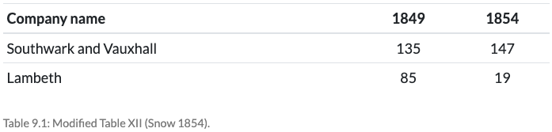

```{r xaringan-themer, include = FALSE}
library(xaringanthemer)
mono_accent(base_color = "#5E5E5E") #3E8A83?
options(htmltools.preserve.raw = FALSE)
```

```{r, echo = FALSE}
knitr::opts_chunk$set(
  message = FALSE, warning = FALSE
)
```

```{r, include = FALSE}
library(tidyverse)
library(broom)
library(ggdag)
library(knitr)
library(kableExtra)

world_happiness <- read_csv("world_happiness.csv")
```

<!--
pagedown::chrome_print("~/Dropbox/Teaching/03-Simmons Courses/MATH228-Introduction to Data Science/Lecture Slides/01-Introduction/01-Introduction.html")
-->

class: center, middle, frame

# Interaction Models

---

# World Happiness Report

First, download the 2015 World Happiness Report, via the `world_happiness.csv` dataset in the **Data** folder. 

> What is the relationship between a country's **life expectancy** and **happiness score**, and does this vary by region? Specifically, we'll look at **Latin America**. 

--

First, some **data cleaning**...

```{r}
world_happiness = world_happiness %>%
  mutate(latin_america = 
           case_when(
             region == "Latin America & Caribbean" ~ "Latin America", 
             region != "Latin America & Caribbean" ~ "Not Latin America"
           ), 
         latin_america = fct_rev(latin_america)) 
```

---

# Linear Regression

$$\large \widehat{Happiness} = \beta_{0}+\beta_{1}(\text{Life Expectancy})$$

```{r}
model1 = lm(happiness_score ~ life_expectancy, 
            data = world_happiness)
tidy(model1)
```

.display1[Life Expectancy] = .display3[numerical/continuous]

> For every one-year increase in life expectancy, there is an associated increase in happiness by 0.105 points. 

---

# Linear Regression

$$\large \widehat{Happiness} = \beta_{0}+\beta_{1}(\text{Latin America})$$

```{r}
model2 = lm(happiness_score ~ latin_america, 
            data = world_happiness)
tidy(model2)
```

.display1[Latin America] = .display3[categorical/binary]

> Being in Latin America is associated with a 0.901 point increase in happiness. 

---

# (Multiple) Linear Regression

$$\large \widehat{Happiness} = \beta_{0}+\beta_{1}(\text{Life Expectancy}) + \beta_{2}(\text{Latin America})$$

```{r}
model3 = lm(happiness_score ~ life_expectancy + latin_america, 
            data = world_happiness)
tidy(model3)
```

**Holding Latin America (TRUE/FALSE) status constant**:

> For every one-year increase in life expectancy, there is an associated increase in happiness by 0.102 points.


**Holding life expectancy constant**:

> Being in Latin America is associated with a 0.623 point increase in happiness. 

---

# One Numerical X

$$\large \widehat{Happiness} = -2.21+0.105(\text{Life Expectancy})$$

.center[
```{r, dpi = 300, fig.width=12, fig.height=5.5, echo = FALSE}
world_happiness %>%
  ggplot(aes(x = life_expectancy, y = happiness_score)) + 
  geom_point(size = 2.5) + 
  geom_smooth(method = "lm", se = FALSE) +
  labs(x = "Life Expectancy", y = "Happiness Score") +
  theme_minimal(base_size = 14)
```
]

---

# One Categorical X

$$\large \widehat{Happiness} = 5.24+0.901(\text{Latin America})$$

.center[
```{r, dpi = 300, fig.width=12, fig.height=5.5, echo = FALSE}
world_happiness %>%
  group_by(latin_america) %>%
  summarize(mean_happiness = mean(happiness_score, na.rm = TRUE)) %>%
  ggplot(aes(x = latin_america, y = mean_happiness)) + 
  geom_col(width = 0.25, alpha = 0.4) + 
  geom_point(size = 2.5) + 
  geom_line(aes(x = as.numeric(latin_america), y = mean_happiness), color = "blue", size = 1.5, linetype = "dashed") +
  labs(x = "", y = "Happiness Score") +
  theme_minimal(base_size = 14)
```
]

---

# Multiple X

$$\large \widehat{Happiness} = -2.08+0.102(\text{Life Expectancy}) + 0.623(\text{Latin America})$$

.center[
```{r, dpi = 300, fig.width=12, fig.height=5.5, echo = FALSE}
world_happiness %>%
  ggplot(aes(x = life_expectancy, y = happiness_score, color = latin_america)) + 
  geom_point(size = 3.5, alpha = 0.5) + 
  geom_abline(slope = 0.102, 
              intercept = -2.08, 
              color = "gray70", size = 1.5, linetype = "dashed") +
  geom_abline(slope = 0.102, 
              intercept = -2.08 + 0.623, 
              color = "dodgerblue", size = 1.5, linetype = "dashed") +
  scale_color_manual(values = c("gray70", "dodgerblue")) +
  labs(x = "Life Expectancy", y = "Happiness Score", 
       color = "") +
  theme_minimal(base_size = 14)
```
]

- .display2[0.102]: The **slope** of *both* lines

- .display3[0.623]: The change in **intercept** for a specific group (Latin America)

---

# Interactions

\begin{align*}
\large \widehat{Happiness} &= \beta_{0}+\beta_{1}(\text{Life Expectancy}) + \beta_{2}(\text{Latin America})\\ 
\ \ \ \ &+\beta_{3}(\text{Life Expectancy}\times\text{Latin America})
\end{align*}

```{r}
model4 = lm(happiness_score ~ life_expectancy + latin_america + 
              (life_expectancy * latin_america), 
            data = world_happiness)
tidy(model4)
```

> In **Latin America**, for every one-year increase in life expectancy, there is an associated increase in happiness by $\beta_{1}+\beta_{3}=0.102+0.0288$ points. 

---

# Interactions

\begin{align*}
\large \widehat{Happiness} &= -2.02+0.102(\text{Life Expectancy}) -1.52(\text{Latin America})\\ 
\ \ \ \ &+0.0288(\text{Life Expectancy}\times\text{Latin America})
\end{align*}

```{r, dpi = 300, fig.width=12, fig.height=5.5, echo = FALSE}
world_happiness %>%
  ggplot(aes(x = life_expectancy, y = happiness_score, color = latin_america)) + 
  geom_point(size = 3.5, alpha = 0.5) + 
  geom_abline(slope = 0.102, 
              intercept = -2.02, 
              color = "gray70", size = 1.5, linetype = "dashed") +
  geom_abline(slope = 0.102 + 0.0288, 
              intercept = -2.02 - 1.52, 
              color = "dodgerblue", size = 1.5, linetype = "dashed") +
  scale_color_manual(values = c("gray70", "dodgerblue")) +
  labs(x = "Life Expectancy", y = "Happiness Score", 
       color = "") +
  theme_minimal(base_size = 14)
```

- .display1[0.0288] (**interaction term**): The change in **slope** for a specific group (Latin America)

---

# Interactions 

\begin{align*}
\large \widehat{Happiness} &= -2.02+0.102(\text{Life Expectancy}) -1.52(\text{Latin America})\\ 
\ \ \ \ &+0.0288(\text{Life Expectancy}\times\text{Latin America})
\end{align*}

.display2[General Idea]

The .display1[0.0288] is the **additional** change that happens when you combine *life expectancy* and *Latin America* in one model. 

- There is a **life expectancy effect** (.display2[0.102]). 

- There is a **Latin America effect** (.display3[-1.52]). 

- There is *also* an additional **life expectancy effect in Latin America** (.display1[0.0288]). 

---

# Interactions

\begin{align*}
\large \widehat{Happiness} &= -2.02+0.102(\text{Life Expectancy}) -1.52(\text{Latin America})\\ 
\ \ \ \ &+0.0288(\text{Life Expectancy}\times\text{Latin America})
\end{align*}

We can break this up into **two equations**:

**1.** .display2[Latin America] (Latin America = **1**): 
\begin{align*}
\large &-2.02+0.202(\text{Life Expectancy})-1.52(1)+0.0288(\text{Life Expectancy}\times 1)\\
&\ \ \ \ = -3.54+0.2308(\text{Life Expectancy})
\end{align*}

<br></br>

**2.** .display3[Not Latin America] (Latin America = **0**):
\begin{align*}
\large &-2.02+0.202(\text{Life Expectancy})-1.52(0)+0.0288(\text{Life Expectancy}\times 0)\\
&\ \ \ \ = -2.02+0.202(\text{Life Expectancy})
\end{align*}

---

# Interactions

**1.** .display2[Latin America]: $$\widehat{Happiness}=-3.54+0.2308(\text{Life Expectancy})$$

**2.** .display3[Not Latin America]: $$\widehat{Happiness}=-2.02+0.202(\text{Life Expectancy})$$

```{r, dpi = 300, fig.width=12, fig.height=5.5, echo = FALSE, out.width = "85%"}
world_happiness %>%
  ggplot(aes(x = life_expectancy, y = happiness_score, color = latin_america)) + 
  geom_point(size = 3.5, alpha = 0.5) + 
  geom_abline(slope = 0.102, 
              intercept = -2.02, 
              color = "gray70", size = 1.5, linetype = "dashed") +
  geom_abline(slope = 0.102 + 0.0288, 
              intercept = -2.02 - 1.52, 
              color = "dodgerblue", size = 1.5, linetype = "dashed") +
  scale_color_manual(values = c("gray70", "dodgerblue")) +
  labs(x = "Life Expectancy", y = "Happiness Score", 
       color = "") +
  theme_minimal(base_size = 14)
```

---

# Code for last plot

(**If you're interested!**)

```{r, eval = FALSE}
world_happiness %>%
  ggplot(aes(x = life_expectancy, y = happiness_score, color = latin_america)) + 
  geom_point(size = 3.5, alpha = 0.5) + 
  geom_abline(slope = 0.102, 
              intercept = -2.02, 
              color = "gray70", size = 1.5, linetype = "dashed") +
  geom_abline(slope = 0.102 + 0.0288, 
              intercept = -2.02 - 1.52, 
              color = "dodgerblue", size = 1.5, linetype = "dashed") +
  scale_color_manual(values = c("gray70", "dodgerblue")) +
  labs(x = "Life Expectancy", y = "Happiness Score", 
       color = "") +
  theme_minimal(base_size = 14)
```

---

# Your turn!

Download the `fastfood_calories.csv` dataset from the **Data** folder. Filter for *only* **McDonalds** and **Burger King** data:

```{r, eval = FALSE}
fastfood_mc_bk = fastfood_calories %>%
  filter(restaurant %in% c("Mcdonalds", "Burger King"))
```

- This dataset comes from [TidyTuesday](https://github.com/rfordatascience/tidytuesday/tree/master/data/2018/2018-09-04) via *fastfoodnutrition.com*. 

.display3[In your breakout rooms...]

**1.** Fit a linear regression model predicting `calories` as a function of `cholesterol` and `restaurant`. Do **not** include an interaction term. Interpret the coefficients.

- This fits a so-called **parallel slopes model**. 

**2.** Fit the same regression model, but this time **include the interaction term**, `cholesterol*restaurant`. Interpret the coefficients, particularly the interaction term. 

**3.** Discuss which model you think is "best" in this context!

---

class: center, middle, frame

# Quasi-experiments

---

# What is a quasi-experiment?

> A research design that aims to establish a cause-and-effect relationship. 

> A quasi-experiment **does not** rely on *random assignment*!

> Treatment assignment is **"as if" random**, though (e.g., through nature, government intervention, eligibility cutoff, etc.). 

--

.display2[Advantages]

- Simpler to design than RCTs

- Improved generalizability, due to lack of laboratory setting (they are **natural experiments**)

- Groups are self-selected (maybe not intentionally, but still...)

--

.display3[Disadvantages]

- Potentially susceptible to **confounding**

- Groups might not be well-balanced

---

# John Snow's Cholera Hypothesis

Back in the 19th century, many thought cholera transmission was **airborne**. 

- There were *three* epidemics in London, but no one could figure out how cholera was spread!

--

.pull-left[
[**John Snow**](https://en.wikipedia.org/wiki/John_Snow), an English physician (not the GoT character), also thought cholera spread was airborne, *at first*. 

- Through a bunch of *anecdotal evidence*, Snow eventually hypothesized that cholera was spread by **water**, through the contaminated Thames River. 

- But he could not be completely convinced until he designed an appropriate study to *prove* this!
]

.pull-right[
```{r, echo = FALSE, dpi = 100}

```
]

---

# Snow's Quasi-experiment

Snow couldn't just **randomize** London residents to drink from the *Thames* or some other *uncontaminated water source*! But he remembered that several water companies served different areas of the city... 🧐🧐🧐

- **In 1949** one company (.display2[Lambeth]) had moved its intake pipes upstream higher in the Thames, *above the main sewage discharge point*. 

- One other company (.display3[Southwark and Vauxhall]) had not. 

- Snow collected some data and determined that the different households serviced by these companies were *similar* on observed characteristics. 

--

From *Causal Inference: The Mixtape* ([Chapter 9](https://mixtape.scunning.com/difference-in-differences.html#john-snows-cholera-hypothesis)) 👇

.center[
```{r, echo = FALSE, dpi = 150}

```
]

--

$\Delta=(19-85)-(147-135)=-78$ 👉 .display2[difference-in-differences!]

---

class: center, middle, frame

# Difference-in-Differences

---

# Raising the Minimum Wage

.center[

.display2[What happens if you raise the minimum wage?]

💰💰💰
]

--

.center[

.display1[Economic theory] 👉 .display3[Fewer jobs]

]

--

.pull-left[
The effect of the minimum wage on employment might also be tied to many **local** contextual factors!

- That's where **Card and Krueger (1994)** come in.
]

.pull-right[
```{r, echo = FALSE, dpi = 300}

```
]

--

> .display2[The Target Trial]: If you had a billion dollars, complete discretion and could run a randomized experiment, how would you test whether minimum wages increased or decreased employment?

---

# New Jersey in 1992

.display2[They raised the minimum wage!]

- .display3[&#36;4.25 → &#36;5.05]

--

<br><br>

.display1[Comparing "Before" and "After" in NJ] ⏳⌛

.center[

.display2[Average # of jobs per fast food restaurant in NJ]

.display3[NJ (before change) = 20.44]

.display3[NJ (after change) = 21.03]

]

--

<br></br>

.center[

.display1[DIFFERENCE = 21.03 - 20.44 = 0.59]

]

> Is this a **causal effect**?

---

# Pennsylvania in 1992

.display2[They **did not** raise the minimum wage!]

- .display3[&#36;4.25 → &#36;4.25]

--

<br></br>

.display1[Comparing "After" between NJ and PA] ⌛

.center[

.display2[Average # of jobs per fast food restaurant]

.display3[PA (after change) = 21.17]

.display3[NJ (after change) = 21.03]

]

--

<br></br>

.center[

.display1[DIFFERENCE = 21.03 - 21.17 = -0.14]

]

> Is this a **causal effect**?

---

# Problems

## Comparing before/after in NJ

- You're **only** looking at the **.display2[treatment group]**! ("Treatment" = *min wage 👆*)

- It's **impossible** to know if the change in # of jobs was due to the treatment, or if it just occurred *naturally*. 

--

## Comparing only treatment/control "after"

- You're **only** looking at **.display2[post-treatment values]**!

- It's **impossible** to know if change happened because of natural growth over *time*. 

---

# DD (in DAG form)

```{r, echo = FALSE, fig.width=12, fig.height=6, dpi = 300}
set.seed(391)
wage_dag = 
  dagify(outcome ~ treatment + time + nj,
         treatment ~ time + nj,
         exposure = "treatment",
         outcome = "outcome",
         coords = list(x = c(outcome = 3, treatment = 1, time = 2, nj = 2), 
                       y = c(outcome = 1, treatment = 1, time = 3, nj = 2)),
         labels = c("outcome" = "Jobs", "treatment" = "Min Wage", 
                    "time" = "Time (year)", "nj" = "NJ"))
ggdag_status(wage_dag, use_labels = "label", text = FALSE) + 
  theme_dag() + 
  theme(legend.position = "none")
```

---

# Difference-in-Differences

```{r, echo = FALSE, fig.width=12, fig.height=6, dpi = 250}
dd_labels <- tribble(
  ~Group, ~Time, ~label,
  "NJ", "Before", "A",
  "NJ", "After", "B",
  "PA", "Before", "C",
  "PA", "After", "D"
)
dd_data <- tribble(
  ~Group, ~Before, ~Intervention, ~After,
  "NJ", 20.44, 20.75, 21.00,
  "PA",   23.3, 22.2, 21.2
) %>% 
  pivot_longer(cols = !Group, names_to = "Time", values_to = "avg") %>% 
  left_join(dd_labels, by = c("Group", "Time")) %>% 
  mutate(across(c(Group, Time), ~fct_inorder(.)))
ggplot(dd_data, aes(x = Time, y = avg, color = Group, group = Group)) +
  geom_vline(xintercept = "Intervention") +
  geom_line(size = 3,
            key_glyph = draw_key_point) +
  geom_point(data = filter(dd_data, !is.na(label)), size = 6) +
  geom_text(aes(label = label), 
            fontface = "bold", size = 4, color = "white") +
  scale_color_manual(values = c("#4C81B3", "#C4689B")) +
  labs(x = NULL, y = "Average # of Jobs", color = "State") +
  ylim(20, 24) +
  scale_x_discrete(labels = c("Before" = "Feb 1992 (Before)", 
                              "Intervention" = "Intervention", 
                              "After" = "Nov 1992 (After)")) +
  theme_bw(base_size = 20)
```

--

Let $\boldsymbol\Delta$ denote a **change**. 

- $\boldsymbol\Delta$(post - pre) = **within-group difference**
    - **B - A**, **D - C**
    
---

# Difference-in-Differences

```{r, echo = FALSE, fig.width=12, fig.height=6, dpi = 250}
dd_labels <- tribble(
  ~Group, ~Time, ~label,
  "NJ", "Before", "A",
  "NJ", "After", "B",
  "PA", "Before", "C",
  "PA", "After", "D"
)
dd_data <- tribble(
  ~Group, ~Before, ~Intervention, ~After,
  "NJ", 20.44, 20.75, 21.00,
  "PA",   23.3, 22.2, 21.2
) %>% 
  pivot_longer(cols = !Group, names_to = "Time", values_to = "avg") %>% 
  left_join(dd_labels, by = c("Group", "Time")) %>% 
  mutate(across(c(Group, Time), ~fct_inorder(.)))
ggplot(dd_data, aes(x = Time, y = avg, color = Group, group = Group)) +
  geom_vline(xintercept = "Intervention") +
  geom_line(size = 3,
            key_glyph = draw_key_point) +
  geom_point(data = filter(dd_data, !is.na(label)), size = 6) +
  geom_text(aes(label = label), 
            fontface = "bold", size = 4, color = "white") +
  scale_color_manual(values = c("#4C81B3", "#C4689B")) +
  labs(x = NULL, y = "Average # of Jobs", color = "State") +
  ylim(20, 24) +
  scale_x_discrete(labels = c("Before" = "Feb 1992 (Before)", 
                              "Intervention" = "Intervention", 
                              "After" = "Nov 1992 (After)")) +
  theme_bw(base_size = 20)
```

Let $\boldsymbol\Delta$ denote a **change**. 

- $\boldsymbol\Delta$(treatment - control) = **across-group difference**
    - **A - C**, **B - D**

---

# Difference-in-Differences

```{r, echo = FALSE, fig.width=12, fig.height=6, dpi = 250}
dd_labels <- tribble(
  ~Group, ~Time, ~label,
  "NJ", "Before", "A",
  "NJ", "After", "B",
  "PA", "Before", "C",
  "PA", "After", "D"
)
dd_data <- tribble(
  ~Group, ~Before, ~Intervention, ~After,
  "NJ", 20.44, 20.75, 21.00,
  "PA",   23.3, 22.2, 21.2
) %>% 
  pivot_longer(cols = !Group, names_to = "Time", values_to = "avg") %>% 
  left_join(dd_labels, by = c("Group", "Time")) %>% 
  mutate(across(c(Group, Time), ~fct_inorder(.)))
ggplot(dd_data, aes(x = Time, y = avg, color = Group, group = Group)) +
  geom_vline(xintercept = "Intervention") +
  geom_line(size = 3,
            key_glyph = draw_key_point) +
  geom_point(data = filter(dd_data, !is.na(label)), size = 6) +
  geom_text(aes(label = label), 
            fontface = "bold", size = 4, color = "white") +
  scale_color_manual(values = c("#4C81B3", "#C4689B")) +
  labs(x = NULL, y = "Average # of Jobs", color = "State") +
  ylim(20, 24) +
  scale_x_discrete(labels = c("Before" = "Feb 1992 (Before)", 
                              "Intervention" = "Intervention", 
                              "After" = "Nov 1992 (After)")) +
  theme_bw(base_size = 20)
```

$\boldsymbol\Delta$(DD) = **(B - A) - (D - C)** *or* **(B - D) - (A - C)**

- This is an estimate of the **ATT** (*average treatment effect on the treated*)

---

# DD (in table form)

```{r, echo = FALSE, fig.width=10, fig.height=3.5, dpi = 250}
dd_labels <- tribble(
  ~Group, ~Time, ~label,
  "NJ", "Before", "A",
  "NJ", "After", "B",
  "PA", "Before", "C",
  "PA", "After", "D"
)
dd_data <- tribble(
  ~Group, ~Before, ~Intervention, ~After,
  "NJ", 20.44, 20.75, 21.00,
  "PA",   23.3, 22.2, 21.2
) %>% 
  pivot_longer(cols = !Group, names_to = "Time", values_to = "avg") %>% 
  left_join(dd_labels, by = c("Group", "Time")) %>% 
  mutate(across(c(Group, Time), ~fct_inorder(.)))
ggplot(dd_data, aes(x = Time, y = avg, color = Group, group = Group)) +
  geom_vline(xintercept = "Intervention") +
  geom_line(size = 3,
            key_glyph = draw_key_point) +
  geom_point(data = filter(dd_data, !is.na(label)), size = 6) +
  geom_text(aes(label = label), 
            fontface = "bold", size = 4, color = "white") +
  scale_color_manual(values = c("#4C81B3", "#C4689B")) +
  labs(x = NULL, y = "Average # of Jobs", color = "State") +
  ylim(20, 24) +
  scale_x_discrete(labels = c("Before" = "Feb 1992 (Before)", 
                              "Intervention" = "Intervention", 
                              "After" = "Nov 1992 (After)")) +
  theme_bw(base_size = 20)
```

```{r, echo=FALSE}
dd <- tribble(
  ~` `, ~`Pre Int (mean)`, ~`Post Int (mean)`, ~`∆ <span class='smaller'>(post − pre)</span>`,
  "Pennsylvania", "<b>23.33</b><br><span class='small'>C</small>", "<b>21.17</b><br><span class='small'>D</small>", "<b>-2.16</b><br><span class='small'>D − C</small>",
  "New Jersey", "<b>20.44</b><br><span class='small'>A</small>", "<b>21.03</b><br><span class='small'>B</small>", "<b>0.59</b><br><span class='small'>B − A</small>",
  "∆<br><span class='smaller'>(NJ − PA)</span>", "<b>-2.89</b><br><span class='small'>A - C</small>", "<b>-0.14</b><br><span class='small'>B - D</small>", "<b>DD = 2.76</b>"
)
dd %>% 
  kbl(escape = FALSE, align = "cccc") %>% 
  kable_styling(bootstrap_options = "none") %>% 
  row_spec(3, background = "#DDDDDD") %>% 
  column_spec(4, background = "#DDDDDD") %>% 
  row_spec(0, bold = TRUE, background = "#4882B4", color = "#C5E0F8") %>% 
  column_spec(1, bold = TRUE, background = "#4882B4", color = "#C5E0F8")
```

---

# Back to Interaction Models

It is **much easier** to find a *difference-in-differences* estimate with **regression**.

- The **difference-in-differences** estimate is just the .display2[interaction term]!

- Plus, we can control for *other* possible **confounders**. 

--

.display1[General Format]: For person *i* in treatment group *s* at time *t*, 

\begin{align*}
Y_{its}&=\alpha + \gamma(\text{Treatment}_{s}) + \lambda(\text{Time}_{t}) \\
       &\ \ \ \ +\boldsymbol\delta(\text{Treatment}\times\text{Time})_{st}+\epsilon_{its}
\end{align*}
where $\epsilon_{its}$ is a random error term. 

--

- $\alpha$ = Mean of control group, **pre-treatment/intervention**

- $\gamma$ = Change in outcome **across groups**, *holding time constant*

- $\lambda$ = Change in outcome **over time**, *holding intervention constant*

- $\delta$ = **Difference-in-differences** estimate!

---

# Back to Interaction Models

It is **much easier** to find a *difference-in-differences* estimate with **regression**.

- The **difference-in-differences** estimate is just the .display2[interaction term]!

- Plus, we can control for *other* possible **confounders**. 

.display1[General Format]: For person *i* in treatment group *s* at time *t*, 

\begin{align*}
Y_{its}&=\alpha + \gamma(\text{Treatment}_{s}) + \lambda(\text{Time}_{t}) \\
       &\ \ \ \ +\boldsymbol\delta(\text{Treatment}\times\text{Time})_{st}+\epsilon_{its}
\end{align*}
where $\epsilon_{its}$ is a random error term. 

.display2[In R]:

```{r, eval = FALSE}
model_dd = lm(outcome ~ treatment + time + (group*time), data = ...)
```

- `treatment` = 1 (or `TRUE`) if **treatment group**
- `time` = 1 (or `TRUE`) if **after intervention**

---

# Practice

In your **breakout groups**, use the `nj_min.csv` data (and the `nj_min_codebook` file) to **replicate** the Card and Krueger (1994) results. 

- $\widehat{ATT}=2.76$ - The average causal effect of the minimum-wage hike on employment

Are there any other potential confounders you might wish to control for? How does controlling for them affect your ATT estimate?

---

class: center, middle, frame

# Parallel Trends Assumption

---

# Parallel Trends

> Treatment and control groups might have *different values* at first, but we assume that **the treatment group would have changed like the control group in the absence of treatment**. 

```{r, echo = FALSE, fig.width=12, fig.height=6, dpi = 250}
dd_labels <- tribble(
  ~Group, ~Time, ~label,
  "NJ", "Before", "A",
  "NJ", "After", "B",
  "PA", "Before", "C",
  "PA", "After", "D"
)
dd_data <- tribble(
  ~Group, ~Before, ~Intervention, ~After,
  "NJ", 20.44, 20.75, 21.00,
  "PA",   23.3, 22.2, 21.2
) %>% 
  pivot_longer(cols = !Group, names_to = "Time", values_to = "avg") %>% 
  left_join(dd_labels, by = c("Group", "Time")) %>% 
  mutate(across(c(Group, Time), ~fct_inorder(.)))
ggplot(dd_data, aes(x = Time, y = avg, color = Group, group = Group)) +
  geom_vline(xintercept = "Intervention") +
  geom_line(size = 3,
            key_glyph = draw_key_point) +
  geom_point(data = filter(dd_data, !is.na(label)), size = 6) +
  geom_text(aes(label = label), 
            fontface = "bold", size = 4, color = "white") +
  scale_color_manual(values = c("#4C81B3", "#C4689B")) +
  labs(x = NULL, y = "Average # of Jobs", color = "State") +
  ylim(18, 24) +
  scale_x_discrete(labels = c("Before" = "Feb 1992 (Before)", 
                              "Intervention" = "Intervention", 
                              "After" = "Nov 1992 (After)")) +
  theme_bw(base_size = 20)
```

---

# Parallel Trends

> Treatment and control groups might have *different values* at first, but we assume that **the treatment group would have changed like the control group in the absence of treatment**. 

```{r, echo = FALSE, fig.width=12, fig.height=6, dpi = 250}
dd_labels <- tribble(
  ~Group, ~Time, ~label,
  "NJ", "Before", "A",
  "NJ", "After", "B",
  "PA", "Before", "C",
  "PA", "After", "D"
)
dd_data <- tribble(
  ~Group, ~Before, ~Intervention, ~After,
  "NJ", 20.44, 20.75, 21.00,
  "PA",   23.3, 22.2, 21.2
) %>% 
  pivot_longer(cols = !Group, names_to = "Time", values_to = "avg") %>% 
  left_join(dd_labels, by = c("Group", "Time")) %>% 
  mutate(across(c(Group, Time), ~fct_inorder(.)))
ggplot(dd_data, aes(x = Time, y = avg, color = Group, group = Group)) +
  geom_vline(xintercept = "Intervention") +
  geom_line(size = 3,
            key_glyph = draw_key_point) +
  annotate(geom = "segment", x = "Before", xend = "After",
           y = 20.44, yend = 20.44-2.16, color = "#4C81B3", size = 2, linetype = "22") +
  geom_point(data = filter(dd_data, !is.na(label)), size = 6) +
  geom_text(aes(label = label), 
            fontface = "bold", size = 4, color = "white") +
  scale_color_manual(values = c("#4C81B3", "#C4689B")) +
  labs(x = NULL, y = "Average # of Jobs", color = "State") +
  ylim(18, 24) +
  scale_x_discrete(labels = c("Before" = "Feb 1992 (Before)", 
                              "Intervention" = "Intervention", 
                              "After" = "Nov 1992 (After)")) +
  theme_bw(base_size = 20)
```

---

# Parallel Trends

> Treatment and control groups might have *different values* at first, but we assume that **the treatment group would have changed like the control group in the absence of treatment**. 

```{r, echo = FALSE, fig.width=12, fig.height=6, dpi = 250}
dd_labels <- tribble(
  ~Group, ~Time, ~label,
  "NJ", "Before", "A",
  "NJ", "After", "B",
  "PA", "Before", "C",
  "PA", "After", "D"
)
dd_data <- tribble(
  ~Group, ~Before, ~Intervention, ~After,
  "NJ", 20.44, 20.75, 21.00,
  "PA",   23.3, 22.2, 21.2
) %>% 
  pivot_longer(cols = !Group, names_to = "Time", values_to = "avg") %>% 
  left_join(dd_labels, by = c("Group", "Time")) %>% 
  mutate(across(c(Group, Time), ~fct_inorder(.)))
ggplot(dd_data, aes(x = Time, y = avg, color = Group, group = Group)) +
  geom_vline(xintercept = "Intervention") +
  geom_line(size = 3,
            key_glyph = draw_key_point) +
  annotate(geom = "segment", x = "Before", xend = "After",
           y = 20.44, yend = 20.44-2.16, color = "#4C81B3", size = 2, linetype = "22") +
  annotate(geom = "segment", x = "After", xend = "After",
           y = 20.44-2.16, yend = 21.00, color = "#C5E0F8", size = 2) +
  annotate(geom = "label", x = "After", y = 19.64, label = "Causal\neffect",
           fontface = "italic", size = 5, fill = "#C5E0F8", color = "black") +
  geom_point(data = filter(dd_data, !is.na(label)), size = 6) +
  geom_text(aes(label = label), 
            fontface = "bold", size = 4, color = "white") +
  scale_color_manual(values = c("#4C81B3", "#C4689B")) +
  labs(x = NULL, y = "Average # of Jobs", color = "State") +
  ylim(18, 24) +
  scale_x_discrete(labels = c("Before" = "Feb 1992 (Before)", 
                              "Intervention" = "Intervention", 
                              "After" = "Nov 1992 (After)")) +
  theme_bw(base_size = 20)
```
